# Design Patterns Cheatsheet / 设计模式速查手册

[打开详细教材](Design-Patterns.md)

## 总览与统一顺序

主要参考：用户提供的 `00designpatternscard.pdf`，Jason S. McDonald，2007，两页 GoF 图解卡。

**阅读顺序约定**：PDF 是两栏排版，本文按“每栏从上到下，先左栏再右栏”阅读图解，跳过第一页左上角的字母索引。第一页先读左栏 Chain of Responsibility 至 Mediator，再读右栏 Memento 至 Visitor。第二页先读 Structural 左栏 Adapter 至 Flyweight，再接右上角 Proxy；随后读右栏 Creational 的 Abstract Factory 至 Singleton。这里没有采用 PDF 左上角索引的字母排序。

两份文档共享下表的 23 项顺序与英文锚点。模式名、分类和基础角色来自 PDF；案例、C++17 实现、工程边界、对比及原稿纠错属于额外补充。图形重绘保留 PDF 的角色结构；对原图不准确的签名和关系作明确修正，而不照搬错误。

|分类|关注问题|数量|范围|
|---|---|---:|---|
|Behavioral / 行为型|职责与协作如何分配|11|01–11|
|Structural / 结构型|对象与类如何组织|7|12–18|
|Creational / 创建型|对象如何创建|5|19–23|

|序号|分类|标准英文名称 / 中文名称|
|---:|---|---|
|01|Behavioral|[Chain of Responsibility / 责任链模式](#chain-of-responsibility)|
|02|Behavioral|[Command / 命令模式](#command)|
|03|Behavioral|[Interpreter / 解释器模式](#interpreter)|
|04|Behavioral|[Iterator / 迭代器模式](#iterator)|
|05|Behavioral|[Mediator / 中介者模式](#mediator)|
|06|Behavioral|[Memento / 备忘录模式](#memento)|
|07|Behavioral|[Observer / 观察者模式](#observer)|
|08|Behavioral|[State / 状态模式](#state)|
|09|Behavioral|[Strategy / 策略模式](#strategy)|
|10|Behavioral|[Template Method / 模板方法模式](#template-method)|
|11|Behavioral|[Visitor / 访问者模式](#visitor)|
|12|Structural|[Adapter / 适配器模式](#adapter)|
|13|Structural|[Bridge / 桥接模式](#bridge)|
|14|Structural|[Composite / 组合模式](#composite)|
|15|Structural|[Decorator / 装饰器模式](#decorator)|
|16|Structural|[Facade / 外观模式](#facade)|
|17|Structural|[Flyweight / 享元模式](#flyweight)|
|18|Structural|[Proxy / 代理模式](#proxy)|
|19|Creational|[Abstract Factory / 抽象工厂模式](#abstract-factory)|
|20|Creational|[Builder / 建造者模式](#builder)|
|21|Creational|[Factory Method / 工厂方法模式](#factory-method)|
|22|Creational|[Prototype / 原型模式](#prototype)|
|23|Creational|[Singleton / 单例模式](#singleton)|
## 看图约定

空心三角指向父类/接口；虚线三角为接口实现，实线三角为继承。实心菱形在拥有方；实线箭头是关联，虚线箭头是依赖。所有权关系随具体实现调整，不能仅凭 shared_ptr 画组合。完整解释见[UML 阅读与 C++ 所有权](Design-Patterns.md#uml-reading)。

## Behavioral / 行为型模式

### 01. Chain of Responsibility / 责任链模式 {#chain-of-responsibility}

**类别：Behavioral** · [详细讲解与完整 C++17 示例](Design-Patterns.md#chain-of-responsibility)

**核心：** 让多个处理者依次获得处理请求的机会，使发送者不必指定最终接收者。

**场景：** 桌面工程工具按“本地缓存 → 远端仓库”查找构建产物。

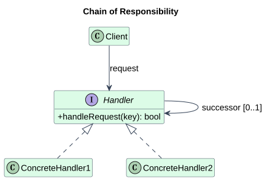

**参与者：** Client 发起请求；Handler 定义处理入口并引用 successor；ConcreteHandler1/2 决定处理还是转发。successor 是同一种抽象角色，因此链长可变。

**辨析：** Command 封装“要做什么”，责任链决定“谁来处理”。HTTP 中间件常让多个节点都执行，是责任链的工程变体；GoF 经典示例是找到处理者后停止。

### 02. Command / 命令模式 {#command}

**类别：Behavioral** · [详细讲解与完整 C++17 示例](Design-Patterns.md#command)

**核心：** 把一次请求封装为对象，使请求可作为参数保存、排队、记录或撤销。

**场景：** C++ 文本编辑器把插入操作放入历史记录，支持撤销。

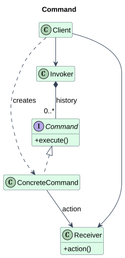

**参与者：** Command 定义 execute；ConcreteCommand 保存接收者和请求参数；Receiver 执行业务；Invoker 持有并触发命令；Client 创建和配置命令。

**辨析：** Strategy 描述可替换的算法，Command 描述一次具体请求；Memento 保存状态快照，可以辅助 Command 撤销，但不负责触发请求。

### 03. Interpreter / 解释器模式 {#interpreter}

**类别：Behavioral** · [详细讲解与完整 C++17 示例](Design-Patterns.md#interpreter)

**核心：** 用对象表示小型语言的语法规则，并递归解释由这些规则组成的句子。

**场景：** 构建工具解释“变量 + 常量”组成的配置表达式。

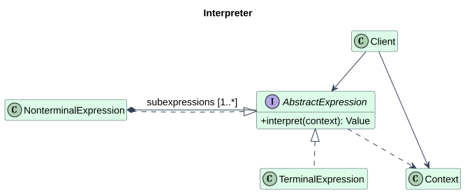

**参与者：** AbstractExpression 定义 interpret；TerminalExpression 解释叶子；NonterminalExpression 组合子表达式；Context 提供外部环境；Client 创建并求值表达式树。

**辨析：** Composite 解释树的结构，Interpreter 为这棵树赋予文法与求值语义。Visitor 可以把求值、打印等操作从 AST 节点中分离。解析文本和解释 AST 是不同阶段。

### 04. Iterator / 迭代器模式 {#iterator}

**类别：Behavioral** · [详细讲解与完整 C++17 示例](Design-Patterns.md#iterator)

**核心：** 在不暴露聚合对象内部表示的前提下，提供顺序访问元素的方法。

**场景：** 遥测样本仓库对客户端提供只读遍历，而隐藏存储容器。

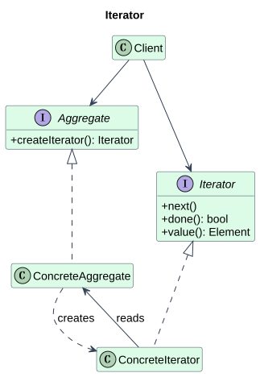

**参与者：** Aggregate 创建 Iterator；ConcreteAggregate 提供具体元素；Iterator 定义遍历协议；ConcreteIterator 保存位置和聚合对象引用；Client 驱动遍历。

**辨析：** Visitor 关注对不同类型元素执行操作，Iterator 关注取出元素；两者可以一起使用。范围 for 是语法，容器满足迭代器协议才是其背后的设计。

### 05. Mediator / 中介者模式 {#mediator}

**类别：Behavioral** · [详细讲解与完整 C++17 示例](Design-Patterns.md#mediator)

**核心：** 把多个对象的交互规则集中到中介对象，使同事对象不必彼此直接引用。

**场景：** 配置对话框中，复选框控制应用按钮是否可用。

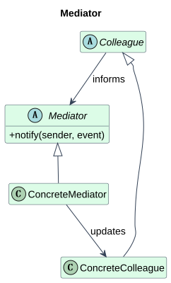

**参与者：** Mediator 定义通知入口；ConcreteMediator 集中协调规则；Colleague 引用中介者；ConcreteColleague 报告事件并接受更新。

**辨析：** Observer 传播状态变化，Mediator 决定对象之间如何协作。Facade 通常向外提供子系统入口，而同事主动向中介者报告事件。

### 06. Memento / 备忘录模式 {#memento}

**类别：Behavioral** · [详细讲解与完整 C++17 示例](Design-Patterns.md#memento)

**核心：** 在保持封装的前提下保存对象的内部状态，使它以后可以恢复到该状态。

**场景：** 编辑器保存一次文本状态，并在修改后恢复。

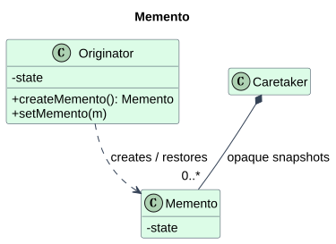

**参与者：** Originator 知道状态语义、创建和恢复快照；Memento 封装状态；Caretaker 管快照的保存期限与历史顺序，不修改快照内容。

**辨析：** Prototype 创建一个新对象，Memento 恢复已有对象。Command 记录行为，Memento 记录状态；状态快照不等于数据库持久化或事务回滚。

### 07. Observer / 观察者模式 {#observer}

**类别：Behavioral** · [详细讲解与完整 C++17 示例](Design-Patterns.md#observer)

**核心：** 建立一对多依赖，使主题变化时通知所有已订阅的观察者。

**场景：** 传感器数据模型把新温度推送给显示面板。

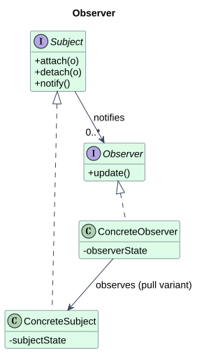

**参与者：** Subject 管理订阅并通知；ConcreteSubject 保存业务状态；Observer 定义 update；ConcreteObserver 更新自己的呈现状态，可按需引用主题查询数据。

**辨析：** Mediator 编排协作，Observer 广播变化。发布订阅消息总线常有第三方 broker；GoF Observer 通常由主题直接维护订阅者，不能把两者所有语义画等号。

### 08. State / 状态模式 {#state}

**类别：Behavioral** · [详细讲解与完整 C++17 示例](Design-Patterns.md#state)

**核心：** 把状态相关行为封装到状态对象中，使上下文随内部状态改变而改变行为。

**场景：** 播放器在停止和播放状态下对同一个 toggle 请求作不同响应。

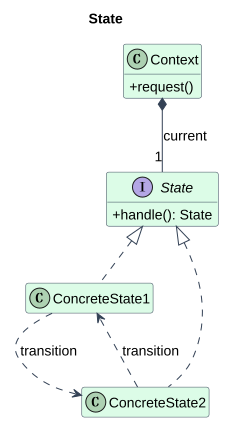

**参与者：** Context 保存当前 State 并接收请求；State 定义 handle；ConcreteState1/2 实现对应状态的行为，转换可由状态或上下文决定。

**辨析：** Strategy 的替换围绕算法选择，State 的替换围绕生命周期和合法转换。状态并非必须自动变化，外部事件也能驱动；策略也可由内部策略管理器选择，区别在意图。

### 09. Strategy / 策略模式 {#strategy}

**类别：Behavioral** · [详细讲解与完整 C++17 示例](Design-Patterns.md#strategy)

**核心：** 封装一族可替换算法，使算法可以独立于使用它的上下文变化。

**场景：** 遥测模块按部署需求选择 CSV 或 JSON 编码算法。

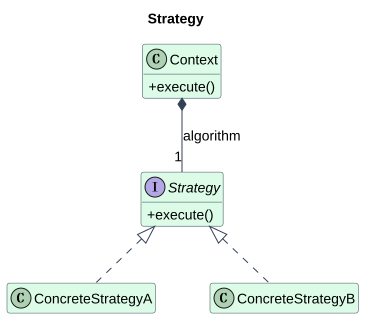

**参与者：** Strategy 定义算法协议；ConcreteStrategyA/B 实现不同算法；Context 提供业务入口，并把算法步骤委托给策略。

**辨析：** State 根据对象状态表达行为和转换，Strategy 根据任务选择算法；Template Method 用继承替换算法步骤，Strategy 用组合替换整个算法。

### 10. Template Method / 模板方法模式 {#template-method}

**类别：Behavioral** · [详细讲解与完整 C++17 示例](Design-Patterns.md#template-method)

**核心：** 在基类中固定算法骨架，把其中可变步骤交给派生类实现。

**场景：** 数据导入流程固定为读取、解析、保存，不同文件实现各自解析。

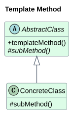

**参与者：** AbstractClass 定义 templateMethod 和 primitive operations；ConcreteClass 重写可变步骤；钩子可提供默认实现，让派生类可选地扩展。

**辨析：** Strategy 替换算法对象，Template Method 重写骨架里的局部步骤。C++ template 是泛型语法，Template Method 是设计模式，两者名称相近但并非同一概念。

### 11. Visitor / 访问者模式 {#visitor}

**类别：Behavioral** · [详细讲解与完整 C++17 示例](Design-Patterns.md#visitor)

**核心：** 把作用于稳定对象结构上的操作移到访问者中，使新增操作无需修改既有元素类。

**场景：** 编译器对整数与加法 AST 节点新增打印操作。

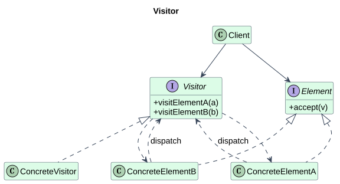

**参与者：** Element 定义 accept；ConcreteElementA/B 把自身交给正确重载；Visitor 声明 visitElementA/B；ConcreteVisitor 实现操作；Client 把元素和访问者配对。

**辨析：** Iterator 解决遍历，Visitor 解决按具体类型操作；Composite 表示 AST 树结构。std::variant + std::visit 是封闭类型集合的现代替代方案，但仍需分析类型与操作哪个更稳定。

## Structural / 结构型模式

### 12. Adapter / 适配器模式 {#adapter}

**类别：Structural** · [详细讲解与完整 C++17 示例](Design-Patterns.md#adapter)

**核心：** 把已有接口转换成客户端需要的接口，使原本不兼容的组件可以协作。

**场景：** 统一温度传感器接口接入返回华氏温度的旧驱动。

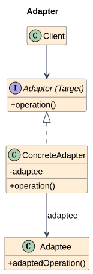

**参与者：** PDF 把目标接口命名为 Adapter，具体包装者命名为 ConcreteAdapter；本文图中保留这一命名并标注 Target。Adaptee 是旧接口，Client 只认识目标协议。

**辨析：** Decorator 保持原接口并增加职责，Adapter 改变客户端看到的接口或语义；Facade 简化一组子系统入口，Adapter 主要解决接口不兼容。Bridge 通常在设计阶段拆出两个变化维度。

### 13. Bridge / 桥接模式 {#bridge}

**类别：Structural** · [详细讲解与完整 C++17 示例](Design-Patterns.md#bridge)

**核心：** 把抽象功能与底层实现拆成两条可独立扩展的层次，再通过组合连接。

**场景：** 不同类型的遥控器控制电视或收音机。

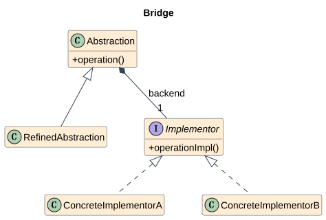

**参与者：** Abstraction 定义高层操作并持有 Implementor；ConcreteImplementorA/B 实现底层协议；RefinedAbstraction 是额外补充角色，用来展示抽象层也可以扩展。

**辨析：** Adapter 接合既有不兼容接口，Bridge 主动设计独立变化轴；Strategy 通常替换一个算法，Bridge 强调抽象层次与实现层次的独立扩展。仅有成员指针并不能证明使用了 Bridge。

### 14. Composite / 组合模式 {#composite}

**类别：Structural** · [详细讲解与完整 C++17 示例](Design-Patterns.md#composite)

**核心：** 用树表示部分与整体，使客户端能通过统一接口处理叶子和组合节点。

**场景：** 工程工作区把文件和目录统一为可计算大小的节点。

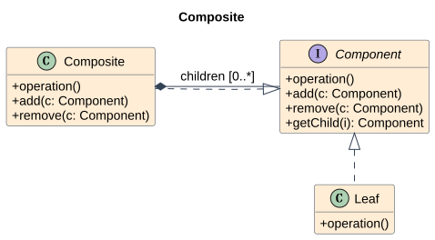

**参与者：** Component 是公共接口；Leaf 无子节点；Composite 管 children 并汇总操作。PDF add(in c: Composite) 过度限制孩子类型，本文修正为 Component，以允许叶子成为孩子。

**辨析：** Decorator 一般包装一个 Component 并附加行为，Composite 聚合多个 Component 表示整体；Interpreter 为特定树节点赋予语言规则。

### 15. Decorator / 装饰器模式 {#decorator}

**类别：Structural** · [详细讲解与完整 C++17 示例](Design-Patterns.md#decorator)

**核心：** 通过包装同一接口的对象，在运行时叠加额外职责。

**场景：** 输出通道在基础控制台写入之外增加前缀和审计。

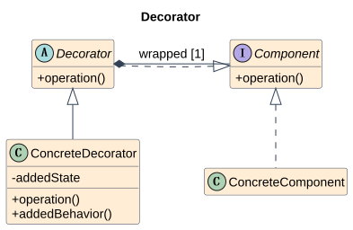

**参与者：** Component 定义共同协议；ConcreteComponent 执行基本职责；Decorator 保存 component 并转发；ConcreteDecorator 保存 addedState 或执行 addedBehavior。

**辨析：** Adapter 改接口，Decorator 保持接口加职责；Proxy 的主要意图是控制访问；Composite 管多个子对象。相同的包装形状可以服务不同意图，必须结合调用行为判断。

### 16. Facade / 外观模式 {#facade}

**类别：Structural** · [详细讲解与完整 C++17 示例](Design-Patterns.md#facade)

**核心：** 给一组子系统接口提供更易使用的高层入口。

**场景：** 编译服务统一词法扫描、解析、生成代码的调用流程。

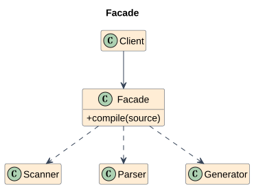

**参与者：** Facade 提供高层方法；SubsystemA/B 等提供底层服务；Client 调用外观。PDF 以 Complex system 矩形示意子系统群，而非一个统一父类。

**辨析：** Adapter 转换不兼容协议，Facade 聚合并简化多种接口；Mediator 处理同事间交互，Facade 通常从客户端单向调度子系统。

### 17. Flyweight / 享元模式 {#flyweight}

**类别：Structural** · [详细讲解与完整 C++17 示例](Design-Patterns.md#flyweight)

**核心：** 共享可复用的内部状态，把每次使用的外部状态留在上下文中，以减少大量细粒度对象的存储。

**场景：** 文本渲染器共享同一字体与字符的字形数据，坐标每次传入。

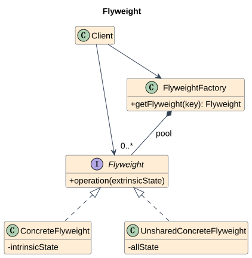

**参与者：** Flyweight 定义接收外部状态的操作；ConcreteFlyweight 保存可共享内部状态；FlyweightFactory 管共享对象；UnsharedConcreteFlyweight 表示不共享的变体；Client 管上下文。

**辨析：** Singleton 约束唯一实例，Flyweight 按键共享多种实例；缓存不限于状态分离，而享元的关键是 intrinsic/extrinsic 的明确划分。Prototype 通过复制创建独立对象，享元通常返回共享只读对象。

### 18. Proxy / 代理模式 {#proxy}

**类别：Structural** · [详细讲解与完整 C++17 示例](Design-Patterns.md#proxy)

**核心：** 以替身保持同一服务接口，并控制对真实对象的访问。

**场景：** 图像预览工具只在第一次显示时加载昂贵图像。

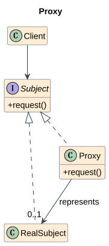

**参与者：** Subject 是客户端协议；RealSubject 执行业务；Proxy 保存真实对象引用或延迟创建能力；Client 通常只引用 Subject。

**辨析：** Decorator 增加功能职责，Proxy 管服务访问；Adapter 改变协议。日志包装可以是装饰器也可以是代理的一部分，必须按主要目的和契约判断。

## Creational / 创建型模式

### 19. Abstract Factory / 抽象工厂模式 {#abstract-factory}

**类别：Creational** · [详细讲解与完整 C++17 示例](Design-Patterns.md#abstract-factory)

**核心：** 为相关产品族提供创建接口，使客户端不依赖具体产品类。

**场景：** 跨平台 UI 一次选择整套 Windows 或 Mac 按钮与文本框。

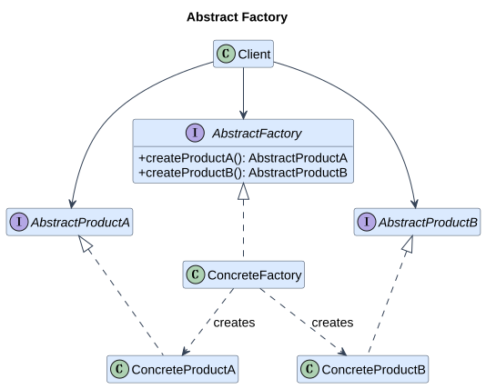

**参与者：** AbstractFactory 定义 createProductA/B；ConcreteFactory 创建一致产品族；AbstractProduct 是产品协议；ConcreteProduct 提供族内实现；Client 使用工厂与抽象产品。本文把 PDF 合并表示的产品框展开成 A/B 两个产品等级；每个具体工厂代表一个族。

**辨析：** Factory Method 以派生类决定创建类型，Abstract Factory 以一个对象提供整族创建服务；抽象工厂的方法经常由工厂方法实现。区别不是简单计数“一件还是多件”，还要看变化维度与创建协议。

### 20. Builder / 建造者模式 {#builder}

**类别：Creational** · [详细讲解与完整 C++17 示例](Design-Patterns.md#builder)

**核心：** 把复杂对象的构造过程与表示分离，使同一构造步骤可以产生不同结果。

**场景：** 报告导出按标题与正文两步构建文本或 HTML 表示。

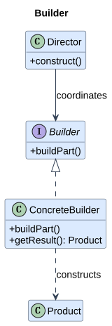

**参与者：** Director 调度 construct；Builder 定义 buildPart；ConcreteBuilder 保存构造中的状态并提供 getResult；Product 是结果对象，本文补充 PDF 未展开的 Product 角色。

**辨析：** Abstract Factory 直接创建一族产品，Builder 分步骤组装一个复杂结果；Factory Method 决定实例化类型。链式 setter 只是调用风格，只有管理构造过程与结果职责才体现建造者意图。

### 21. Factory Method / 工厂方法模式 {#factory-method}

**类别：Creational** · [详细讲解与完整 C++17 示例](Design-Patterns.md#factory-method)

**核心：** 定义创建产品的接口，并由派生类决定实例化哪一种产品。

**场景：** 日志导出工作流由派生导出器决定创建控制台还是文件目的地。

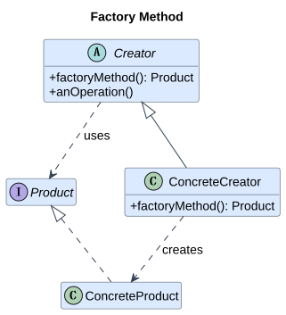

**参与者：** Product 定义产品协议；ConcreteProduct 实现协议；Creator 定义 factoryMethod 和使用产品的操作；ConcreteCreator 决定实际创建类型。

**辨析：** 一个含 switch 的 create(type) 通常是 Simple Factory，不是 GoF Factory Method 的典型派生结构。Abstract Factory 切换产品族；Factory Method 的判据是把创建决定留给派生类，产品数并不是唯一判据。

### 22. Prototype / 原型模式 {#prototype}

**类别：Creational** · [详细讲解与完整 C++17 示例](Design-Patterns.md#prototype)

**核心：** 通过多态复制已有实例来创建同种具体类型的新对象。

**场景：** 编辑器复制用户已经配置好的一种绘图图层。

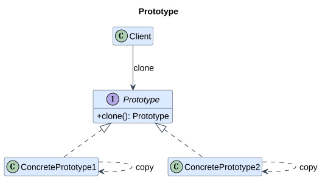

**参与者：** Prototype 定义 clone；ConcretePrototype1/2 实现各自的复制；Client 持有原型并调用 clone。原型注册表是可选的补充，并非模式必需角色。

**辨析：** Builder 按步骤重新构造，Prototype 从已有实例复制；Flyweight 共享已有状态，Prototype 通常建立独立可修改实例；Memento 目标是恢复而非创建。

### 23. Singleton / 单例模式 {#singleton}

**类别：Creational** · [详细讲解与完整 C++17 示例](Design-Patterns.md#singleton)

**核心：** 限制一个类只有一个实例，并提供全局访问入口。

**场景：** 在明确只有一套进程日志配置的程序中提供统一日志入口。

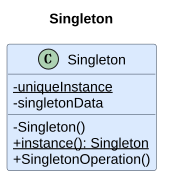

**参与者：** Singleton 保存 uniqueInstance、singletonData，并以静态 instance 提供访问。C++ 局部 static 是静态成员指针结构的现代实现变体，返回引用表达非空借用。

**辨析：** Flyweight 按键共享许多实例，Singleton 只限制一个类的实例数；普通全局对象提供访问但不一定禁止额外构造。依赖注入可保持应用中只有一份服务，同时让类型本身仍可实例化。

## 常见选择的快速对照

|要隔离的变化|优先查看|容易混淆的区别|
|---|---|---|
|派生框架决定产品实现|[Factory Method](#factory-method)|不是含 switch 的简单工厂|
|一整族兼容产品|[Abstract Factory](#abstract-factory)|族与产品种类是两个维度|
|按步骤得到不同表示|[Builder](#builder)|不是仅仅给 setter 返回引用|
|协议/单位不兼容|[Adapter](#adapter)|Decorator 保留协议并加职责|
|高层功能与后端独立扩展|[Bridge](#bridge)|Adapter 主要连接已有接口|
|访问政策、延迟创建|[Proxy](#proxy)|Decorator 主要叠加额外行为|
|替换算法|[Strategy](#strategy)|State 围绕对象状态与转换|
|保存请求 / 保存状态|[Command](#command) / [Memento](#memento)|命令并不天然可撤销|
|广播变化 / 编排交互|[Observer](#observer) / [Mediator](#mediator)|通知不等于协调规则|
|遍历结构 / 对类型施加操作|[Iterator](#iterator) / [Visitor](#visitor)|两者可以配合|

图中可选角色和具体代码的差异、PDF 签名修正及完整来源说明见[教材审核记录](Design-Patterns.md#audit-record)。所有图片复用教材同一份资源，无重复拷贝。
