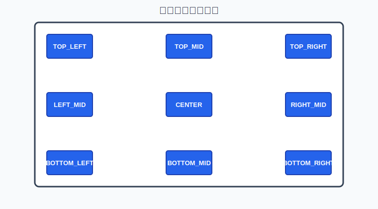
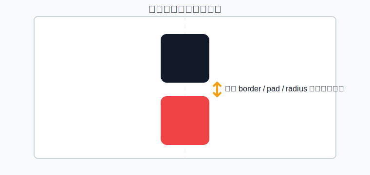
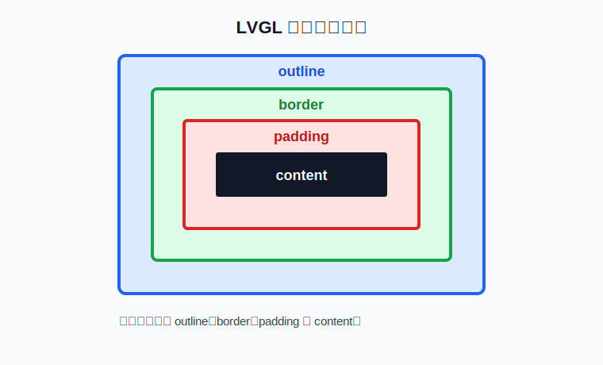
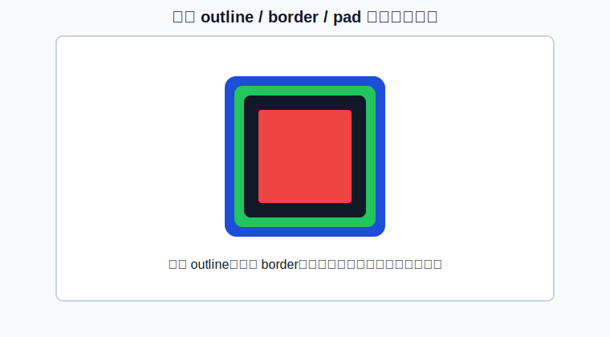
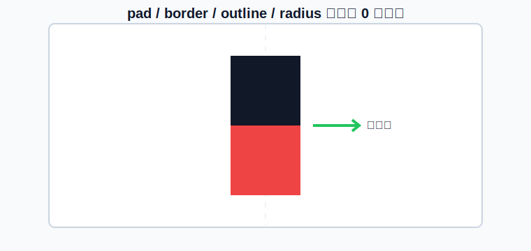

# LVGL 基础

LVGL（Light and Versatile Graphics Library）是一个开源的图形用户界面库，旨在为嵌入式系统和物联网设备提供轻量级、可移植、灵活且易于使用的图形用户界面解决方案。

## 基础对象lv_obj

### 对象（Object）的概念

- LVGL 是一个基于对象的图形库，所有可见的 UI 元素（如按钮、标签、滑块等）都是对象。
- 对象是 LVGL 的基本构建块，具有通用属性（如位置、大小、颜色、事件回调等）。
- 所有控件（如 lv_btn、lv_label）都继承自基础对象 lv_obj。

### 如何创建对象？

- 功能：创建一个最基础的 UI 对象（lv_obj），它是其他复杂控件的父类。

```c
lv_obj_t * lv_obj_create(lv_obj_t * parent);
```

参数：
- parent：父对象指针。

返回值：
- 指向新创建对象的指针（lv_obj_t*）。

### 创建对象参考：

```c
// 获取活动屏幕对象
lv_obj_t *scr = lv_scr_act();
// 创建一个对象
lv_obj_t *obj= lv_obj_create(scr);
```

或：

```c
// 创建一个对象
lv_obj_t *obj= lv_obj_create(lv_scr_act());
```

你可以把 LVGL 的对象（Object） 想象成 一个透明的空盒子，而 lv_obj_create() 就是创建一个空盒子，空盒子有什么作用？你可以直接用它当背景、或作为存放其它对象的容器。了解了什么是对象后，我们继续了解下对象有哪些可以修改的属性。

## 在LVGL中，对象有哪些属性呢？

### Size（大小）

```c
//设置对象宽
lv_obj_set_width(obj, new_width);
//设置对象高
lv_obj_set_height(obj, new_height);
//设置对象宽&高
lv_obj_set_size(obj,new_width,new_height);
```

### Position（位置）

```c
//设置x坐标
lv_obj_set_x(obj, new_x);
//设置y坐标
lv_obj_set_y(obj, new_y);
//设置x&y坐标
lv_obj_set_pos(obj, new_x, new_y);
```

### 对象层级

当我们创建对象时，后创建的对象会在前创建的对象之上。

```c
    lv_obj_t * obj0 = lv_obj_create(lv_scr_act());
    lv_obj_set_size(obj0 ,100,50);
    lv_obj_set_style_bg_color(obj0 ,lv_color_hex(0x000000),LV_PART_MAIN);//黑色

    lv_obj_t * obj1 = lv_obj_create(lv_scr_act());
    lv_obj_set_size(obj1 ,50,50);
    lv_obj_set_style_bg_color(obj1 ,lv_color_hex(0xFF0000),LV_PART_MAIN);//红色
```

### 父子关系

当我们使用lv_obj_create创建对象时，需要传入的参数也是一个对象，lv_scr_act()获取的是LVGL初始化时绑定到屏幕上创建的第一个对象。

暂时无法在飞书文档外展示此内容

所以在上方的代码中，obj0和obj1都是act_scr的子对象，act_scr就是obj0和obj1的父对象。

我们可以通过lv_obj_get_parent，获取对象的父对象

```c
lv_obj_get_parent(obj);
```

也可以通过lv_obj_get_child获取对象的子对象

```c
lv_obj_get_child(parent, idx);
```

idx：
- 0 获取创建的第一个子项
- 1 获取创建的第二个子项
- -1 获取最后创建的子项

当然了，我们也可以继续往下，基于obj1创建它的子对象

```c
    lv_obj_t * obj0 = lv_obj_create(lv_scr_act());
    lv_obj_set_size(obj0 ,100,100);
    lv_obj_set_style_bg_color(obj0 ,lv_color_hex(0x000000),LV_PART_MAIN);

    lv_obj_t * child_obj = lv_obj_create(obj0);
    lv_obj_set_size(child_obj,50,50);
    lv_obj_set_style_bg_color(child_obj,lv_color_hex(0xFF0000),LV_PART_MAIN);
```

上述代码的对象树状结构

```text
lv_scr_act（LVGL初始化对象）

├─ obj0 ─ child_obj
├─ obj1
└─ ...（其他对象）
```

所以，这其实是一个树状的数据结构，有了这个结构，就更方便我们对所有的对象进行操作。

### Alignment（对齐）

```c
//设置对象在父对象中心
lv_obj_center(obj);
//参照其父对象对齐
lv_obj_set_align(obj, lv_align);
//参照其父对象对齐，并且偏移x_ofs, y_ofs
lv_obj_align(obj, lv_align, x_ofs, y_ofs);
//参照指定对象（base_obj）对齐，并且偏移x_ofs, y_ofs
lv_obj_align_to(obj, base_obj, lv_align, x_ofs, y_ofs);
```

其中lv_align可选值为

```c
/** Alignments*/
enum {
    LV_ALIGN_DEFAULT = 0,
    LV_ALIGN_TOP_LEFT,
    LV_ALIGN_TOP_MID,
    LV_ALIGN_TOP_RIGHT,
    LV_ALIGN_BOTTOM_LEFT,
    LV_ALIGN_BOTTOM_MID,
    LV_ALIGN_BOTTOM_RIGHT,
    LV_ALIGN_LEFT_MID,
    LV_ALIGN_RIGHT_MID,
    LV_ALIGN_CENTER,

    LV_ALIGN_OUT_TOP_LEFT,
    LV_ALIGN_OUT_TOP_MID,
    LV_ALIGN_OUT_TOP_RIGHT,
    LV_ALIGN_OUT_BOTTOM_LEFT,
    LV_ALIGN_OUT_BOTTOM_MID,
    LV_ALIGN_OUT_BOTTOM_RIGHT,
    LV_ALIGN_OUT_LEFT_TOP,
    LV_ALIGN_OUT_LEFT_MID,
    LV_ALIGN_OUT_LEFT_BOTTOM,
    LV_ALIGN_OUT_RIGHT_TOP,
    LV_ALIGN_OUT_RIGHT_MID,
    LV_ALIGN_OUT_RIGHT_BOTTOM,
};
```



例如，我们可以创建两个对象，然后设置他们之间的位置

```c
    lv_obj_t * obj1 = lv_obj_create(lv_scr_act());
    lv_obj_set_size(obj1,50,50);
    lv_obj_set_style_bg_color(obj1,lv_color_hex(0x000000),LV_PART_MAIN);
    lv_obj_set_align(obj1,LV_ALIGN_TOP_MID);

    lv_obj_t * obj2 = lv_obj_create(lv_scr_act());
    lv_obj_set_size(obj2,50,50);
    lv_obj_set_style_bg_color(obj2,lv_color_hex(0xFF0000),LV_PART_MAIN);
    lv_obj_align_to(obj2, obj1, LV_ALIGN_OUT_BOTTOM_MID, 0, 0);
```

## 对象盒子模型

理解这个模型非常重要，很多小伙伴在做LVGL界面开发时，发现难以对齐、控件有边框、离屏幕有边距，其实都是没有理解这个模型。我们可以运行下下方的代码：

```c
    lv_obj_t * obj1 = lv_obj_create(lv_scr_act());
    lv_obj_set_size(obj1,50,50);
    lv_obj_set_style_bg_color(obj1,lv_color_hex(0x000000),LV_PART_MAIN);
    lv_obj_set_align(obj1,LV_ALIGN_TOP_MID);

    lv_obj_t * obj2 = lv_obj_create(lv_scr_act());
    lv_obj_set_size(obj2,50,50);
    lv_obj_set_style_bg_color(obj2,lv_color_hex(0xFF0000),LV_PART_MAIN);
    lv_obj_align_to(obj2, obj1, LV_ALIGN_OUT_BOTTOM_MID, 0, 0);
```



执行这个代码后，我们可以看到，虽然我们设置红色的对象是在黑色对象的下方，但是为何它们中间还有个缝隙？其实这些都和盒子模型有关。

LVGL对象引入了盒子模型的思想，对象的尺寸会包含边框、边界、填充和内容，如下方所示：

- 边界(outline)框：元素的宽度/高度围起来的区域。
- 边框(border)宽度：边框的宽度。
- 填充(padding)：对象其子对象之间的空间。
- 内容(content)：如果边界框按边框宽度和填充的大小缩小，则显示其大小的内容区域。





```c
    lv_obj_t * obj1 = lv_obj_create(lv_scr_act());
    lv_obj_center(obj1);
    lv_obj_set_size(obj1,100,100);
    lv_obj_set_style_bg_color(obj1,lv_color_hex(0x000000),LV_PART_MAIN); //黑色

    lv_obj_set_style_outline_width(obj1,5,LV_PART_MAIN);
    lv_obj_set_style_border_width(obj1,5,LV_PART_MAIN);
    lv_obj_set_style_pad_all(obj1,5,LV_PART_MAIN);
    lv_obj_set_style_border_color(obj1,lv_color_hex(0x00FF00),LV_PART_MAIN); //绿色
    lv_obj_set_style_outline_color(obj1,lv_color_hex(0x0000FF),LV_PART_MAIN);//蓝色

    lv_obj_t * obj2 = lv_obj_create(obj1);
    lv_obj_set_size(obj2,LV_PCT(100),LV_PCT(100));
    lv_obj_set_style_bg_color(obj2,lv_color_hex(0xFF0000),LV_PART_MAIN); //红色
    lv_obj_set_style_outline_width(obj2,0,LV_PART_MAIN);
    lv_obj_set_style_border_width(obj2,0,LV_PART_MAIN);
```

我们可以看到，创建对象后，我们设置border、outline、pad都为非0的情况下，它们是包裹在对象内容外边的，也就是对象内容显示的大小=对象大小-border-outline-pad。如果我们需要让对象无缝衔接，我们可以把它们都设置为0



```c
    lv_obj_t * obj1 = lv_obj_create(lv_scr_act());
    lv_obj_set_size(obj1,50,50);
    lv_obj_set_style_bg_color(obj1,lv_color_hex(0x000000),LV_PART_MAIN);
    lv_obj_set_align(obj1,LV_ALIGN_TOP_MID);
    lv_obj_set_style_pad_all(obj1,0,LV_PART_MAIN);
    lv_obj_set_style_border_width(obj1,0,LV_PART_MAIN);
    lv_obj_set_style_outline_width(obj1,0,LV_PART_MAIN);

    lv_obj_t * obj2 = lv_obj_create(lv_scr_act());
    lv_obj_set_size(obj2,50,50);
    lv_obj_set_style_bg_color(obj2,lv_color_hex(0xFF0000),LV_PART_MAIN);
    lv_obj_align_to(obj2, obj1, LV_ALIGN_OUT_BOTTOM_MID, 0, 0);
    lv_obj_set_style_pad_all(obj2,0,LV_PART_MAIN);
    lv_obj_set_style_border_width(obj2,0,LV_PART_MAIN);
    lv_obj_set_style_outline_width(obj2,0,LV_PART_MAIN);
```

通过上面的示例，我们可以看到虽然对象是完全靠在一起了，但是对象似乎还有个圆角，圆角如何去除呢？

```c
    lv_obj_set_style_radius(obj1 ,0,LV_PART_MAIN);
```

然后我们可以尝试下，如果我们需要一个全黑的页面，应该怎么做呢？主要分三步
- 创建一个对象，对象大小为屏幕大小
- 把页面背景颜色设置为全黑
- 把边距、边框宽度、外框宽度、圆角全部设置为0

```c
    lv_obj_t * cont = lv_obj_create(lv_scr_act());
    //LV_PCT(100)为100%占满父窗口
    lv_obj_set_size(cont ,LV_PCT(100),LV_PCT(100));
    //背景颜色
    lv_obj_set_style_bg_color(cont ,lv_color_hex(0x000000),LV_PART_MAIN);
    lv_obj_set_style_pad_all(cont,0,LV_PART_MAIN);
    lv_obj_set_style_border_width(cont,0,LV_PART_MAIN);
    lv_obj_set_style_outline_width(cont,0,LV_PART_MAIN);
    lv_obj_set_style_radius(cont,0,LV_PART_MAIN);
```

学习完基础对象的属性后，我们就可以学习具体的控件了，在学习具体控件前，我们先来了解一个LVGL设计的核心思想。

## 对象标志设置-Flags

对象中有一些标志可以通过lv_obj_add/clear_flag(obj, LV_OBJ_FLAG_...);启用/禁用的：

- `LV_OBJ_FLAG_HIDDEN` 隐藏对象。 （就像它根本不存在一样）
- `LV_OBJ_FLAG_CLICKABLE` 使输入设备可点击对象
- `LV_OBJ_FLAG_CLICK_FOCUSABLE` 单击时将焦点状态添加到对象
- `LV_OBJ_FLAG_CHECKABLE` 对象被点击时切换选中状态
- `LV_OBJ_FLAG_SCROLLABLE` 使对象可滚动
- `LV_OBJ_FLAG_SCROLL_ELASTIC` 允许在内部滚动但速度较慢
- `LV_OBJ_FLAG_SCROLL_MOMENTUM` 在“抛出”时使对象滚动得更远
- `LV_OBJ_FLAG_SCROLL_ONE` 只允许滚动一个可捕捉的孩子
- `LV_OBJ_FLAG_SCROLL_CHAIN` 允许将滚动传播到父级
- `LV_OBJ_FLAG_SCROLL_ON_FOCUS` 自动滚动对象以使其在聚焦时可见
- `LV_OBJ_FLAG_SNAPPABLE` 如果在父对象上启用了滚动捕捉，它可以捕捉到这个对象
- `LV_OBJ_FLAG_PRESS_LOCK` 保持对象被按下，即使按下从对象上滑动
- `LV_OBJ_FLAG_EVENT_BUBBLE` 也将事件传播给父级
- `LV_OBJ_FLAG_GESTURE_BUBBLE` 将手势传播给父级
- `LV_OBJ_FLAG_ADV_HITTEST` 允许执行更准确的命中（点击）测试。例如。考虑圆角。
- `LV_OBJ_FLAG_IGNORE_LAYOUT` 使对象可以通过布局定位
- `LV_OBJ_FLAG_FLOATING` 父滚动时不滚动对象，忽略布局
- `LV_OBJ_FLAG_LAYOUT_1` 自定义标志，可供布局免费使用
- `LV_OBJ_FLAG_LAYOUT_2` 自定义标志，可供布局免费使用
- `LV_OBJ_FLAG_WIDGET_1` 自定义标志，组件免费使用
- `LV_OBJ_FLAG_WIDGET_2` 自定义标志，组件免费使用
- `LV_OBJ_FLAG_USER_1` 自定义标志，用户免费使用
- `LV_OBJ_FLAG_USER_2` 自定义标志，用户免费使用
- `LV_OBJ_FLAG_USER_3` 自定义标志，用户免费使用
- `LV_OBJ_FLAG_USER_4` 自定义标志，由用户部分免费使用。

例如，我们想隐藏对象

```c
/*Hide on object*/
lv_obj_add_flag(obj, LV_OBJ_FLAG_HIDDEN);
```

## 对象事件

每个对象都是可以绑定多种事件的，LVGL的事件类型如下：

- 输入设备事件(Input device events)
- 绘图事件(Drawing events)
- 其他事件(Special events)
- 特殊事件(Other events)
- 自定义事件(Custom events)

具体事件的内容，我们在后续讲解对应控件时进行说明，这节课，我们先了解下什么是事件即可。

### Input device events（输入设备事件）

- `LV_EVENT_PRESSED` 对象已被按下
- `LV_EVENT_PRESSING` 对象被按下（按下时连续调用）
- `LV_EVENT_PRESS_LOST` 对象仍被按下，但光标/手指已滑离对象
- `LV_EVENT_SHORT_CLICKED` 对象被按下一小段时间，然后释放它。如果滚动则不会调用。
- `LV_EVENT_LONG_PRESSED` 对象已按下输入设备驱动程序中指定的至少 long_press_time。如果滚动则不会调用。
- `LV_EVENT_LONG_PRESSED_REPEAT` 在每个 long_press_repeat_time 毫秒的 long_press_time 之后调用。如果滚动则不会调用。
- `LV_EVENT_CLICKED` 如果对象没有点击，则在释放时调用（无论是否长按）
- `LV_EVENT_RELEASED` 在对象被释放后的每种情况下调用
- `LV_EVENT_SCROLL_BEGIN` 开始滚动。事件参数是 NULL 或 lv_anim_t *，如果需要，可以修改滚动动画描述符。
- `LV_EVENT_SCROLL_END` 滚动结束。
- `LV_EVENT_SCROLL` 对象被滚动
- `LV_EVENT_GESTURE` 检测到手势。使用 lv_indev_get_gesture_dir(lv_indev_get_act()); 获取手势
- `LV_EVENT_KEY` 一个密钥被发送到对象。使用 lv_indev_get_key(lv_indev_get_act()); 获取密钥
- `LV_EVENT_FOCUSED` 对象被聚焦
- `LV_EVENT_DEFOCUSED` 对象散焦
- `LV_EVENT_LEAVE` 对象散焦但仍被选中
- `LV_EVENT_HIT_TEST` 执行高级命中测试。使用 lv_hit_test_info_t * a = lv_event_get_hit_test_info(e) 并检查 a->point 是否可以点击对象。如果没有则 a->res = false

### Drawing events（绘图事件）

- `LV_EVENT_COVER_CHECK` 检查对象是否完全覆盖一个区域。事件参数是lv_cover_check_info_t *。
- `LV_EVENT_REFR_EXT_DRAW_SIZE` 获取对象周围所需的额外绘制区域（例如用于阴影）。事件参数是 lv_coord_t * 来存储大小。仅用更大的值覆盖它。
- `LV_EVENT_DRAW_MAIN_BEGIN` 开始主绘图阶段。
- `LV_EVENT_DRAW_MAIN` 执行主绘图
- `LV_EVENT_DRAW_MAIN_END` 完成主绘制阶段
- `LV_EVENT_DRAW_POST_BEGIN` 开始后期绘制阶段（当所有孩子都被绘制时）
- `LV_EVENT_DRAW_POST` 执行后期绘制阶段（当所有孩子都被绘制时）
- `LV_EVENT_DRAW_POST_END` 完成后期绘制阶段（当所有孩子都被绘制时）
- `LV_EVENT_DRAW_PART_BEGIN` 开始绘制零件。事件参数是lv_obj_draw_dsc_t *。
- `LV_EVENT_DRAW_PART_END` 完成绘制零件。事件参数是lv_obj_draw_dsc_t *。

### Other events（其他事件）

- `LV_EVENT_DELETE` 对象正在被删除
- `LV_EVENT_CHILD_CHANGED` 孩子被移除/添加
- `LV_EVENT_SIZE_CHANGED` 对象坐标/大小已更改
- `LV_EVENT_STYLE_CHANGED` 对象的样式已更改
- `LV_EVENT_BASE_DIR_CHANGED` 基础目录已经改变
- `LV_EVENT_GET_SELF_SIZE` 获取小部件的内部尺寸

### Special events（特殊事件）

- `LV_EVENT_VALUE_CHANGED` 对象的值已更改（即滑块移动）
- `LV_EVENT_INSERT` 正在向对象插入文本。事件数据是插入的char *。
- `LV_EVENT_REFRESH` 通知对象刷新其上的某些内容（对于用户）
- `LV_EVENT_READY` 一个过程已经完成
- `LV_EVENT_CANCEL` 一个过程被取消

例如，我们可以通过绑定点击事件，在对象监听到点击事件时，主动做一些操作。

```c
static void lv_event_cb_func(lv_event_t * e){
    printf("obj click\n");
}

void init_page(void)

{

    lv_obj_t * obj = lv_obj_create(lv_scr_act());
    lv_obj_center(obj);
    lv_obj_set_size(obj,50,50);
    lv_obj_set_style_bg_color(obj,lv_color_hex(0x000000),LV_PART_MAIN);
    //使得对象可以被点击
    lv_obj_add_flag(obj,LV_OBJ_FLAG_CLICKABLE);
    lv_obj_add_event_cb(obj,lv_event_cb_func,LV_EVENT_CLICKED,NULL);
}
```

## 对象样式

样式是用来设置对象外观的，LVGL提供多类样式组，包含位置尺寸类样式、边距类样式、背景类样式、边框类样式、阴影图像类样式、文字类样式、图形类样式。

前面学习对象时，我们其实已经使用过位置、尺寸、边距、背景样式设置。

LVGL对象添加样式的方法，一般有两种方式：

第一种：直接设置某个对象的样式

```c
lv_obj_set_style_bg_color(obj,lv_color_hex(0x000000),LV_PART_MAIN);
```

第二种：对于一些可复用的通用样式，可以初始化一个样式结构体进行存储，然后需要使用时添加到不同对象

```c
static lv_style_t com_style;
lv_style_init(&com_style);
lv_style_set_bg_color(&com_style,lv_color_hex(0x000000));
```

多个对象可复用：

```c
lv_obj_add_style(obj1, &com_style, LV_PART_MAIN);
lv_obj_add_style(obj2, &com_style, LV_PART_MAIN);
```

需要特别说明的是：lv_obj_set_style_bg_color和lv_obj_add_style的第三个参数selector

selector 是一个复合参数，由两部分信息组成（通过位运算组合）：

1. 对象的 “部件”（Part）

指定样式应用到对象的哪个组成部分（如按钮的主体、滑块的旋钮等）。

常见取值：LV_PART_MAIN（主体部分）、LV_PART_CURSOR（光标部分）、LV_PART_INDICATOR（指示器部分）等。

- `LV_PART_MAIN` 主部件
- `LV_PART_SCROLLBAR` 滚动条
- `LV_PART_INDICATOR` 指标，例如用于滑块、条、开关或复选框的勾选框
- `LV_PART_KNOB` 像手柄一样可以抓取调整值
- `LV_PART_SELECTED` 表示当前选择的选项或部分
- `LV_PART_ITEMS` 如果小部件具有多个相似元素（例如表格单元格）
- `LV_PART_TICKS` 刻度上的刻度，例如对于图表或仪表
- `LV_PART_CURSOR` 标记一个特定的地方，例如文本区域或图表的光标
- `LV_PART_CUSTOM_FIRST` 可以从这里添加自定义部件。

2. 对象的 “状态”（State）

指定样式在对象的哪种状态下生效（如默认状态、按下状态、聚焦状态等）。

常见取值：LV_STATE_DEFAULT（默认状态）、LV_STATE_PRESSED（按下状态）、LV_STATE_FOCUSED（聚焦状态）等，多个状态可通过 | 组合（如 LV_STATE_PRESSED | LV_STATE_FOCUSED）。

- `LV_STATE_DEFAULT` 正常，释放状态
- `LV_STATE_CHECKED` 切换或检查状态
- `LV_STATE_FOCUSED` 通过键盘或编码器聚焦或通过触摸板/鼠标点击
- `LV_STATE_FOCUS_KEY` 通过键盘或编码器聚焦，但不通过触摸板/鼠标聚焦
- `LV_STATE_EDITED` 由编码器编辑
- `LV_STATE_HOVERED` 鼠标悬停（现在不支持）
- `LV_STATE_PRESSED` 被按下
- `LV_STATE_SCROLLED` 正在滚动
- `LV_STATE_DISABLED` 禁用状态
- `LV_STATE_USER_1` 自定义状态
- `LV_STATE_USER_2` 自定义状态
- `LV_STATE_USER_3` 自定义状态
- `LV_STATE_USER_4` 自定义状态

通俗理解：

selector 相当于告诉 LVGL：“我要给这个对象（obj）的 [某个部分] 在 [某种状态下] 设置背景色（value）”。

LVGL样式非常丰富，不同控件的样式也会有差异，所以我们这节课不会直接讲解所有样式，因为没用到，很容易忘记，而是在用到的时候，在逐步说明，我们这里举一个简单的例子，怎么设置一个控件对应的部件和状态下的样式。

例如，我们设置对象未按下时和按下时背景不一样

```c
    lv_obj_t * obj = lv_obj_create(lv_scr_act());
    lv_obj_center(obj);
    lv_obj_set_size(obj,50,50);
    lv_obj_add_flag(obj,LV_OBJ_FLAG_CLICKABLE);
    lv_obj_set_style_bg_color(obj,lv_color_hex(0x000000),LV_PART_MAIN);
    lv_obj_set_style_bg_color(obj,lv_color_hex(0xFF0000),LV_PART_MAIN | LV_STATE_PRESSED);
```

到这里，对象的基本属性就讲解完成了，上面的属性非常重要，是我们开展后续控件开发的前提，如果你看一遍忘记了，可以重新多看两遍，因为后续各类控件的实现，我们都是基于上面属性的修改进行讲解的。

## LVGL的思想是一切皆对象。

最后，我们再补充一个概念，LVGL的思想是一切皆对象，简单来说，我们后续学习的所有控件，标签、按钮、开关、图像都是继承自基础对象（lv_obj），这意味着它们共享一套属性和方法（如位置、大小、父子关系、事件处理等）。

- 根节点：lv_obj（基础对象，是所有组件的 “祖先”）。
- 派生组件：如lv_btn（按钮）、lv_label（标签）、lv_slider（滑块）等，均继承lv_obj的属性和方法，再添加自身特性（如按钮有 “按下状态”）。

```text
lv_obj（基础对象）

├─ lv_btn（按钮）
├─ lv_label（标签）
├─ lv_slider（滑块）
└─ ...（其他组件）
```

- 类比：可以类比现实世界的 “物品”—— 无论椅子、桌子还是杯子，都有 “大小、位置、用途” 等共性，它们都是基于物品进行扩展的。

这段话怎么理解呢？我们可以创建一个对象和一个按键

```c
    lv_obj_t * obj = lv_obj_create(lv_scr_act());
    lv_obj_center(obj);
    lv_obj_set_size(obj,50,50);
    lv_obj_set_style_bg_color(obj,lv_color_hex(0x000000),LV_PART_MAIN);

    lv_obj_t * btn = lv_btn_create(lv_scr_act());
    lv_obj_center(btn);
    lv_obj_set_size(btn,50,50);
    lv_obj_set_style_bg_color(btn,lv_color_hex(0xFF0000),LV_PART_MAIN);
```

我们可以看到对象obj和btn除了创建函数不一样，其它的位置、大小、样式配置都可以用一样的函数，这是因为lvgl所有控件，其实都是基于obj的，于是obj具备的属性，按键也都具备，了解这个思想非常重要，尤其是后期我们需要制作一些自定义样式、事件的控件。

## 标签lv_label

lv_label可以用来显示静态或动态的文本内容。它可以显示单行或多行文本，支持不同的字体、颜色和对齐方式。

```c
lv_obj_t * label = lv_label_create(lv_scr_act());
lv_obj_center(label);

lv_label_set_text(label,"Hello");
```

显示变量

```c
int data = 10;
lv_label_set_text_fmt(label, "Value: %d", data);
```

换行

```c
lv_label_set_text(label,"Hello\n nihao \n");
```

修改颜色

```c
lv_label_set_recolor(label,true);

lv_label_set_text(label,"#0000ff Hello# #ff00ff nihao#");
```

显示中文
LVGL自带汉字库CJK
在LVGL的官方库中，其实已经内置了一个CJK中文字库：中日韩越统一表意文字（CJKV Unified Ideographs），目的是要把分别来自中文、日文、韩文中，本质相同、形状一样或稍异的表意文字（主要为汉字，但也有仿汉字如日本国字、韩国独有汉字）于ISO 10646及Unicode标准内赋予相同编码。越南文后来亦加入此计划，所以亦有“CJKV”的称呼。
虽然该库日常使用的汉字数量有数千个，再加上生僻字，数量达到数万个，但缺少很多简体中文中经常使用的汉字，如“问”字。
使用自带的CJK汉字库需要将lv_conf.h文件中的LV_FONT_SIMSUN_16_CJK字库宏定义开启，否则不能使用。

```c
lv_obj_set_style_text_font(label, &lv_font_simsun_16_cjk, LV_PART_MAIN);
lv_label_set_text(label,"Hello 小智");
```

自定义字体
基于LVGL官方的字体生成模型

https://lvgl.io/tools/fontconverter

[图片]

[图片]

字体ttf下载:https://www.fonts.net.cn/fonts-zh-1.html
生成的testfont.c文件放到工程下main.c的路径，然后代码中直接使用即可

```c
LV_FONT_DECLARE(testfont);
lv_obj_t * label = lv_label_create(lv_scr_act());
lv_obj_center(label);
lv_obj_set_style_text_font(label, &testfont, LV_PART_MAIN);

lv_label_set_text(label,"初始化");
```

基于FreeType的动态字体生成
FreeType 是一个开源的字体渲染引擎，用于在代码运行时渲染字体文件。
我从https://www.fonts.net.cn/fonts-zh-1.html下载了几个项目中需要用到的字体样式：
暂时无法在飞书文档外展示此内容
暂时无法在飞书文档外展示此内容
暂时无法在飞书文档外展示此内容
为了方便管理，我们可以在工程中加入了一个res资源文件，用于放置字库，后面这个文件夹也会放置项目图片、音乐等资源。

app（工程）
├─ res（资源文件）
│   ├── res_conf.h（资源配置）
│   └── font（字库样式）
│       ├── font_conf.h
│       ├── SOURCEHANSANSCN_LIGHT.OTF
│       ├── SOURCEHANSANSCN_REGULAR.OTF
│       └── Library-3-am-3.otf
└─ ...
配置资源路径，因为考虑到在PC机上和板卡上的路径不同，所以需要手动设置PC和板卡的路径，为了方便我们找到字库。

```c
#ifndef _RES_CONF_H_
#define _RES_CONF_H_

#ifdef SIMULATOR_LINUX
#define FONT_PATH "./build/你的app名称/res/font/"
#else
#define FONT_PATH "/usr/res/font/"
#endif

#endif
```

使用add_font函数添加字库，这里面设置了三种字库，分别是粗体、细体和一组美观的数字样式

```c
#ifndef _FONT_CONF_H_
#define _FONT_CONF_H_

#include "res_conf.h"
#include "font_utils.h"

typedef enum
{
FONT_TYPE_CN = 0,

FONT_TYPE_CN_LIGHT,
FONT_TYPE_NUMBER,

}FONT_TYPE;

#define FONT_TYPE_CN_PATH FONT_PATH "SOURCEHANSANSCN_REGULAR.OTF"
#define FONT_TYPE_CN_LIGHT_PATH FONT_PATH "SOURCEHANSANSCN_LIGHT.OTF"
#define FONT_TYPE_NUMBER_PATH FONT_PATH "Library-3-am-3.otf"

#define font_init() \
do { \
add_font(FONT_TYPE_CN,FONT_TYPE_CN_PATH); \
add_font(FONT_TYPE_CN_LIGHT,FONT_TYPE_CN_LIGHT_PATH); \
add_font(FONT_TYPE_NUMBER,FONT_TYPE_NUMBER_PATH); \

} while (0)

#endif
```

然后在工程CMakeLists.txt中添加字库组件和头文件

```cmake
cmake_minimum_required(VERSION 3.15)

project(app1)

# 添加显式定义，定义宏 SIMULATOR_LINUX,这样才能在代码中识别到该宏

if(SIMULATOR_LINUX)
add_compile_definitions(SIMULATOR_LINUX)
endif()

# 拷贝res文件夹到build中，方便后续打包

file(COPY res DESTINATION ${PROJECT_BINARY_DIR})

aux_source_directory(. SOURCES)
add_executable(app1 ${SOURCES})
target_include_directories(app1 PRIVATE

./
res/
res/font/
${CMAKE_SOURCE_DIR}/component/font
${CMAKE_SOURCE_DIR}/lvgl
)

target_link_libraries(app1 PRIVATE

lvgl
font
)
```

最后，在main.c中添加字库初始化
main.c中添加

```c
#include "font_conf.h"
font_init(); //放在lv_init后方
```

然后就可以使用字库了

```c
void lv_example_hello_world(void) {

// 创建一个标签对象

lv_obj_t *label = lv_label_create(lv_scr_act());

// 将标签居中对齐到屏幕

lv_obj_align(label, LV_ALIGN_CENTER, 0, 0);

// 获取字库

lv_font_t* font = get_font(FONT_TYPE_CN, 50);
if(font != NULL)
lv_obj_set_style_text_font(label, font, 0);

// 设置标签的文本内容

lv_label_set_text(label, "Hello, World!");
}
```

当然，也可以优化下，把字库函数封装为obj_font_set，方便使用

```c
static void obj_font_set(lv_obj_t *obj,int type, uint16_t weight){
lv_font_t* font = get_font(type, weight);
if(font != NULL)
lv_obj_set_style_text_font(obj, font, 0);
}

void init_page(void)
{
lv_obj_t * label = lv_label_create(lv_scr_act());
lv_obj_center(label);
obj_font_set(label,FONT_TYPE_CN, 20);

lv_label_set_text(label,"初始化");

}
```

## 按钮

## 按钮lv_button

接着我们看看lv_button按钮控件是如何实现的，例如我们要创建这么一个按钮

[图片]

```c
lv_obj_t * btn = lv_btn_create(lv_scr_act());
lv_obj_align(btn, LV_ALIGN_CENTER, 0, 0);

lv_obj_t * label = lv_label_create(btn);
lv_label_set_text(label, "Button");
lv_obj_center(label);
```

我们可以看到按钮控件其实是由两个零件对象组成的
- 底部的按键背景
- 顶部的文字
我们可以分别设置它们的样式。
例如设置为圆角半径50，背景透明，边框宽度为2，边框颜色为蓝色的按钮，文字为黑色的按钮：

[图片]

```c
lv_obj_t * btn = lv_btn_create(lv_scr_act());
lv_obj_align(btn, LV_ALIGN_CENTER, 0, 0);
lv_obj_set_style_radius(btn,50,LV_PART_MAIN);
lv_obj_set_style_bg_opa(btn,LV_OPA_0,LV_PART_MAIN);
lv_obj_set_style_border_width(btn,2,LV_PART_MAIN);
lv_obj_set_style_border_color(btn,lv_color_hex(0x0000ff),LV_PART_MAIN);
lv_obj_clear_state(btn,LV_STATE_FOCUS_KEY);

lv_obj_t * label = lv_label_create(btn);
lv_label_set_text(label, "Button");

lv_label_set_recolor(label,true);

lv_label_set_text(label,"#000000 Button#");
lv_obj_center(label);
```

除了按钮的样式，还有一个很重要的参数，那就是按钮的点击事件了，如果我们希望在按钮按下的时候，打印一些信息，那如何实现呢？
其实也很简单，我们只需要实现一个按钮事件回调函数，在按钮被点击后，lvgl就会执行这个函数。

```c
static void btn_click_event_cb_func(lv_event_t * e){
printf("btn click\n");
}

void init_page(void)
{
lv_obj_t * btn = lv_btn_create(lv_scr_act());
lv_obj_align(btn, LV_ALIGN_CENTER, 0, 0);
lv_obj_add_event_cb(btn, btn_click_event_cb_func, LV_EVENT_CLICKED, NULL);

lv_obj_t * label = lv_label_create(btn);
lv_label_set_text(label, "Button");
lv_obj_center(label);
}
```

同理，我们可以注册多种事件，例如对按键来说：按钮的点击、长按事件

```c
static void btn_click_event_cb_func(lv_event_t * e){
lv_event_code_t code = lv_event_get_code(e);
switch (code)
{
case LV_EVENT_SHORT_CLICKED:
printf("btn short click\n");
break;
case LV_EVENT_LONG_PRESSED:
printf("btn long click\n");
break;
default:
break;
}
}

void init_page(void)
{
lv_obj_t * btn = lv_btn_create(lv_scr_act());
lv_obj_align(btn, LV_ALIGN_CENTER, 0, 0);
lv_obj_add_event_cb(btn, btn_click_event_cb_func, LV_EVENT_ALL, NULL);

lv_obj_t * label = lv_label_create(btn);
lv_label_set_text(label, "Button");
lv_obj_center(label);
}
```

以上就是按钮的常规用法，其它的按钮API，大家可以根据官方手册或者源码进行学习，如何学习呢？一般是参考API说明和官方示例，然后把代码跑起来，看实际效果即可。

## 开关lv_switch

开关看起来像一个小滑块，开关的功能类似于按钮，也可以用来打开和关闭某些东西。

[图片]

我们可以创建一个switch看看效果

```c
lv_obj_t * sw = lv_switch_create(lv_scr_act());
```

开关包括以下3个部件：
- LV_PART_MAIN 主部件背景。 修改其 padding 会让下面的(指示器和旋钮)在相应方向上的大小发生变化。
- LV_PART_INDICATOR 显示开关状态的指示部件。
- LV_PART_KNOB 顶部的旋钮部件。 默认情况下，旋钮是圆形的，边长等于滑块的较小边。
同理，我们可以设置每个零件的样式，例如我们希望做一个ios的开关，设置开关在选中状态下、指示模块为绿色，同时清除焦点状态。

[图片]

这里要注意两个点，第一个是选中状态LV_STATE_CHECKED，第二是指示模块LV_PART_INDICATOR

```c
lv_obj_t * sw = lv_switch_create(lv_scr_act());
lv_obj_center(sw);
lv_obj_set_style_bg_color(sw, lv_color_hex(0x00FF00), LV_PART_INDICATOR | LV_STATE_CHECKED);
lv_obj_clear_state(sw,LV_STATE_FOCUS_KEY);
```

那开关的事件如何监听呢？和按钮部分一样，注册事件回调函数，监听值变化事件，然后获取对象的状态即可

```text
static void btn_sw_event_cb_func(lv_event_t * e){
lv_event_code_t code = lv_event_get_code(e);
lv_obj_t * obj = lv_event_get_target(e);
switch (code)
{
case LV_EVENT_VALUE_CHANGED:
printf("State: %s\n", lv_obj_has_state(obj, LV_STATE_CHECKED) ? "On" : "Off");
break;
default:
break;
}
}

void init_page(void)
{
lv_obj_t * sw = lv_switch_create(lv_scr_act());
lv_obj_center(sw);
lv_obj_set_style_bg_color(sw, lv_color_hex(0x00FF00), LV_PART_INDICATOR | LV_STATE_CHECKED);
lv_obj_clear_state(sw,LV_STATE_FOCUS_KEY);
lv_obj_add_event_cb(sw, btn_sw_event_cb_func, LV_EVENT_ALL, NULL);
}
```

## 文本框

## 文本框lv_textarea

文本框用于接收用户的输入

[图片]

```c
lv_obj_t * ta = lv_textarea_create(lv_scr_act());
lv_textarea_set_one_line(ta, true);
lv_obj_center(ta);
```

初始化后，我们就可以通过键盘输入数值到文本框。

[图片]

文本框是一个基础对象，其上面有一个 标签(Label) 和一个光标(cursor)。我们可以向文本框中添加文本或字符。 长行会被换行，当文本内容变得足够长时(文本框可视区域容纳不下时)，可以滚动文本框。
文本框由四个部件组成：
- LV_PART_MAIN 主部件。
- LV_PART_SCROLLBAR 文本内容过长时显示的滚动条。
- LV_PART_CURSOR 字符插入位置的光标。光标的区域始终是当前字符的边界框。
- LV_PART_TEXTAREA_PLACEHOLDER 文本占位符，可以通过这部分设置文本占位符的样式。
所以，我们也可以根据上述的部件对象，单独设置每个零件的样式。

```c
lv_obj_t * ta = lv_textarea_create(lv_scr_act());
lv_textarea_set_one_line(ta, true);
lv_obj_center(ta);

//设置背景颜色

lv_obj_set_style_bg_color(ta,lv_color_hex(0xFFFFFF),LV_PART_MAIN);

//设置边框颜色

lv_obj_set_style_border_color(ta,lv_color_hex(0x000000),LV_PART_MAIN);

//设置文字颜色

lv_obj_set_style_text_color(ta,lv_color_hex(0xFF0000),LV_PART_MAIN);

//设置光标颜色

lv_obj_set_style_border_color(ta,lv_color_hex(0x00FF00),LV_PART_CURSOR | LV_STATE_FOCUSED);
```

文本框还有几种常见的用法，
例如添加占位符：

```c
lv_obj_t * ta = lv_textarea_create(lv_scr_act());
lv_textarea_set_one_line(ta, true);
lv_obj_center(ta);
lv_textarea_set_placeholder_text(ta, "input your name");
```

设置密码模式：

```c
lv_textarea_set_password_mode(ta, true);
```

输入到文本框的数值如何获取呢？

```c
static void ta_event_cb(lv_event_t * e)
{
lv_event_code_t code = lv_event_get_code(e);
lv_obj_t * ta = lv_event_get_target(e);
if (code == LV_EVENT_READY) {
const char * text = lv_textarea_get_text(ta);
if (text != NULL) {
printf("current text: %s\n", text);
} else {
printf("current text: (empty)\n");
}
}
}

static void btn_click_event_cb_func(lv_event_t * e){
printf("btn click\n");
lv_obj_t * ta = lv_event_get_user_data(e);
lv_event_send(ta, LV_EVENT_READY, NULL);
}

void init_page(void)
{
lv_obj_t * ta = lv_textarea_create(lv_scr_act());
lv_textarea_set_one_line(ta, true);
lv_obj_center(ta);
lv_obj_add_event_cb(ta, ta_event_cb, LV_EVENT_READY, NULL);

lv_obj_t * btn = lv_btn_create(lv_scr_act());
lv_obj_add_event_cb(btn, btn_click_event_cb_func, LV_EVENT_CLICKED, ta);
lv_obj_t * label = lv_label_create(btn);
lv_label_set_text(label, "Button");
lv_obj_center(label);

//放在label设置后才能居中对齐

lv_obj_align_to(btn, ta, LV_ALIGN_OUT_BOTTOM_MID, 0, 0);
}
```

## 键盘

## 键盘lv_keyboard

前面，我们讲解了文本框，文本框是用来接收用户输入的，我们在电脑模拟器上，可以使用电脑物理键盘作为输入，但是对于我们设备板卡端，我们不太可能接一个物理键盘，所以我们要做的是创建一个模拟键盘，类似手机的键盘一样，有两种方法，一种是自己通过按钮实现，简单点来说，就是创建多个按钮实现，还有一种是通过lvgl的键盘控件。

[图片]

创建键盘控件的函数如下：

```c
lv_obj_t *kb = lv_keyboard_create(lv_scr_act());
```

同时，我们也可以修改控件的样式

```c
lv_obj_t *kb = lv_keyboard_create(lv_scr_act());

//设置键盘大小

lv_obj_set_size(kb, 700, 280);

//设置键盘主体背景

lv_obj_set_style_bg_color(kb,lv_color_hex(0x000000),LV_PART_MAIN);

//清除对象焦点状态

lv_obj_clear_state(kb,LV_STATE_FOCUS_KEY);
```

绑定键盘输入到文本框

```c
//绑定键盘和输入框

lv_keyboard_set_textarea(kb, ta);

//创建文本框

lv_obj_t * ta = lv_textarea_create(lv_scr_act());
lv_textarea_set_one_line(ta, true);
lv_obj_center(ta);

//创建键盘控件

lv_obj_t *kb = lv_keyboard_create(lv_scr_act());

//设置键盘大小

lv_obj_set_size(kb,  500, 280);

//绑定键盘和输入框

lv_keyboard_set_textarea(kb, ta);

//对齐，使得键盘在文本框右侧

lv_obj_align_to(kb,ta,LV_ALIGN_OUT_RIGHT_MID,0,0);
```

当然了，这里是没有输入法匹配的，也就是你只能一个一个字符敲，如果你需要更加智能的输入法，那就需要花长时间去自己实现了，当然网上也有一些第三方键盘，但是目前体验都不好，应该说是和手机对比起来，智能补全、输入匹配差很多，所以对于这类小屏幕产品，还是建议在设计阶段尽量减少键盘的使用，因为屏幕较小，键盘操作体验相对差。

## 图像lv_img

图像显示应该是一个应用中，用得最多的功能之一了，大家可以看到我们的设计原型图，无论是背景，图标，时钟这些全都是图片，那如何在应用中显示图片呢？一般也有两种方式
第一种，把图片转换为c文件
通过把图片上传到lvgl官方的图片转换工具，选中CF_TRUE_COLOR全色彩，这里的Color format会影响图片显示效果和转换出来的c文件大小，显示效果越好，文件越大。最后点击Convert转换即可下载图片名.c文件。

[图片]

https://lvgl.io/tools/imageconverter

[图片]

生成的图片文件添加到main.c同一路径下，例如icon_back.c，使用方法如下

```c
LV_IMG_DECLARE(icon_back);
lv_obj_t * img = lv_img_create(lv_scr_act());
lv_img_set_src(img, &icon_back);
lv_obj_center(img);
```

这种方式适合在一些没有文件系统的产品中使用，但是我们板卡是Linux的，所以我们可以直接使用图片文件，而不用进行转换。
我们可以在字库工程的基础上，在app_sdk/app/res/res_conf.h中添加图像的路径

```c
#ifndef _RES_CONF_H_
#define _RES_CONF_H_

#ifdef SIMULATOR_LINUX
#define FONT_PATH "./build/app1/res/font/"
#define IMAGE_PATH "./build/app1/res/image/"
#else
#define FONT_PATH "/usr/res/font/"
#define IMAGE_PATH "/usr/res/image/"
#endif

#endif
```

在res文件中添加image文件夹，然后创建image_conf.h文件，实现一个根据图像名称获取图像完整路径的宏GET_IMAGE_PATH

```c
#ifndef _IMAGE_CONF_H_
#define _IMAGE_CONF_H_

#include "res_conf.h"

#define  DRIVER_LETTER  "A:"
#define GET_IMAGE_PATH(name) (DRIVER_LETTER IMAGE_PATH name)

#endif
```

上方的A:是盘符，你可以理解为电脑的C盘D盘，因为LVGL是支持多文件系统的，如果是PC模拟器，我们可以在platform/x86linux/src/porting/lv_conf.h路径下配置对应盘符

```c
#define LV_USE_FS_STDIO 1

#if LV_USE_FS_STDIO

#define LV_FS_STDIO_LETTER 'A'   /*Set an upper cased letter on which the drive will accessible (e.g. 'A')*/
#define LV_FS_STDIO_PATH ""      /*Set the working directory. File/directory paths will be appended to it.*/
#define LV_FS_STDIO_CACHE_SIZE 0 /*>0 to cache this number of bytes in lv_fs_read()*/
#endif
```

同理，板卡中可以在platform/t113/src/porting/lv_conf.h路径配置。这里我们默认A即可，不用修改。
然后在CMakeLists.txt中配置图像路径
app/CMakeLists.txt

```c
target_include_directories(demo PRIVATE

./
res/
res/font/
```

res/image/
）
后续把图片放置到image路径下，就可以直接使用文件方式进行引用

[图片]

```c
#include "image_conf.h"

void init_page(void)
{
lv_obj_t * img = lv_img_create(lv_scr_act());
lv_img_set_src(img, GET_IMAGE_PATH("icon_menu_about.png"));
lv_obj_center(img);
}
```

这里注意：
工程中有部分图标，例如icon_back.png，图标是背景是透明的，颜色是白色的，
这类图标在白色背景中是看不到的，你可以设置背景为黑色背景。

```c
lv_obj_t * cont = lv_obj_create(lv_scr_act());

//LV_PCT(100)为100%占满父窗口

lv_obj_set_size(cont ,LV_PCT(100),LV_PCT(100));

//背景颜色

lv_obj_set_style_bg_color(cont ,lv_color_hex(0x000000),LV_PART_MAIN);
lv_obj_set_style_pad_all(cont,0,LV_PART_MAIN);
lv_obj_set_style_border_width(cont,0,LV_PART_MAIN);
lv_obj_set_style_outline_width(cont,0,LV_PART_MAIN);
lv_obj_set_style_radius(cont,0,LV_PART_MAIN);

lv_obj_t * img = lv_img_create(cont);
lv_img_set_src(img, GET_IMAGE_PATH("icon_back.png"));
lv_obj_center(img);
```

你也可以直接打印下

```c
printf("%s",GET_IMAGE_PATH("icon_back.png"));
```

就可以看到图片的实际路径。
另外，图片还有几个需要注意的技巧
如果我们需要设置图片显示的大小，是不可以直接用lv_obj_set_size进行设置的，你可以设置下看下效果。

```c
lv_obj_set_size(img,50,50);
```

## 我们只能通过缩放的方式进行设置，使用lv_img_set_zoom

```c
//图像缩放函数

lv_img_set_zoom(img, factor)
```

参数说明：
factor：设置值超过256则会放大图像，设置值比256小会缩小图像。
例如：

lv_img_set_zoom(img,512)，则是放大1倍。

## 如果我们需要旋转图片，则使用lv_img_set_angle

```c
//图像旋转函数：

lv_img_set_angle(img, angle)
```

参数说明：
angle:角度的精度为 0.1 度，因此对于 45.8° 设置 458。
另外，很多时候，我们希望可以通过点击图片进行跳转，例如我们的返回按钮、菜单列表图，那我们直接给图像对象添加可点击事件，图像默认是没有LV_OBJ_FLAG_CLICKABLE标志的，得手动添加上

```c
static void img_click_event_cb_func(lv_event_t * e){
printf("img_click_event_cb_func click\n");
}

void init_page(void)
{
lv_obj_t *img = lv_img_create(lv_scr_act());
lv_img_set_src(img,GET_IMAGE_PATH("icon_setting.png"));
lv_obj_center(img);
lv_obj_add_flag(img,LV_OBJ_FLAG_CLICKABLE);
lv_obj_add_event_cb(img,img_click_event_cb_func,LV_EVENT_CLICKED,NULL);
}
```

## 动画lv_anim

一个静态页面是没有灵魂的，很多时候，我们都希望可以实现一些动态效果，例如加载的loading提示，像这类的效果是如何实现的呢？这就需要用到lvgl的动画了。

[图片]

## 我们看看如何使用lv_anim来实现loading动画

暂时无法在飞书文档外展示此内容
具体实现代码

```c
static void anim_cb(void * img, int32_t value) {

//每次动画回调时，设置对象的角度

lv_img_set_angle(img,value);

}

void init_page(void)
{

//创建img对象

lv_obj_t *img = lv_img_create(lv_scr_act());
lv_img_set_src(img,GET_IMAGE_PATH("icon_setting.png"));
lv_obj_center(img);

//创建动画

lv_anim_t anim;

lv_anim_init(&anim);

//绑定对象

lv_anim_set_var(&anim, img);

//设置动画值在0-3600变化

lv_anim_set_values(&anim, 0, 3600);

//设置动画时间为1500ms，也就是从0增加到3600时间为1500ms

lv_anim_set_time(&anim, 1500);

//设置回调函数

lv_anim_set_exec_cb(&anim, anim_cb);

//设置重复次数，LV_ANIM_REPEAT_INFINITE为一直重复

lv_anim_set_repeat_count(&anim,LV_ANIM_REPEAT_INFINITE);

//设置动画算法，快进快出

lv_anim_set_path_cb(&anim,lv_anim_path_ease_in_out);

//最后启动动画

lv_anim_start(&anim);

}
```

## 这里面lv_anim_set_path_cb的常用参数如下：

```c
lv_anim_set_path_cb(&anim,lv_anim_path_ease_in_out);
```

lv_anim_path_linear 线性动画

lv_anim_path_step最后一步改变

lv_anim_path_ease_in 开始时很慢
lv_anim_path_ease_out 最后慢
lv_anim_path_ease_in_out 开始和结束都很慢
lv_anim_path_overshoot 超过结束值
lv_anim_path_bounce 从最终值反弹一点（比如撞墙）
下方是一个运动加缩放的示例：

[图片]

```c
static void anim_x_cb(void * obj, int32_t v)
{

//设置对象的x坐标

lv_obj_set_x(obj, v);
}

static void anim_size_cb(void * obj, int32_t v)
{

//设置对象的大小

lv_obj_set_size(obj, v, v);
}

void init_page(void)
{
lv_obj_t * obj = lv_obj_create(lv_scr_act());

//设置对象颜色

lv_obj_set_style_bg_color(obj, lv_color_hex(0xff0000), 0);

//设置对象圆角，LV_RADIUS_CIRCLE为圆形

lv_obj_set_style_radius(obj, LV_RADIUS_CIRCLE, LV_PART_MAIN);

//设置对象居中对齐

lv_obj_center(obj);

lv_anim_t a;

lv_anim_init(&a);

//绑定动画的对象

lv_anim_set_var(&a, obj);

//动画每轮运行时间

lv_anim_set_time(&a, 1000);

//动画恢复时间

lv_anim_set_playback_time(&a, 300);

//动画重复次数

lv_anim_set_repeat_count(&a, LV_ANIM_REPEAT_INFINITE);

//动画运动算法：开始和结束都很慢

lv_anim_set_path_cb(&a, lv_anim_path_ease_in_out);

//设置大小变化回调函数 大小从10-》50

lv_anim_set_exec_cb(&a, anim_size_cb);
lv_anim_set_values(&a, 10, 50);

lv_anim_start(&a);

//设置位置变化回调函数，位置从10-》240

lv_anim_set_exec_cb(&a, anim_x_cb);
lv_anim_set_values(&a, 10, 240);

}
```

动画的可扩展性是非常强的，上方都是单个对象的动画，当然我们也可以通过设置多个对象动画，来实现更加复杂的动效。

## 进度条lv_bar

[图片]

如何创建进度条：

```c
lv_obj_t * bar = lv_bar_create(lv_scr_act());
lv_obj_set_size(bar, 200, 20);
lv_obj_center(bar);
```

如何设置进度条的样式？
进度条对象由一个主对象和一个指示器组成。
- LV_PART_MAIN 进度条的主部件。
- LV_PART_INDICATOR 进度条的指示部件。

```c
lv_obj_t * bar = lv_bar_create(lv_scr_act());
lv_obj_set_size(bar, 200, 20);
lv_obj_center(bar);
lv_obj_set_style_bg_color(bar,lv_color_hex(0x00ff00),LV_PART_INDICATOR);
```

如何设置进度条的进度？
对于进度条，最常用的是用于指示某个任务的完成进度，我们可以使用lv_bar_set_value设置进度条的指示位置

```c
lv_bar_set_value(bar, new_value, LV_ANIM_ON/OFF);
```

new_value默认在0-100间，如果我们需要修改这个值的范围，可以使用lv_bar_set_range(bar, min, max) 修改的进度条的范围（最小值和最大值）
LV_ANIM_ON/OFF设置是否需要动画
例如，我们使用进度条配合动画，实现从0加载到100的效果

```c
static void set_temp(void * bar, int32_t temp)
{
lv_bar_set_value(bar, temp, LV_ANIM_ON);
}

void init_page(void)
{
lv_obj_t * bar = lv_bar_create(lv_scr_act());
lv_obj_set_size(bar, 200, 20);
lv_obj_center(bar);

lv_anim_t a;

lv_anim_init(&a);

lv_anim_set_var(&a, bar);
lv_anim_set_values(&a, 0, 100);

//动画时长

lv_anim_set_time(&a, 3000);
lv_anim_set_exec_cb(&a, set_temp);

//只执行一次

lv_anim_set_repeat_count(&a, 1);

lv_anim_start(&a);

}
```

同时，我们也可以把进度值显示出来

[图片]

```c
static lv_obj_t * label;

static void set_temp(void * bar, int32_t temp)
{
lv_bar_set_value(bar, temp, LV_ANIM_ON);
int value = (int)lv_bar_get_value(bar);
lv_label_set_text_fmt(label,"%d%%",value);
}

void init_page(void)
{
lv_obj_t * bar = lv_bar_create(lv_scr_act());
lv_obj_set_size(bar, 200, 20);
lv_obj_center(bar);

label = lv_label_create(lv_scr_act());
lv_obj_align_to(label,bar,LV_ALIGN_OUT_RIGHT_MID,10,0);

lv_anim_t a;

lv_anim_init(&a);

lv_anim_set_var(&a, bar);
lv_anim_set_values(&a, 0, 100);
lv_anim_set_time(&a, 3000);
lv_anim_set_exec_cb(&a, set_temp);
lv_anim_set_repeat_count(&a, 1);

lv_anim_start(&a);

}
```

## 滑动条lv_slider

滑动条对象看起来像是在进度条lv_bar上增加了一个可以调节的旋钮，使用时可以通过拖动旋钮来设置一个值。 就像进度条(bar)一样，Slider可以是垂直的或水平的(当设置进度条的宽度小于其高度，就可以创建出垂直摆放的滑动条)。

[图片]

```c
lv_obj_t * slider = lv_slider_create(lv_scr_act());
lv_obj_center(slider);
```

滑动条的样式设置：
- LV_PART_MAIN 滑动条的主部件。
- LV_PART_INDICATOR 滑动条的指示器部件。
- LV_PART_KNOB 滑动条的旋钮部件。
例如我们可以创建一个这种样式的滑动条

[图片]

```c
lv_obj_t * slider = lv_slider_create(lv_scr_act());
lv_obj_center(slider);

//设置指示器背景颜色

lv_obj_set_style_bg_color(slider,lv_color_hex(0x00ff00),LV_PART_INDICATOR);

//设置旋钮背景颜色

lv_obj_set_style_bg_color(slider,lv_color_hex(0x00ff00),LV_PART_KNOB);

//设置旋钮边框颜色和宽度

lv_obj_set_style_border_color(slider,lv_color_hex(0xff0000),LV_PART_KNOB);
lv_obj_set_style_border_width(slider,3,LV_PART_KNOB);
```

同理，因为滑动条是基于lv_bar的，所以我们也可以和lv_bar一样，设置它的属性：
要设置滑动条的初始值

```c
lv_slider_set_value(slider, new_value, LV_ANIM_ON/OFF)
```

要指定滑动条的范围（最小值、最大值）

```c
lv_slider_set_range(slider, min, max)
```

滑动条一般用于获取用户的输入：
例如，我们要实现通过拖动滑动条的旋钮，实时获取滑动条的值显示到label对象中

[图片]

```c
static lv_obj_t * slider_label;

static void slider_event_cb(lv_event_t * e)
{
lv_obj_t * slider = lv_event_get_target(e);
int value = (int)lv_slider_get_value(slider);
lv_label_set_text_fmt(slider_label,"%d%%",value);

//重新对齐，避免数值不同不能居中

lv_obj_align_to(slider_label, slider, LV_ALIGN_OUT_BOTTOM_MID, 0, 10);
}

void init_page(void)
{
lv_obj_t * slider = lv_slider_create(lv_scr_act());
lv_obj_center(slider);
lv_obj_add_event_cb(slider, slider_event_cb, LV_EVENT_VALUE_CHANGED, NULL);

slider_label = lv_label_create(lv_scr_act());
lv_label_set_text_fmt(slider_label,"%d%%",0);
lv_obj_align_to(slider_label, slider, LV_ALIGN_OUT_BOTTOM_MID, 0, 10);
}
```

## 圆弧 lv_arc

如何创建一个圆弧控件？

[图片]

```c
lv_obj_t * arc = lv_arc_create(lv_scr_act());
lv_obj_set_size(arc, 150, 150);
lv_obj_center(arc);
```

圆弧控件也是由三个部件组成：
- LV_PART_MAIN 圆弧的背景部分。
- LV_PART_INDICATOR 圆弧的指示器部分。
- LV_PART_KNOB 圆弧的旋钮部分。
所以圆弧的样式设置和前面的滑动条、进度条是非常类似的，这里就不再强调了。接下来，我们来看看圆弧的一些其它属性设置：

## 设置圆弧当前值lv_arc_set_value

例如：

```c
lv_arc_set_value(arc,40);
```

设置圆弧当前位置值为40，这会影响指示器的位置

## 设置圆弧的起始和结束角度lv_arc_set_bg_angles

例如：

```c
lv_arc_set_bg_angles(arc, 0,360);
```

则是创建一个闭合的狐

## 设置圆弧的起始和结束值lv_arc_set_range

例如：

```c
lv_arc_set_range(arc, 0, 360);
```

则是让圆弧起始角度值为0，结束角度值为360，如果我们不设置，默认值是0，100

## 设置旋转角度lv_arc_set_rotation

例如：

```c
lv_arc_set_rotation(arc, 270);
```

则是把整个圆弧旋转270°
要使圆弧不可调整，请移除旋钮的样式并使对象不可点击：

```c
lv_obj_remove_style(arc, NULL, LV_PART_KNOB);
lv_obj_clear_flag(arc, LV_OBJ_FLAG_CLICKABLE);
```

例如，我们可以使用圆弧和动画，实现一个加载进度的效果

```c
static void set_angle(void * obj, int32_t v)
{
lv_arc_set_value(obj, v);
}

void init_page(void)
{
lv_obj_t * arc = lv_arc_create(lv_scr_act());
lv_arc_set_rotation(arc, 270);
lv_arc_set_bg_angles(arc, 0, 360);
lv_obj_remove_style(arc, NULL, LV_PART_KNOB);
lv_obj_clear_flag(arc, LV_OBJ_FLAG_CLICKABLE);
lv_obj_center(arc);

lv_anim_t a;

lv_anim_init(&a);

lv_anim_set_var(&a, arc);
lv_anim_set_exec_cb(&a, set_angle);
lv_anim_set_time(&a, 1000);
lv_anim_set_repeat_count(&a, LV_ANIM_REPEAT_INFINITE);
lv_anim_set_repeat_delay(&a, 500);
lv_anim_set_values(&a, 0, 100);

lv_anim_start(&a);

}
```

## 滚轮 lv_roller

滚轮在显示方案中用得比较多，无论是时间设置、城市设置、应用配置，很多时候都使用滚轮作为用户输入控件。

[图片]

```c
lv_obj_t *roller1 = lv_roller_create(lv_scr_act());

lv_roller_set_options(roller1,
```

"Monday\n"
"Tuesday\n"
"Wednesday\n"
"Thursday\n"
"Friday\n"
"Saturday\n"
"Sunday",

```c
LV_ROLLER_MODE_INFINITE);
lv_obj_center(roller1);
```

## 设置滚轮选项：lv_roller_set_options

可以通过lv_roller_set_options(roller, options, LV_ROLLER_MODE_NORMAL/INFINITE)设置
选项之间要用 \n 分隔。 例如："1\n2\n3"。
参数 LV_ROLLER_MODE_NORMAL 是设置为正常模式（滚轮在选项结束时结束）
参数 LV_ROLLER_MODE_INFINITE 是设置为无限模式（滚轮可以永远滚动）

## 设置滚轮中心默认选择id:lv_roller_set_selected

可以使用 lv_roller_set_selected(roller, id, LV_ANIM_ON/OFF) 手动选中一个选项，其中 id 是选项的索引，选项从 0 开始索引。
设置滚轮可见行数：lv_roller_set_visible_row_count
可见行数可以通过 lv_roller_set_visible_row_count(roller, num) 进行调整。
不设置时默认是3行。
滚轮控件由两个部件组成：
- LV_PART_MAIN 主部件。
- LV_PART_SELECTED 中间选中的选项部件。
所以滚轮的样式设置也很简单，例如，我们需要设置一个下方样式的滚轮

[图片]

```c
void init_page(void)
{
lv_obj_t *roller1 = lv_roller_create(lv_scr_act());

lv_roller_set_options(roller1,
```

"Monday\n"
"Tuesday\n"
"Wednesday\n"
"Thursday\n"
"Friday\n"
"Saturday\n"
"Sunday",

```c
LV_ROLLER_MODE_INFINITE);
lv_obj_center(roller1);

//设置主部件背景颜色为黑色

lv_obj_set_style_bg_color(roller1,lv_color_hex(0x000000),LV_PART_MAIN);

//设置主部件文字颜色为白色

lv_obj_set_style_text_color(roller1,lv_color_hex(0xffffff),LV_PART_MAIN);

//设置主部件边框宽度为0

lv_obj_set_style_border_width(roller1,0,LV_PART_MAIN);

//设置选择部件背景颜色为黑色

lv_obj_set_style_bg_color(roller1,lv_color_hex(0x000000),LV_PART_SELECTED);

//设置选择部件文字颜色为白色

lv_obj_set_style_text_color(roller1,lv_color_hex(0xffffff),LV_PART_SELECTED);

//清除焦点状态

lv_obj_clear_state(roller1,LV_STATE_FOCUS_KEY);
}
```

滚轮滚动时，也会产生对应的事件LV_EVENT_VALUE_CHANGED，我们可以监听滚动事件，然后获取当前中心选择id或者字符串。

```c
static void event_handler(lv_event_t * e)
{
lv_obj_t * roller = lv_event_get_target(e);
int id = lv_roller_get_selected(roller);
char buf[32];
lv_roller_get_selected_str(roller, buf, sizeof(buf));
printf("Selected id:%d day: %s\n", id, buf);
}

void init_page(void)
{
lv_obj_t *roller = lv_roller_create(lv_scr_act());

lv_roller_set_options(roller,
```

"Monday\n"
"Tuesday\n"
"Wednesday\n"
"Thursday\n"
"Friday\n"
"Saturday\n"
"Sunday",

```c
LV_ROLLER_MODE_INFINITE);
lv_obj_center(roller);
lv_obj_add_event_cb(roller, event_handler, LV_EVENT_VALUE_CHANGED, NULL);
}
```

## 定时器lv_timer

在做界面开发的时候，很多场景下都需要用到时间相关功能，例如倒计时、定时刷新，所以LVGL也是有提供定时器的，lv_timer是LVGL内置的定时器系统。如果我们有一些需要定期执行的操作，可以往定时器中注册一个函数，这样lvgl就会定期调用执行。
注意：LVGL定时器是非抢占式的，所以一个定时器不能中断另一个定时器。因此，我们可以在定时器中调用任何与 LVGL 相关的函数。

## 定时器的使用非常简单，使用lv_timer_create即可创建

```c
lv_timer_create(timer_cb_func, 1000,  &user_data);
```

第一个参数是定时器溢出时执行的回调函数
第二个参数是溢出时间（单位ms）
第三个是传递的参数，如果不需要，可以填NULL
下方实现一个1s的定时刷新功能

```c
static lv_obj_t * label;
static int count = 0;

void timer_cb_func(lv_timer_t * timer)
{
count++;
lv_label_set_text_fmt(label,"Count = %d",count);
}

void init_page(void) {
label = lv_label_create(lv_scr_act());
lv_obj_center(label);

lv_label_set_text(label,"Hello");

lv_timer_t * timer = lv_timer_create(timer_cb_func, 1000,  NULL);
}
```

下面是定时器几个常用的API函数
设置定时器的重复次数

```c
lv_timer_set_repeat_count(timer, count)
```

定时器在执行指定次数后会自动删除，不设置时，定时器默认无限重复。
主动触发定时器

```c
lv_timer_ready(timer)
```

## 布局

## # 线性布局lv_flex

布局在实际应用中，可以帮我们节省很多手动对齐的计算和代码操作，例如有下面一个场景，我需要创建5个按钮，并且让它们从左到右排序对齐。

[图片]

在没有布局前，我们的实现方式是怎么样的呢？我们需要创建5个按钮，然后逐个进行对齐处理

```c
lv_obj_t * btn1= lv_btn_create(lv_scr_act());
lv_obj_set_size(btn1, 100, 50);
lv_obj_t *label1 = lv_label_create(btn1);
lv_label_set_text_fmt(label1, "Item: %u", 1);
lv_obj_center(label1);

lv_obj_t * btn2= lv_btn_create(lv_scr_act());
lv_obj_set_size(btn2, 100, 50);
lv_obj_t *label2 = lv_label_create(btn2);
lv_label_set_text_fmt(label2, "Item: %u", 2);
lv_obj_center(label2);
lv_obj_align_to(btn2,btn1,LV_ALIGN_OUT_RIGHT_MID,10,0);

lv_obj_t * btn3= lv_btn_create(lv_scr_act());
lv_obj_set_size(btn3, 100, 50);
lv_obj_t *label3 = lv_label_create(btn3);
lv_label_set_text_fmt(label3, "Item: %u", 3);
lv_obj_center(label3);
lv_obj_align_to(btn3,btn2,LV_ALIGN_OUT_RIGHT_MID,10,0);

lv_obj_t * btn4= lv_btn_create(lv_scr_act());
lv_obj_set_size(btn4, 100, 50);
lv_obj_t *label4 = lv_label_create(btn4);
lv_label_set_text_fmt(label4, "Item: %u", 4);
lv_obj_center(label4);
lv_obj_align_to(btn4,btn3,LV_ALIGN_OUT_RIGHT_MID,10,0);

lv_obj_t * btn5= lv_btn_create(lv_scr_act());
lv_obj_set_size(btn5, 100, 50);
lv_obj_t *label5 = lv_label_create(btn5);
lv_label_set_text_fmt(label5, "Item: %u", 5);
lv_obj_center(label5);
lv_obj_align_to(btn5,btn4,LV_ALIGN_OUT_RIGHT_MID,10,0);
```

有了布局后，我们就可以直接添加5个按钮，按钮的对齐、排序，只需要修改布局属性即可，例如下方：

```c
void init_page(void)
{
lv_obj_t * cont_row = lv_obj_create(lv_scr_act());
lv_obj_set_size(cont_row, 1000, 200);
lv_obj_set_flex_flow(cont_row, LV_FLEX_FLOW_ROW);

for(int i = 0; i < 5; i++) {
lv_obj_t * obj = lv_btn_create(cont_row);
lv_obj_set_size(obj, 100, 50);
lv_obj_t * label = lv_label_create(obj);
lv_label_set_text_fmt(label, "Item: %u", i);
lv_obj_center(label);
}
}
```

这里面最重要的函数是lv_obj_set_flex_flow，用于设置子对象的排列方向和换行规则

```c
lv_obj_set_flex_flow(obj, flex_flow)
```

flex_flow的值可以选择：
- `LV_FLEX_FLOW_ROW` 子对象沿 水平方向（行） 排列（从左到右）
- `LV_FLEX_FLOW_ROW_WRAP` 水平方向+超出容器宽度换行
- `LV_FLEX_FLOW_ROW_REVERSE` 水平+反向排列（从右到左）
- `LV_FLEX_FLOW_ROW_WRAP_REVERSE` 水平+反向排列（从右到左）+ 超出容器宽度换行

- `LV_FLEX_FLOW_COLUMN` 子对象沿 垂直方向（列） 排列（从上到下）
- `LV_FLEX_FLOW_COLUMN_WRAP` 垂直方向+超出容器高度换列
- `LV_FLEX_FLOW_COLUMN_REVERSE` 垂直反向排列（从下到上）
- `LV_FLEX_FLOW_COLUMN_WRAP_REVERSE` 垂直反向排列（从下到上）+ 超出容器高度换列

1. 主轴方向（Primary Direction）
- `LV_FLEX_FLOW_ROW` 子对象沿水平方向排列
- `LV_FLEX_FLOW_COLUMN` 子对象沿垂直方向排列
2. 换行排序规则（Wrap）
WRAP 换行/换列标志（子对象超出容器宽度/高度时自动换下一行/列）
REVERSE 反向排序

对于这些参数的类型，大家可以自己修改下看下效果
用得多的一般就两个LV_FLEX_FLOW_ROW、LV_FLEX_FLOW_COLUMN
如果我们需要修改子项的间隔，我们可以使用下方函数：

对于：    lv_obj_set_flex_flow(cont_row, LV_FLEX_FLOW_ROW);
使用：    lv_obj_set_style_pad_column(cont_row,50,LV_PART_MAIN);

对于：    lv_obj_set_flex_flow(cont_row, LV_FLEX_FLOW_COLUMN);
使用：    lv_obj_set_style_pad_row(cont_row,50,LV_PART_MAIN);

```c
void init_page(void)
{
lv_obj_t * cont_row = lv_obj_create(lv_scr_act());
lv_obj_set_size(cont_row, 1000, 200);
lv_obj_set_flex_flow(cont_row, LV_FLEX_FLOW_ROW);
lv_obj_set_style_pad_column(cont_row,150,LV_PART_MAIN);

for(int i = 0; i < 5; i++) {
lv_obj_t * obj = lv_btn_create(cont_row);
lv_obj_set_size(obj, 100, 50);
lv_obj_t * label = lv_label_create(obj);
lv_label_set_text_fmt(label, "Item: %u", i);
lv_obj_center(label);
}
}
```

如果要管理布局中子对象的位置，可以使用 lv_obj_set_flex_align

```c
lv_obj_set_flex_align(obj, main_place, cross_place, track_cross_place)
```

main_place 在父布局中子对象的位置
cross_place 在横/纵轴上子对象对齐方式。横/纵依赖lv_obj_set_flex_flow设置
track_cross_place 在横/纵轴上轨道的位置。横/纵依赖lv_obj_set_flex_flow设置
对于main_place 在父布局中子对象的位置
main_place设置为LV_FLEX_ALIGN_START、LV_FLEX_ALIGN_CENTER、LV_FLEX_ALIGN_END如下

[图片]

[图片]

[图片]

```c
void init_page(void)
{
lv_obj_t * cont_row = lv_obj_create(lv_scr_act());
lv_obj_set_size(cont_row, 1000, 200);
lv_obj_set_flex_flow(cont_row, LV_FLEX_FLOW_ROW);
lv_obj_set_flex_align(cont_row, LV_FLEX_ALIGN_CENTER, LV_FLEX_ALIGN_CENTER, LV_FLEX_ALIGN_CENTER);

for(int i = 0; i < 5; i++) {
lv_obj_t * obj = lv_btn_create(cont_row);
lv_obj_set_size(obj, 100, 50);
lv_obj_t * label = lv_label_create(obj);
lv_label_set_text_fmt(label, "Item: %u", i);
lv_obj_center(label);
}
}
```

除此以外，还有三种可以设置子对象间距的方式
LV_FLEX_ALIGN_SPACE_EVENLY：在容器中平均分配空白空间，使得子对象之间的间距相等。
LV_FLEX_ALIGN_SPACE_AROUND：在容器中平均分配空白空间，使得子对象之间的间距相等，并且每个项目的周围都有相同的空白空间。
LV_FLEX_ALIGN_SPACE_BETWEEN：在容器中平均分配空白空间，使得子对象之间的间距相等，但第一个和最后一个项目与容器边缘之间没有空白空间。
LV_FLEX_ALIGN_SPACE_EVENLY：每个项目之间的间距相等

[图片]

LV_FLEX_ALIGN_SPACE_AROUND：每个项目的周围都有相同的空白空间

[图片]

LV_FLEX_ALIGN_SPACE_BETWEEN：项目之间的间距相等，但第一个和最后一个项目与容器边缘之间没有空白空间。

[图片]

```c
void init_page(void)
{
lv_obj_t * cont_row = lv_obj_create(lv_scr_act());
lv_obj_set_size(cont_row, 1000, 200);
lv_obj_set_flex_flow(cont_row, LV_FLEX_FLOW_ROW);
lv_obj_set_flex_align(cont_row,LV_FLEX_ALIGN_SPACE_EVENLY,LV_FLEX_ALIGN_CENTER,LV_FLEX_ALIGN_CENTER);
lv_obj_set_style_pad_all(cont_row,0,LV_PART_MAIN);
lv_obj_set_style_border_width(cont_row,0,LV_PART_MAIN);
lv_obj_set_style_outline_width(cont_row,0,LV_PART_MAIN);

for(int i = 0; i < 5; i++) {
lv_obj_t * obj = lv_btn_create(cont_row);
lv_obj_set_size(obj, 100, 50);
lv_obj_t * label = lv_label_create(obj);
lv_label_set_text_fmt(label, "Item: %u", i);
lv_obj_center(label);
}
}
```

cross_place 在横/纵轴上子对象对齐方式。横/纵依赖lv_obj_set_flex_flow设置
例如：当子对象具有不同的高度，如果设置为LV_FLEX_ALIGN_END，则将它们放置在轨道的底部。

```c
void init_page(void)
{
lv_obj_t * cont_row = lv_obj_create(lv_scr_act());
lv_obj_set_size(cont_row, 1000, 200);
lv_obj_set_flex_flow(cont_row, LV_FLEX_FLOW_ROW);
lv_obj_set_flex_align(cont_row,LV_FLEX_ALIGN_CENTER,LV_FLEX_ALIGN_END,LV_FLEX_ALIGN_CENTER);

for(int i = 0; i < 5; i++) {
lv_obj_t * obj = lv_btn_create(cont_row);
lv_obj_t * label = lv_label_create(obj);
if(i == 2){
lv_obj_set_size(obj, 100, 80);
```

}else

```c
lv_obj_set_size(obj, 100, 50);
lv_label_set_text_fmt(label, "Item: %u", i);
lv_obj_center(label);
}
}
```

下方是设置cross_place为LV_FLEX_ALIGN_START、LV_FLEX_ALIGN_CENTER、LV_FLEX_ALIGN_END的区别

[图片]

[图片]

[图片]

track_cross_place 在横/纵轴上轨道的位置，横/纵依赖lv_obj_set_flex_flow设置
track_cross_place 设置为LV_FLEX_ALIGN_START、LV_FLEX_ALIGN_CENTER、LV_FLEX_ALIGN_END如下

[图片]

[图片]

[图片]

上方的布局中，我们习惯把lv_obj_set_flex_flow作为线性布局使用，虽然它支持多种模式，但是复杂的模式可能不利于代码的维护，所以，如果我们需要网格布局呢？

## 网格布局 lv_grid

[图片]

使用网格布局时，我们一般设置对象为LV_LAYOUT_GRID，例如lv_obj_set_layout(cont, LV_LAYOUT_GRID);
网格布局在首次使用时，可能不太好理解，你可以把网格布局转换为excel的表格去理解

```c
//一个3*3的网格布局，最后必须以LV_GRID_TEMPLATE_LAST结尾
//每行网格的个数，每个格子的宽

static lv_coord_t col_dsc[] = {70, 70, 70, LV_GRID_TEMPLATE_LAST};

//每列网格的个数，每个格子的高

static lv_coord_t row_dsc[] = {70, 70, 70, LV_GRID_TEMPLATE_LAST};

void init_page(void)
{
lv_obj_t * cont = lv_obj_create(lv_scr_act());
lv_obj_set_size(cont, 210, 210);
lv_obj_center(cont);
lv_obj_set_style_pad_all(cont,0,LV_PART_MAIN);

//设置为网格布局

lv_obj_set_layout(cont, LV_LAYOUT_GRID);

//设置网格个数，每个网格的宽、高

lv_obj_set_style_grid_column_dsc_array(cont, col_dsc, LV_PART_MAIN);
lv_obj_set_style_grid_row_dsc_array(cont, row_dsc, LV_PART_MAIN);

//设置子项的填充距离

lv_obj_set_style_pad_column(cont,0,LV_PART_MAIN);
lv_obj_set_style_pad_row(cont,0,LV_PART_MAIN);

//使用对象填充网格

for(int i = 0; i < 9; i++) {
uint8_t col = i % 3;
uint8_t row = i / 3;
lv_obj_t * btn = lv_btn_create(cont);
lv_obj_set_size(btn,60,60);
lv_obj_t * label = lv_label_create(btn);
lv_label_set_text_fmt(label, "c%d, r%d", col, row);
lv_obj_center(label);

//设置对象在网格布局中的位置

lv_obj_set_grid_cell(btn, LV_GRID_ALIGN_START,col, 1,LV_GRID_ALIGN_START,row,1);
}
}
```

[图片]

在上面代码中，我们可以看到网格中每个红色小格子的长宽为70，这是由下方配置实现的，你可以理解这里是创建了一个3*3的excel表格，每个小格子的宽高都是70

```c
//每行网格个数，每个格子的宽

static lv_coord_t col_dsc[] = {70, 70, 70, LV_GRID_TEMPLATE_LAST};

//每列网格的个数，每个格子的高

static lv_coord_t row_dsc[] = {70, 70, 70, LV_GRID_TEMPLATE_LAST};

//设置网格个数，每个网格的宽、高

lv_obj_set_style_grid_column_dsc_array(cont, col_dsc, LV_PART_MAIN);
lv_obj_set_style_grid_row_dsc_array(cont, row_dsc, LV_PART_MAIN);
```

然后每个蓝色按钮的大小为60，按钮则为excel表格中的内容

```c
lv_obj_set_size(btn,60,60);
```

这里需要讲解的是lv_obj_set_grid_cell函数，默认情况下，子项不会添加到网格中。 它们需要手动添加到单元格中。为此需要调用lv_obj_set_grid_cell

```c
lv_obj_set_grid_cell(child, column_align, column_pos, column_span, row_align, row_pos, row_span)。
```

child：需要添加的对象
column_align 和 row_align：表示子对象在网格布局中x/y轴的对齐方式。
colum_pos 和 row_pos：表示该对象放置在网格中x/y轴的坐标。
colum_span 和 row_span：表示该对象所占用的x/y轴网格数量，必须 >= 1
对齐方式：
按钮在网格中的位置和对齐方式，则是由lv_obj_set_grid_cell中的column_align和row_align决定，
分别代表的是按钮在网格中某个小格子的对齐方式，我们可以这样实现下看看效果，在初始化按钮的代码中，让i为4的按钮对齐方式为LV_GRID_ALIGN_END

```c
for(i = 0; i < 9; i++) {
uint8_t col = i % 3;
uint8_t row = i / 3;
btn = lv_btn_create(cont);
lv_obj_set_size(btn,60,60);

//设置对象在网格布局中的位置

if(i == 4)
lv_obj_set_grid_cell(btn, LV_GRID_ALIGN_END,col, 1,LV_GRID_ALIGN_END,row,1);

else

lv_obj_set_grid_cell(btn, LV_GRID_ALIGN_START,col, 1,LV_GRID_ALIGN_START,row,1);
label = lv_label_create(btn);
lv_label_set_text_fmt(label, "c%d, r%d", col, row);
lv_obj_center(label);
}
```

[图片]

坐标：
这里pos坐标是比较好理解的，就是网格中的位置，例如(0,0),(0,1),(1,0),(1,1)这样的坐标系。可以理解为excel表格的位置。
0，0
0，1
0，2
1，0
1，1
1，2
2，0
2，1
2，2
占用网格数量：
占用网格数量span是什么意思呢？我们可以看下这部分源码

```c
lv_obj_t* init_btn(lv_obj_t *parent,int i){
lv_obj_t * obj = lv_btn_create(parent);

lv_obj_set_size(obj, 60, 60);
lv_obj_t * label = lv_label_create(obj);
lv_label_set_text_fmt(label, "Item:%u", i);
lv_obj_center(label);
return obj;
}

void init_page(void)
{

//一个3*3的网格布局，最后必须以LV_GRID_TEMPLATE_LAST结尾
//每个子项的宽

static lv_coord_t col_dsc[] = {70, 70, 70,LV_GRID_TEMPLATE_LAST};

//每个子项的高

static lv_coord_t row_dsc[] = {70, 70, 70,LV_GRID_TEMPLATE_LAST};

lv_obj_t * cont = lv_obj_create(lv_scr_act());
lv_obj_set_size(cont, 210, 210);
lv_obj_center(cont);
lv_obj_set_layout(cont, LV_LAYOUT_GRID);
lv_obj_set_style_pad_all(cont,0,LV_PART_MAIN);
lv_obj_set_style_grid_column_dsc_array(cont, col_dsc, LV_PART_MAIN);
lv_obj_set_style_grid_row_dsc_array(cont, row_dsc, LV_PART_MAIN);

//设置子项的填充距离

lv_obj_set_style_pad_column(cont,0,LV_PART_MAIN);
lv_obj_set_style_pad_row(cont,0,LV_PART_MAIN);

lv_obj_t * btn1 = init_btn(cont,1);
lv_obj_set_grid_cell(btn1, LV_GRID_ALIGN_START,0, 1,LV_GRID_ALIGN_START,0,1);
lv_obj_t * btn2 = init_btn(cont,2);
lv_obj_set_grid_cell(btn2, LV_GRID_ALIGN_START,0, 1,LV_GRID_ALIGN_START,1,1);

lv_obj_t * btn3 = init_btn(cont,3);
lv_obj_set_grid_cell(btn3, LV_GRID_ALIGN_END,1, 1,LV_GRID_ALIGN_END,0,1);
lv_obj_t * btn4 = init_btn(cont,4);
lv_obj_set_grid_cell(btn4, LV_GRID_ALIGN_END,1, 2,LV_GRID_ALIGN_END,1,1);
}
```

在这里，我们虽然初始化了一个3*3的网格布局，但实际上只初始化了四个按钮，其中按钮3和4所占的宽度为2*70=140，有点类似excel的合并单元格

[图片]

[图片]

到这里，网格布局就讲解完了，实际项目中是否要使用布局，使用哪种布局方式，其实都是由开发者自己决定的，可以说不使用布局，你也可以实现各类的页面效果，但是合理使用布局，的确是可以减少代码量，也更方便后续进行维护。

## 页面切换

在实际产品开发中，页面跳转是最常用的功能之一，就像我们的原型图中描述的一样，一个应用可能有数十或数百页，这么多的页面我们不可能都放在一个页面中进行处理，特别是嵌入式的设备，内存肯定吃不消，所以这里就涉及到分页和页面跳转逻辑的实现。
方法1：
基于lv_scr_load或lv_scr_load_anim实现页面切换

```c
//加载新屏幕对象

void lv_scr_load(lv_obj_t * new_scr);

//加载新屏幕对象-可设置动画

void lv_scr_load_anim(

lv_obj_t * new_scr,                 // 新屏幕对象
lv_scr_load_anim_t anim_type,       // 动画类型（如LV_SCR_LOAD_ANIM_MOVE_LEFT）
uint32_t time,                      // 动画持续时间（毫秒）
uint32_t delay,                     // 动画延迟时间（毫秒）
bool auto_del                       // 最后一个参数：是否自动删除旧屏幕

);
```

实现如下：

```c
static lv_obj_t *page1;
static lv_obj_t *page2;

void page1_event_cb(lv_event_t * e)
{
lv_scr_load(page2);

// lv_scr_load_anim(page2, LV_SCR_LOAD_ANIM_MOVE_LEFT, 300, 0, false);  // 带左滑动画

}

void page2_event_cb(lv_event_t * e)
{
lv_scr_load(page1);

// lv_scr_load_anim(page1, LV_SCR_LOAD_ANIM_MOVE_RIGHT, 300, 0, false);  // 带右滑动画

}

void init_page(void)
{

// 创建屏幕

page1 = lv_obj_create(NULL);  // 屏幕1

// 在屏幕1上添加内容（例如一个按钮）

lv_obj_t *btn = lv_btn_create(page1);
lv_obj_align(btn, LV_ALIGN_CENTER, 0, 0);
lv_obj_t *label = lv_label_create(btn);
lv_label_set_text(label, "Go to page2");

// 点击按钮切换到屏幕2

lv_obj_add_event_cb(btn, page1_event_cb, LV_EVENT_CLICKED, NULL);

page2 = lv_obj_create(NULL);  // 屏幕2

// 在屏幕2上添加返回按钮

lv_obj_t *back_btn = lv_btn_create(page2);
lv_obj_align(back_btn, LV_ALIGN_CENTER, 0, 0);
lv_obj_t *back_label = lv_label_create(back_btn);
lv_label_set_text(back_label, "Back to page1");

// 点击返回按钮

lv_obj_add_event_cb(back_btn, page2_event_cb, LV_EVENT_CLICKED, NULL);

lv_scr_load(page1);
}
```

上面的方法，有两个比较明显的缺点，
第一个是，两个页面所有的代码都在同一个.c文件中，当页面复杂后，会导致.c文件非常大，不好维护。
第二个是，使用lv_scr_load加载新页面时，是不会清除旧页面的，这就导致其它没显示的页面，会一直占用内存，而lv_scr_load_anim虽然可以设置清除旧页面，但是新页面加载时，又不会自动初始化，没初始化的页面加载时会导致程序挂掉。

方法2：
所以我更建议的方法是，页面初始化时，把页面所有的控件都创建在父对象之下，如果我们想删除当前页面的所有控件，我们只需要调用lv_obj_clean即可，清理完成后，我们就可以重新初始化新页面的控件。
例如我们这里创建两个页面page1.c和page2.c

```c
#include <stdio.h>
#include "lvgl.h"

static void btn_click_event_cb_func(lv_event_t * e){
printf("page1 btn click\n");

//获取活动屏幕对象

lv_obj_t * act_scr = lv_scr_act();

//调用lv_obj_clean清掉lv_scr_act下所有子对象

lv_obj_clean(act_scr);
init_page2();
}

void init_page1()
{
lv_obj_t * label = lv_label_create(lv_scr_act());
lv_obj_center(label);
lv_label_set_text(label,"page 1");

lv_obj_t * btn = lv_btn_create(lv_scr_act());
lv_obj_align(btn, LV_ALIGN_CENTER, 0, 0);
lv_obj_add_event_cb(btn, btn_click_event_cb_func, LV_EVENT_CLICKED, NULL);

lv_obj_t * btn_label = lv_label_create(btn);
lv_label_set_text(btn_label, "Open page2");
lv_obj_center(btn_label);

lv_obj_align_to(btn,label,LV_ALIGN_OUT_BOTTOM_MID,0,20);

}
```

page2.c实现，和page1基本一致

```c
#include <stdio.h>
#include "lvgl.h"

static void btn_click_event_cb_func(lv_event_t * e){
printf("page2 btn click\n");

//获取活动屏幕对象

lv_obj_t * act_scr = lv_scr_act();

//调用lv_obj_clean清掉lv_scr_act下所有子对象

lv_obj_clean(act_scr);
init_page1();
}

void init_page2()
{
lv_obj_t * label = lv_label_create(lv_scr_act());
lv_obj_center(label);
lv_label_set_text(label,"page 2");

lv_obj_t * btn = lv_btn_create(lv_scr_act());
lv_obj_align(btn, LV_ALIGN_CENTER, 0, 0);
lv_obj_add_event_cb(btn, btn_click_event_cb_func, LV_EVENT_CLICKED, NULL);

lv_obj_t * btn_label = lv_label_create(btn);
lv_label_set_text(btn_label, "Open page1");
lv_obj_center(btn_label);

lv_obj_align_to(btn,label,LV_ALIGN_OUT_BOTTOM_MID,0,20);

}
```

page_conf.h用来管理所有页面

```c
#ifndef _PAGE_CONF_H_
#define _PAGE_CONF_H_

void init_page1(void);
void init_page2(void);

#endif
```

然后在main.c中就可以调用init_page1();初始化即可

```c
#include "page_conf.h"

init_page1();
```

补充健壮性

```c
static void btn_click_event_cb_func(lv_event_t * e){
printf("page1 btn click\n");

//获取对象layer层，lv_scr_act对象

lv_obj_t * act_scr = lv_scr_act();

//获取显示屏幕对象

lv_disp_t * d = lv_obj_get_disp(act_scr);

//不在页面切换或者加载过程中才清除,避免页面触发过快，手指还停留着导致显示异常
//页面加载完成后d->prev_scr会清空，d->scr_to_load会指向当前焦点界面

if (d->prev_scr == NULL && (d->scr_to_load == NULL || d->scr_to_load == act_scr))
{

//则调用lv_obj_clean清掉lv_scr_act下所有对象

lv_obj_clean(act_scr);
init_page2();
}
}
```

## 弹窗lv_msgbox

## lvgl中其实给我们提供了一个弹窗的实现lv_msgbox，效果如下

[图片]

## 我们如何创建一个弹窗呢？可以使用lv_msgbox_create函数：

```c
lv_obj_t *lv_msgbox_create(

lv_obj_t *parent,          // 父对象
const char *title,         // 消息框标题
const char *txt,           // 消息内容
const char *btn_txts[],    // 按钮文本数组
bool add_close_btn          // 是否添加关闭按钮

);

static const char * btns[] ={"Apply", "Close", ""};
lv_obj_t * mbox1 = lv_msgbox_create(NULL, "Hello", "This is a message box", btns, false);
lv_obj_center(mbox1);
```

如何监听弹窗点击事件：

```c
static void event_cb(lv_event_t * e)
{
lv_obj_t * obj = lv_event_get_current_target(e);
printf("Button %s clicked", lv_msgbox_get_active_btn_text(obj));
}

void init_page(void)
{
static const char * btns[] ={"Apply", "Close", ""};

lv_obj_t * mbox1 = lv_msgbox_create(NULL, "Hello", "This is a message box", btns, false);
lv_obj_add_event_cb(mbox1, event_cb, LV_EVENT_VALUE_CHANGED, NULL);
lv_obj_center(mbox1);
}
```

自定义弹窗
实际应用时，弹窗的样式可能是各种各样的，使用lvgl提供的弹窗样式，可能满足不了实际产品中各类样式的弹窗需求，面对一个完全不一样的弹窗，我们应该如何实现呢？
要实现自定义弹窗，我们先了解下LVGL初始化的对象层：
参考：3、LVGL Layer分析
总结就是，LVGL初始化时，会在显示器上默认创建三个对象层，分别是act_scr、top_layer、sys_layer。
暂时无法在飞书文档外展示此内容
act_scr在底层，top_layer在act_scr上层，sys_layer在top_layer上层，并且清除top_layer、sys_layer所有样式，设置为透明，所以我们可以看到基于act_scr创建的对象，不会被覆盖。现在，我们知道了在act_scr层上，还有其它的层，那我们就可以在top_layer、sys_layer层，去创建一些不透明的窗口，来实现弹窗效果。
弹窗中最重要的是不修改原来页面的同时，在原来页面上方创建一个新页面，之前我们都是基于lv_scr_act()创建对象，弹窗我们则可以基于lv_layer_top()进行创建。
我们可以单独创建一个文件my_msgbox.c

```c
#include <stdio.h>
#include "lvgl.h"

static lv_style_t com_style;

//初始化通用样式，方便复用

static void init_com_style(){
lv_style_init(&com_style);
lv_style_set_radius(&com_style,0);
lv_style_set_border_width(&com_style,0);
lv_style_set_pad_all(&com_style,0);
lv_style_set_bg_opa(&com_style,0);
}

//按钮点击回调事件

static void back_btn_click_event_cb(lv_event_t * e){
printf("back_btn_click_event_cb");
lv_obj_t * act_scr = lv_layer_top();

//清除layer层所有的对象

lv_obj_clean(act_scr);
lv_style_reset(&com_style);
}

//按钮初始化

static lv_obj_t * init_back_btn(lv_obj_t *parent){
lv_obj_t * btn = lv_btn_create(parent);
lv_obj_set_size(btn,194,44);
lv_obj_set_style_border_width(btn, 2,LV_PART_MAIN);
lv_obj_set_style_shadow_width(btn, 0,LV_PART_MAIN);
lv_obj_set_style_radius(btn,22,LV_PART_MAIN);
lv_obj_set_style_bg_color(btn,lv_color_hex(0xFFFFFF),LV_PART_MAIN);
lv_obj_add_event_cb(btn,back_btn_click_event_cb,LV_EVENT_CLICKED,NULL);

lv_obj_t  * btn_label = lv_label_create(btn);
lv_obj_center(btn_label);
lv_obj_set_style_text_color(btn_label,lv_color_hex(0x000000),LV_PART_MAIN);

lv_label_set_text(btn_label,"Back");

return btn;
}

void init_dialog()
{

//初始化通用样式

init_com_style();

//初始化一个铺满页面的对象，仅方便演示lv_layer_top层

lv_obj_t * cont = lv_obj_create(lv_layer_top());
lv_obj_set_size(cont, LV_PCT(100), LV_PCT(100));
lv_obj_add_style(cont, &com_style, LV_PART_MAIN);

//初始化一个弹窗对象

lv_obj_t *msgbox_obj = lv_obj_create(cont);
lv_obj_set_size(msgbox_obj, 400, 250);
lv_obj_set_style_bg_opa(msgbox_obj, LV_OPA_90, LV_PART_MAIN);
lv_obj_set_style_bg_color(msgbox_obj, lv_color_hex(0xFFFFFF), LV_PART_MAIN);
lv_obj_set_style_radius(msgbox_obj,25,LV_PART_MAIN);
lv_obj_center(msgbox_obj);

//初始化弹窗内的标题label

lv_obj_t * label = lv_label_create(msgbox_obj);
lv_obj_set_style_text_color(label,lv_color_hex(0x000000),LV_PART_MAIN);

lv_label_set_text(label,"Dialog");

lv_obj_align(label,LV_ALIGN_TOP_MID,0,15);

//初始化弹窗的返回按钮

lv_obj_t * back_btn = init_back_btn(msgbox_obj);
lv_obj_align_to(back_btn,label,LV_ALIGN_OUT_BOTTOM_MID,0,38);
}
```

然后在event_cb中调用初始化即可

```c
extern void init_my_msgbox();
```

然后调用

```c
init_my_msgbox();
```

[图片]

这里主要有两个知识点，
第一个，我们初始化对象时，父对象使用的是lv_layer_top

```c
lv_obj_t * cont = lv_obj_create(lv_layer_top());
```

第二个，我们把一些常用的样式，通过init_com_style初始化为com_style，这样可以减少代码量

```c
static lv_style_t com_style;

static void init_com_style(){
lv_style_init(&com_style);
lv_style_set_radius(&com_style,0);
lv_style_set_border_width(&com_style,0);
lv_style_set_pad_all(&com_style,0);
lv_style_set_bg_opa(&com_style,0);
}
```

第三个，我们注册了一个按键回调函数，按下按键时，会执行

```c
static void back_btn_click_event_cb(lv_event_t * e){
printf("back_btn_click_event_cb");

//获取layer top对象

lv_obj_t * act_scr = lv_layer_top();
lv_obj_clean(act_scr);
lv_style_reset(&com_style);
}
```

到这里，我们发现，无论是弹窗、还是一些熄屏界面、或者是一些消息提示，其实我们都可以使用LVGL对象层级的属性，使得无论什么页面，这类消息都可以显示在上层。

## 扩展一

扩展一：自定义控件
在项目开发过程中，可能我们会遇到某些控件，是LVGL没有提供的，这时候我们就需要自己去实现一个控件，也就是自定义控件。如何自定义控件呢，在LVGL源码中给我们提供了一个模板，在源码的lvgl\src\widgets\lv_objx_templ.c，我们可以参考这个文件，来进行自定义控件的开发，LVGL控件其实是基于面向对象的思想设计。
例如：我们想要实现一个load控件的开发，它的样式如下：

[图片]

第一步先从lvgl\src\lv_widgets\lv_objx_templ.c复制出lv_objx_templ.c和lv_objx_templ.h
然后重命名为你需要创建的组件名称，例如
lv_objx_templ.c修改为lv_load.c
lv_objx_templ.h修改为lv_load.h
我们这里为了方便演示，直接把这两个文件放到main.c同路径下

第二步，替换lv_load.c和lv_load.h中的TEMPL和templ字符，参考文件注释说明

```c
/**
```

* TODO Remove these instructions
* Search and replace: templ -> object short name with lower case(e.g. btn, label etc)
*                    TEMPL -> object short name with upper case (e.g. BTN, LABEL etc.)

```c
*
```

* You can remove the defined() clause from the #if statement below. This exists because
* LV_USE_TEMPL is not in lv_conf.h or lv_conf_template.h by default.

```c
*/
```

我们这里把文件中所有的TEMPL改为LOAD,templ改为load

第三步，修改控件的父类，打开控件
lv_load.h中修改打开控件

```c
lv_ANCESTOR_t ancestor;
```

改为

```c
lv_obj_t obj;
```

在#if LV_USE_LOAD != 0 前添加

```c
#define LV_USE_LOAD 1
```

lv_load.c中修改控件继承对象为lv_obj_class

```c
const lv_obj_class_t lv_templ_class = {

.constructor_cb = lv_templ_constructor,
.destructor_cb = lv_templ_destructor,
.event_cb = lv_templ_event,
.width_def = LV_DPI_DEF,
.height_def = LV_DPI_DEF,
.instance_size = sizeof(lv_templ_t),
.group_def = LV_OBJ_CLASS_GROUP_DEF_INHERIT,
.editable = LV_OBJ_CLASS_EDITABLE_INHERIT,
```

.base_class = &lv_templ_class

```c
};
```

改为

```c
const lv_obj_class_t lv_load_class = {
```

.constructor_cb = lv_load_constructor, //构造函数，创建时自动执行
.destructor_cb = lv_load_destructor,   //析构函数，删除时自动执行
.width_def = LV_DPI_DEF,  //控件默认大小
.height_def = LV_DPI_DEF, //控件默认大小
.event_cb = lv_load_event, //控件事件回调函数
.instance_size = sizeof(lv_load_t), //控件大小
.group_def = LV_OBJ_CLASS_GROUP_DEF_INHERIT, //控件默认组
.editable = LV_OBJ_CLASS_EDITABLE_INHERIT,   //控件是否可编辑
.base_class = &lv_obj_class //控件父对象

```c
};
```

然后就可以根据需求实现控件了，lv_load.h和lv_load.c实现如下：

```c
/**
```

* @file lv_load.h

```c
*
*/

/**
```

* TODO Remove these instructions
* Search and replace: load -> object short name with lower case(e.g. btn, label etc)
*                    LOAD -> object short name with upper case (e.g. BTN, LABEL etc.)

```c
*
*/

#ifndef LV_LOAD_H
#define LV_LOAD_H

#ifdef __cplusplus
extern "C" {
#endif

/*********************
```

*      INCLUDES

```c
*********************/

#include "../lv_conf_internal.h"
#define LV_USE_LOAD 1

#if LV_USE_LOAD != 0

#include "../core/lv_obj.h"

/*********************
```

*      DEFINES

```c
*********************/

#define MAX_LOAD_POINT 5
#define LOAD_POINT_WIDTH 10
#define LOAD_POINT_PAD 20

/**********************
```

*      TYPEDEFS

```c
**********************/
/*Data of loadate*/

typedef struct {
lv_obj_t obj;                   //必须，存储base obj

uint16_t point_width;           //点的宽度
uint16_t point_pad;             //点的间距

bool dots[MAX_LOAD_POINT];      //点的显示状态

uint8_t current_dot;            //当前显示的点索引

bool pressed;
} lv_load_t;

extern const lv_obj_class_t lv_load_class;

/**********************
```

* GLOBAL PROTOTYPES

```c
**********************/

/**
```

* Create a load object
* @param parent    pointer to an object, it will be the parent of the new load
* @return          pointer to the created bar

```c
*/

lv_obj_t * lv_load_create(lv_obj_t * parent);

/*======================
```

* Add/remove functions

```c
*=====================*/

/*=====================
```

* Setter functions

```c
*====================*/

void lv_load_set_point_width(lv_obj_t * obj,uint16_t width);

void lv_load_set_point_pad(lv_obj_t * obj,uint16_t pad);

/*=====================
```

* Getter functions

```c
*====================*/

/*=====================
```

* Other functions

```c
*====================*/

/**********************
```

*      MACROS

```c
**********************/

#endif /*LV_USE_LOAD*/

#ifdef __cplusplus

} /*extern "C"*/

#endif

#endif /*LV_LOAD_H*/

/**
```

* @file lv_load.c

```c
*
*/

/**
```

* TODO Remove these instructions
* Search and replace: load -> object short name with lower case(e.g. btn, label etc)
*                    LOAD -> object short name with upper case (e.g. BTN, LABEL etc.)

```c
*
```

* You can remove the defined() clause from the #if statement below. This exists because
* LV_USE_LOAD is not in lv_conf.h or lv_conf_loadate.h by default.

```c
*/

/*********************
```

*      INCLUDES

```c
*********************/

#include "lv_load.h" /*TODO uncomment this*/
#include <stdio.h>

#if defined(LV_USE_LOAD) && LV_USE_LOAD != 0

/*********************
```

*      DEFINES

```c
*********************/

#define MY_CLASS &lv_load_class

/**********************
```

*      TYPEDEFS

```c
**********************/

/**********************
```

*  STATIC PROTOTYPES

```c
**********************/

static void lv_load_constructor(const lv_obj_class_t * class_p, lv_obj_t * obj);
static void lv_load_destructor(const lv_obj_class_t * class_p, lv_obj_t * obj);
static void lv_load_event(const lv_obj_class_t * class_p, lv_event_t * e);

/**********************
```

*  STATIC VARIABLES

```c
**********************/

const lv_obj_class_t lv_load_class = {

.constructor_cb = lv_load_constructor,
.destructor_cb = lv_load_destructor,
.width_def = LV_DPI_DEF,
.height_def = LV_DPI_DEF,
.event_cb = lv_load_event,
.instance_size = sizeof(lv_load_t),
.group_def = LV_OBJ_CLASS_GROUP_DEF_INHERIT,
.editable = LV_OBJ_CLASS_EDITABLE_INHERIT,
```

.base_class = &lv_obj_class

```c
};

/**********************
```

*      MACROS

```c
**********************/

/**********************
```

*   GLOBAL FUNCTIONS

```c
**********************/

lv_obj_t * lv_load_create(lv_obj_t * parent)
{

LV_LOG_INFO("begin");
lv_obj_t * obj = lv_obj_class_create_obj(MY_CLASS, parent);
lv_obj_class_init_obj(obj);
return obj;
}

/*======================
```

* Add/remove functions

```c
*=====================*/

/*
```

* New object specific "add" or "remove" functions come here

```c
*/

/*=====================
```

* Setter functions

```c
*====================*/

void lv_load_set_point_width(lv_obj_t * obj,uint16_t width){
lv_load_t * load_obj = (lv_load_t *)obj;
load_obj->point_width = width;
}

void lv_load_set_point_pad(lv_obj_t * obj,uint16_t pad){
lv_load_t * load_obj = (lv_load_t *)obj;
load_obj->point_pad = pad;
}

/*
```

* New object specific "set" functions come here

```c
*/

/*=====================
```

* Getter functions

```c
*====================*/

/*
```

* New object specific "get" functions come here

```c
*/

/*=====================
```

* Other functions

```c
*====================*/

/*
```

* New object specific "other" functions come here

```c
*/

/**********************
```

*   STATIC FUNCTIONS

```c
**********************/
// 定时器回调

static void lv_load_obj_timer_cb(lv_timer_t * timer) {
lv_obj_t * obj = timer->user_data;
lv_load_t * load_obj = (lv_load_t *)obj;

// 更新圆点状态

load_obj->dots[load_obj->current_dot] = true;
load_obj->current_dot = (load_obj->current_dot + 1) % MAX_LOAD_POINT;
load_obj->dots[load_obj->current_dot] = false;
for(int index =0;index < MAX_LOAD_POINT;index ++){
printf("%d ",load_obj->dots[index]);
}
printf("\n");

// 触发重绘

lv_obj_invalidate(obj);
}

static void lv_load_constructor(const lv_obj_class_t * class_p, lv_obj_t * obj)
{
LV_UNUSED(class_p);
LV_TRACE_OBJ_CREATE("begin");

lv_load_t * load_obj = (lv_load_t *)obj;

// 初始化圆点状态

memset(load_obj->dots,0,sizeof(load_obj->dots));
load_obj->current_dot = 0;
load_obj->point_width = LOAD_POINT_WIDTH;
load_obj->point_pad = LOAD_POINT_PAD;

//重要，没有样式会导致绘制不出内容
//初始化LV_PART_MAIN样式

lv_obj_set_style_bg_opa(obj,LV_OPA_COVER,LV_PART_MAIN);
lv_obj_set_style_bg_color(obj,lv_color_hex(0x2f3237),LV_PART_MAIN);
lv_obj_set_style_radius(obj,30,LV_PART_MAIN);

//初始化LV_PART_INDICATOR样式

lv_obj_set_style_bg_opa(obj,LV_OPA_COVER,LV_PART_INDICATOR);
lv_obj_set_style_radius(obj,LV_RADIUS_CIRCLE,LV_PART_INDICATOR);

// 启动定时器

lv_timer_t * timer = lv_timer_create(lv_load_obj_timer_cb, 1000, obj);

lv_timer_ready(timer);

LV_TRACE_OBJ_CREATE("finished");
}

static void lv_load_destructor(const lv_obj_class_t * class_p, lv_obj_t * obj)
{
lv_load_t * load = (lv_load_t *)obj;

/*Free the widget specific data*/

}

static void lv_load_event(const lv_obj_class_t * class_p, lv_event_t * e)
{
LV_UNUSED(class_p);
lv_res_t res;
res = lv_obj_event_base(MY_CLASS, e);
if(res != LV_RES_OK) return;
lv_event_code_t code = lv_event_get_code(e);
lv_obj_t * obj = lv_event_get_target(e);
if (code == LV_EVENT_DRAW_MAIN) {
lv_load_t * load_obj = (lv_load_t *)obj;

//获取绘制上下文，包含了绘制操作所需的各种信息和资源，例如画布等。

lv_draw_ctx_t * draw_ctx = lv_event_get_draw_ctx(e);

/*绘制LV_PART_MAIN*/

lv_area_t main_area;

//设置绘制的区域，这里直接赋值对象区域

lv_area_copy(&main_area, &obj->coords);
//printf("x1=%d x2=%d y1=%d y2=%d\n",main_area.x1,main_area.x2,main_area.y1,main_area.y2);

//初始化绘制样式描述符，包含了绘制操作所需的边框、背景颜色、圆角信息

lv_draw_rect_dsc_t draw_main_dsc;
lv_draw_rect_dsc_init(&draw_main_dsc);

//这里直接用LV_PART_MAIN部分的样式

lv_obj_init_draw_rect_dsc(obj, LV_PART_MAIN, &draw_main_dsc);
if(load_obj->pressed)
{
draw_main_dsc.bg_color = lv_color_hex(0x00ff00);
}

//绘制函数

lv_draw_rect(draw_ctx, &draw_main_dsc, &main_area);

/*绘制LV_PART_INDICATOR*/

for(int index = 0;index < MAX_LOAD_POINT ; index++){
lv_draw_rect_dsc_t draw_indic_dsc;
lv_draw_rect_dsc_init(&draw_indic_dsc);
lv_obj_init_draw_rect_dsc(obj, LV_PART_INDICATOR, &draw_indic_dsc);

//根据定时器更新的点信息，设置应该绘制的颜色

if(load_obj->dots[index] == true){
draw_indic_dsc.bg_color = lv_color_hex(0x00ff00);
}else{
draw_indic_dsc.bg_color = lv_color_hex(0x155B80);
}

//计算绘制位置和大小，x1 y1为绘制起始位置，x2-x1 y2-y1为绘制的宽高

lv_area_t indic_area;
indic_area.x1 = main_area.x1 + index*load_obj->point_pad;
indic_area.x2 = indic_area.x1 + load_obj->point_width;

indic_area.y1 = (main_area.y2 - main_area.y1)/2 - load_obj->point_width / 2; //y轴中心位置

indic_area.y2 = indic_area.y1 + load_obj->point_width;
lv_draw_rect(draw_ctx, &draw_indic_dsc, &indic_area);
}
```

}else if(code == LV_EVENT_PRESSED)

```c
{
lv_load_t * load_obj = (lv_load_t*)obj;
load_obj->pressed = true;
lv_obj_invalidate(obj);
}

else if(code == LV_EVENT_RELEASED)

{
lv_load_t * load_obj = (lv_load_t*)obj;
load_obj->pressed = false;
lv_obj_invalidate(obj);
}
}

#else /*Enable this file at the top*/

/*This dummy typedef exists purely to silence -Wpedantic.*/

typedef int keep_pedantic_happy;
#endif
```

如何使用呢？很简单，和其它控件一样
添加头文件：

```c
#include "lv_load.h"
```

创建对象：

```c
lv_obj_t * obj = lv_load_create(lv_scr_act());
lv_obj_set_align(obj,LV_ALIGN_TOP_MID);
lv_obj_set_size(obj,92,40);
```

这里为了讲解，也为了让大家更容易理解自定义控件的流程，我们仅仅做了最简单的固定尺寸的控件。

实现原理简析：
我们添加控件相关属性，包括绿色点的宽度、间距、然后用一个dots数组来记录点的状态，显示为绿色是为true，显示灰色为false

```c
typedef struct {
lv_obj_t obj;                   //必须，存储base obj

uint16_t point_width;           //点的宽度
uint16_t point_pad;             //点的间距

bool dots[MAX_LOAD_POINT];      //点的显示状态

uint8_t current_dot;            //当前显示的点索引

bool pressed;
} lv_load_t;
```

点颜色的变化，是通过定时器进行设置的
构造函数中创建定时器

```c
lv_timer_t * timer = lv_timer_create(lv_load_obj_timer_cb, 1000, obj);

lv_timer_ready(timer);
```

定时器中更新点状态，然后触发重绘

```c
static void lv_load_obj_timer_cb(lv_timer_t * timer) {
lv_obj_t * obj = timer->user_data;
lv_load_t * load_obj = (lv_load_t *)obj;

// 更新圆点状态

load_obj->dots[load_obj->current_dot] = true;
load_obj->current_dot = (load_obj->current_dot + 1) % MAX_LOAD_POINT;
load_obj->dots[load_obj->current_dot] = false;
for(int index =0;index < MAX_LOAD_POINT;index ++){
printf("%d ",load_obj->dots[index]);
}
printf("\n");

// 触发重绘

lv_obj_invalidate(obj);
}
```

一旦触发重绘，lv_load_event就会收到LV_EVENT_DRAW类的事件，我们就可以在事件中进行控件绘制
这里我们分别绘制LV_PART_MAIN和LV_PART_INDICATOR部分，LV_PART_MAIN用作背景，LV_PART_INDICATOR用作指示器。

```c
//获取绘制上下文，包含了绘制操作所需的各种信息和资源，例如画布等。

lv_draw_ctx_t * draw_ctx = lv_event_get_draw_ctx(e);

//设置绘制的区域，这里直接赋值对象区域

lv_area_t main_area;
lv_area_copy(&main_area, &obj->coords);

//初始化绘制样式描述符，包含了绘制操作所需的边框、背景颜色、圆角信息

lv_draw_rect_dsc_t draw_main_dsc;
lv_draw_rect_dsc_init(&draw_main_dsc);

//这里直接用LV_PART_MAIN部分的样式

lv_obj_init_draw_rect_dsc(obj, LV_PART_MAIN, &draw_main_dsc);

//或者手动设置样式

//draw_main_dsc.bg_color = lv_color_hex(0x00ff00);

//绘制函数

lv_draw_rect(draw_ctx, &draw_main_dsc, &main_area);
```

这部分函数的说明只能看LVGL的源码注释理解，一般我们都是参考其它控件实现的，例如lv_switch就是一个不错的参考对象。
但是如果你把lv_switch单独拷贝出来，例如修改为lv_switch1，然后直接用的话，你会发现是显示不了任何东西的，因为LVGL源码中样式部分进行了统一管理，在lv_theme_default.c中

```c
#if LV_USE_SWITCH

else if(lv_obj_check_type(obj, &lv_switch_class)) {
lv_obj_add_style(obj, &styles->bg_color_grey, 0);
lv_obj_add_style(obj, &styles->circle, 0);
lv_obj_add_style(obj, &styles->anim_fast, 0);
lv_obj_add_style(obj, &styles->disabled, LV_STATE_DISABLED);
lv_obj_add_style(obj, &styles->outline_primary, LV_STATE_FOCUS_KEY);
lv_obj_add_style(obj, &styles->bg_color_primary, LV_PART_INDICATOR | LV_STATE_CHECKED);
lv_obj_add_style(obj, &styles->circle, LV_PART_INDICATOR);
lv_obj_add_style(obj, &styles->disabled, LV_PART_INDICATOR | LV_STATE_DISABLED);
lv_obj_add_style(obj, &styles->knob, LV_PART_KNOB);
lv_obj_add_style(obj, &styles->bg_color_white, LV_PART_KNOB);
lv_obj_add_style(obj, &styles->switch_knob, LV_PART_KNOB);
lv_obj_add_style(obj, &styles->disabled, LV_PART_KNOB | LV_STATE_DISABLED);

lv_obj_add_style(obj, &styles->transition_normal, LV_PART_INDICATOR | LV_STATE_CHECKED);
lv_obj_add_style(obj, &styles->transition_normal, LV_PART_INDICATOR);
}
#endif
```

而lv_switch.c中是没有样式部分的，所以你需要手动添加演示部分的初始化，例如下方代码。

lv_switch1

```c
#ifndef LV_SWITCH1_H
#define LV_SWITCH1_H

#ifdef __cplusplus
extern "C" {
#endif

/*********************
```

*      INCLUDES

```c
*********************/

#include "../lv_conf_internal.h"
#define LV_USE_SWITCH1 1

#if LV_USE_SWITCH1 != 0

#include "../core/lv_obj.h"

//开关旋钮额外面积校正系数

#define _LV_SWITCH1_KNOB_EXT_AREA_CORRECTION 2

typedef struct {
lv_obj_t obj;
int32_t anim_state;
} lv_switch1_t;

extern const lv_obj_class_t lv_switch1_class;

lv_obj_t * lv_switch1_create(lv_obj_t * parent);

#endif /*LV_USE_SWITCH1*/

#ifdef __cplusplus

} /*extern "C"*/

#endif

#endif /*LV_SWITCH1_H*/

/**
```

* @file lv_sw.c

```c
*
*/

#include "lv_switch1.h"

#if LV_USE_SWITCH1 != 0

#include "../misc/lv_assert.h"
#include "../misc/lv_math.h"
#include "../misc/lv_anim.h"
#include "../core/lv_indev.h"
#include "../core/lv_disp.h"
#include "lv_img.h"

#define MY_CLASS &lv_switch1_class

#define LV_SWITCH1_IS_ANIMATING(sw) (((sw)->anim_state) != LV_SWITCH1_ANIM_STATE_INV)

/** 开关动画开始值（不是开关的实际值，只是表示动画进程）*/

#define LV_SWITCH1_ANIM_STATE_START 0

/** 开关动画结束值（不是开关的实际值，只是表示动画进程）*/

#define LV_SWITCH1_ANIM_STATE_END   256

/** 标记没有动画正在进行*/

#define LV_SWITCH1_ANIM_STATE_INV   -1

/**********************
```

*      TYPEDEFS

```c
**********************/

/**********************
```

*  STATIC PROTOTYPES

```c
**********************/

static void lv_switch1_constructor(const lv_obj_class_t * class_p, lv_obj_t * obj);
static void lv_switch1_destructor(const lv_obj_class_t * class_p, lv_obj_t * obj);
static void lv_switch1_event(const lv_obj_class_t * class_p, lv_event_t * e);
static void draw_main(lv_event_t * e);

static void lv_switch1_anim_exec_cb(void * sw, int32_t value);
static void lv_switch1_trigger_anim(lv_obj_t * obj);
static void lv_switch1_anim_ready(lv_anim_t * a);

/**********************
```

*  STATIC VARIABLES

```c
**********************/

const lv_obj_class_t lv_switch1_class = {

.constructor_cb = lv_switch1_constructor,
.destructor_cb = lv_switch1_destructor,
.event_cb = lv_switch1_event,
```

.width_def = (4 * LV_DPI_DEF) / 10, //控件默认宽度，方便保持不同分辨率的屏幕显示大小
.height_def = (4 * LV_DPI_DEF) / 17,
.group_def = LV_OBJ_CLASS_GROUP_DEF_TRUE,
.instance_size = sizeof(lv_switch1_t),
.base_class = &lv_obj_class

```c
};

/**********************
```

*      MACROS

```c
**********************/

/**********************
```

*   GLOBAL FUNCTIONS

```c
**********************/

lv_obj_t * lv_switch1_create(lv_obj_t * parent)
{
LV_LOG_INFO("begin");
lv_obj_t * obj = lv_obj_class_create_obj(MY_CLASS, parent);
lv_obj_class_init_obj(obj);
return obj;
}

/**********************
```

*   STATIC FUNCTIONS

```text
**********************/

static void lv_switch1_constructor(const lv_obj_class_t * class_p, lv_obj_t * obj)
{
LV_UNUSED(class_p);
LV_TRACE_OBJ_CREATE("begin");

lv_switch1_t * sw = (lv_switch1_t *)obj;

sw->anim_state = LV_SWITCH1_ANIM_STATE_INV;

//手动补全代码，演示使用

lv_obj_set_style_bg_color(obj,lv_color_hex(0x2f3237),LV_PART_MAIN);
lv_obj_set_style_bg_opa(obj,LV_OPA_COVER,LV_PART_MAIN);
lv_obj_set_style_radius(obj,LV_RADIUS_CIRCLE,LV_PART_MAIN);

lv_obj_set_style_radius(obj,LV_RADIUS_CIRCLE,LV_PART_INDICATOR);
lv_obj_set_style_bg_opa(obj,LV_OPA_0,LV_PART_INDICATOR);
lv_obj_set_style_bg_color(obj,lv_color_hex(0x00FF00),LV_PART_INDICATOR | LV_STATE_CHECKED);
lv_obj_set_style_bg_opa(obj,LV_OPA_COVER,LV_PART_INDICATOR | LV_STATE_CHECKED);

lv_obj_set_style_bg_color(obj,lv_color_hex(0xFFFFFF),LV_PART_KNOB);
lv_obj_set_style_radius(obj,LV_RADIUS_CIRCLE,LV_PART_KNOB);
lv_obj_set_style_bg_opa(obj,LV_OPA_COVER,LV_PART_KNOB);

lv_obj_clear_flag(obj, LV_OBJ_FLAG_SCROLLABLE);
lv_obj_add_flag(obj, LV_OBJ_FLAG_CHECKABLE);
lv_obj_add_flag(obj, LV_OBJ_FLAG_SCROLL_ON_FOCUS);

LV_TRACE_OBJ_CREATE("finished");
}

static void lv_switch1_destructor(const lv_obj_class_t * class_p, lv_obj_t * obj)
{
LV_UNUSED(class_p);
lv_switch1_t * sw = (lv_switch1_t *)obj;

lv_anim_del(sw, NULL);
}

static void lv_switch1_event(const lv_obj_class_t * class_p, lv_event_t * e)
{
LV_UNUSED(class_p);

lv_res_t res;

/* 调用父类的事件处理程序 */

res = lv_obj_event_base(MY_CLASS, e);
if(res != LV_RES_OK) return;

lv_event_code_t code = lv_event_get_code(e);
lv_obj_t * obj = lv_event_get_target(e);

if(code == LV_EVENT_REFR_EXT_DRAW_SIZE) {
lv_coord_t knob_left = lv_obj_get_style_pad_left(obj,   LV_PART_KNOB);
lv_coord_t knob_right = lv_obj_get_style_pad_right(obj,  LV_PART_KNOB);
lv_coord_t knob_top = lv_obj_get_style_pad_top(obj,    LV_PART_KNOB);
lv_coord_t knob_bottom = lv_obj_get_style_pad_bottom(obj, LV_PART_KNOB);

/*较小的尺寸是旋钮的直径*/

lv_coord_t knob_size = LV_MAX4(knob_left, knob_right, knob_bottom, knob_top);
knob_size += _LV_SWITCH1_KNOB_EXT_AREA_CORRECTION;
knob_size += lv_obj_calculate_ext_draw_size(obj, LV_PART_KNOB);

lv_coord_t * s = lv_event_get_param(e);

*s = LV_MAX(*s, knob_size);
*s = LV_MAX(*s, lv_obj_calculate_ext_draw_size(obj, LV_PART_INDICATOR));

}
else if(code == LV_EVENT_VALUE_CHANGED) {

lv_switch1_trigger_anim(obj);

lv_obj_invalidate(obj);
}
else if(code == LV_EVENT_DRAW_MAIN) {
draw_main(e);
}
}

static void draw_main(lv_event_t * e)
{
lv_obj_t * obj = lv_event_get_target(e);
lv_switch1_t * sw = (lv_switch1_t *)obj;

lv_draw_ctx_t * draw_ctx = lv_event_get_draw_ctx(e);

/*计算指示器区域*/

lv_coord_t bg_left = lv_obj_get_style_pad_left(obj,     LV_PART_MAIN);
lv_coord_t bg_right = lv_obj_get_style_pad_right(obj,   LV_PART_MAIN);
lv_coord_t bg_top = lv_obj_get_style_pad_top(obj,       LV_PART_MAIN);
lv_coord_t bg_bottom = lv_obj_get_style_pad_bottom(obj, LV_PART_MAIN);

/*绘制指示器*/
/*考虑背景的填充*/

lv_area_t indic_area;
lv_area_copy(&indic_area, &obj->coords);
indic_area.x1 += bg_left;
indic_area.x2 -= bg_right;
indic_area.y1 += bg_top;
indic_area.y2 -= bg_bottom;

lv_draw_rect_dsc_t draw_indic_dsc;
lv_draw_rect_dsc_init(&draw_indic_dsc);
lv_obj_init_draw_rect_dsc(obj, LV_PART_INDICATOR, &draw_indic_dsc);
lv_draw_rect(draw_ctx, &draw_indic_dsc, &indic_area);

/*绘制旋钮*/

lv_coord_t anim_value_x = 0;
lv_coord_t knob_size = lv_obj_get_height(obj);
lv_coord_t anim_length = lv_area_get_width(&obj->coords) - knob_size;

if(LV_SWITCH1_IS_ANIMATING(sw)) {

/* 使用动画的坐标 */

anim_value_x = (anim_length * sw->anim_state) / LV_SWITCH1_ANIM_STATE_END;
}
else {

/* 使用LV_STATE_CHECKED来决定坐标 */

bool chk = lv_obj_get_state(obj) & LV_STATE_CHECKED;
anim_value_x = chk ? anim_length : 0;
}

if(LV_BASE_DIR_RTL == lv_obj_get_style_base_dir(obj, LV_PART_MAIN)) {
anim_value_x = anim_length - anim_value_x;
}

lv_area_t knob_area;
knob_area.x1 = obj->coords.x1 + anim_value_x;
knob_area.x2 = knob_area.x1 + knob_size;

knob_area.y1 = obj->coords.y1;
knob_area.y2 = obj->coords.y2;

lv_coord_t knob_left = lv_obj_get_style_pad_left(obj, LV_PART_KNOB);
lv_coord_t knob_right = lv_obj_get_style_pad_right(obj, LV_PART_KNOB);
lv_coord_t knob_top = lv_obj_get_style_pad_top(obj, LV_PART_KNOB);
lv_coord_t knob_bottom = lv_obj_get_style_pad_bottom(obj, LV_PART_KNOB);

/*将填充应用于旋钮区域*/

knob_area.x1 -= knob_left;
knob_area.x2 += knob_right;
knob_area.y1 -= knob_top;
knob_area.y2 += knob_bottom;

lv_draw_rect_dsc_t knob_rect_dsc;
lv_draw_rect_dsc_init(&knob_rect_dsc);
lv_obj_init_draw_rect_dsc(obj, LV_PART_KNOB, &knob_rect_dsc);

lv_draw_rect(draw_ctx, &knob_rect_dsc, &knob_area);
}

static void lv_switch1_anim_exec_cb(void * var, int32_t value)
{
lv_switch1_t * sw = var;
sw->anim_state = value;
lv_obj_invalidate((lv_obj_t *)sw);
}

/**
```

* 将开关的动画状态重置为“没有正在进行的动画”。

```c
*/

static void lv_switch1_anim_ready(lv_anim_t * a)
{
lv_switch1_t * sw = a->var;
sw->anim_state = LV_SWITCH1_ANIM_STATE_INV;
lv_obj_invalidate((lv_obj_t *)sw);
}

/**
```

* 为开关旋钮启动动画。如果anim_time样式属性大于0。

```text
*/

static void lv_switch1_trigger_anim(lv_obj_t * obj)
{
LV_ASSERT_OBJ(obj, MY_CLASS);
lv_switch1_t * sw = (lv_switch1_t *)obj;

uint32_t anim_dur_full = lv_obj_get_style_anim_time(obj, LV_PART_MAIN);

if(anim_dur_full > 0) {
bool chk = lv_obj_get_state(obj) & LV_STATE_CHECKED;
int32_t anim_start;
int32_t anim_end;

/*没有正在进行的动画->只需设置值*/

if(sw->anim_state == LV_SWITCH1_ANIM_STATE_INV) {
anim_start = chk ? LV_SWITCH1_ANIM_STATE_START : LV_SWITCH1_ANIM_STATE_END;
anim_end   = chk ? LV_SWITCH1_ANIM_STATE_END : LV_SWITCH1_ANIM_STATE_START;
}

/*动画正在进行。从动画结束值开始*/

else {
anim_start = sw->anim_state;
anim_end   = chk ? LV_SWITCH1_ANIM_STATE_END : LV_SWITCH1_ANIM_STATE_START;
}

/*计算实际动画持续时间*/

uint32_t anim_dur = (anim_dur_full * LV_ABS(anim_start - anim_end)) / LV_SWITCH1_ANIM_STATE_END;

/*如果存在先前的动画，则停止它*/

lv_anim_del(sw, NULL);

lv_anim_t a;

lv_anim_init(&a);

lv_anim_set_var(&a, sw);
lv_anim_set_exec_cb(&a, lv_switch1_anim_exec_cb);
lv_anim_set_values(&a, anim_start, anim_end);
lv_anim_set_ready_cb(&a, lv_switch1_anim_ready);
lv_anim_set_time(&a, anim_dur);

lv_anim_start(&a);

}
}

#endif
```

## 扩展二：LVGL配置文件-lv_conf

lv_conf.h 文件提供了丰富的配置选项，用于定制 LVGL 框架的行为，包括颜色深度、内存管理、日志和调试、输入设备、显示驱动、对象和控件、动画和效果、文件系统和字体等。

## # 颜色设置

颜色设置部分，常用的配置就是LV_COLOR_DEPTH（颜色深度）和LV_COLOR_16_SWAP（颜色字节交换），由硬件决定。

```c
/* 颜色深度:1(1字节每像素)，8(RGB332)， 16(RGB565)， 32(ARGB8888) */

#define LV_COLOR_DEPTH 32

/* 颜色字节交换：交换2个字节的RGB565颜色，在显示接口是8位的时候有用(例如SPI) */

#define LV_COLOR_16_SWAP 0

/* 1：启用屏幕透明度。
```

* 这对于OSD菜单、视频播放器和重叠的GUI有用。
* 需要32位深度的颜色，并且屏幕的' bg_opa '应该设置为非LV_OPA_COVER值 */

```c
#define LV_COLOR_SCREEN_TRANSP 0

/* 调整颜色混合功能四舍五入，让颜色混合更加平滑自然。
```

* 0：向下舍入，64：从 x.75向上舍入，128：从一半向上舍入，192：从x.25 向上舍入，254：向上舍入 */

```text
#define LV_COLOR_MIX_ROUND_OFS (LV_COLOR_DEPTH == 32 ? 0: 128)

/* 如果使用色度键，将不会绘制这种颜色的图像像素，类似于抠掉绿幕背景的效果 */

#define LV_COLOR_CHROMA_KEY lv_color_hex(0x00ff00)         /* 纯绿色 */
```

LV_COLOR_DEPTH：颜色深度的设置会影响你的显示效果，但是要显示效果也好，对芯片的性能要求也会越高，如果芯片性能不足，可能会出现帧率很低，导致卡顿，我们项目中，使用32。
对应的颜色格式：
8位：黑白屏、低性能MCU、只需要灰度显示
16位：最常用，彩色屏，平衡性能和效果
32位：需要半透明效果、高质量渐变的高性能设备
LV_COLOR_16_SWAP：颜色字节交换，当你的屏幕显示颜色完全不对时，红色变成蓝色、绿色变成紫色、整个界面颜色错乱，这时候修改LV_COLOR_16_SWAP颜色字节交换。

## # 内存设置

如果你认为系统自带的内存管理函数效果不好，满足不了你的需求，你可以自己实现内存管理函数，然后打开LV_MEM_CUSTOM进行自定义。

```c
#define LV_MEM_CUSTOM           0    /* 0：使用LVGL自带的内存管理，1：使用自研内存管理 */

#if LV_MEM_CUSTOM == 0                                      /* 使用LVGL自带内存管理 */

#define LV_MEM_SIZE        (22U * 1024U)                /* 所管理的空间大小由这里分配，单位：字节 */

#define LV_MEM_ADR          0                           /* 0：使用大数组创建内存池；其他：使用地址段来创建内存池 */

#if LV_MEM_ADR == 0                                     /* 使用内存分配函数来创建LVGL的内存池 */
//        #define LV_MEM_POOL_INCLUDE     your_alloc_library  /* 头文件路径 */
//        #define LV_MEM_POOL_ALLOC       your_alloc          /* 内存分配函数 */

#endif
#else                                                       /* 使用自研内存管理 */

#define LV_MEM_CUSTOM_INCLUDE       <stdlib.h>          /* 头文件路径 */
#define LV_MEM_CUSTOM_ALLOC         malloc              /* 内存分配函数 */
#define LV_MEM_CUSTOM_FREE          free                /* 内存释放函数 */
#define LV_MEM_CUSTOM_REALLOC       realloc             /* 内存重新分配函数 */

#endif

/* 在渲染和其他内部处理机制期间使用的中间内存缓冲区的数量。
```

* 如果没有足够的缓冲区，你会看到一个错误日志信息 */

```c
#define LV_MEM_BUF_MAX_NUM                  16

/* 使用标准的 `memcpy` 和 `memset` 代替LVGL自己的函数 */

#define LV_MEMCPY_MEMSET_STD                0
```

## # HAL设置

HAL层的配置，一般主要配置LV_DISP_DEF_REFR_PERIOD和LV_INDEV_DEF_READ_PERIOD参数，这两个参数用于设置屏幕刷新周期，或者输入设备读取周期，这里会影响刷新帧率和读取响应速度，可根据实际效果修改。
设置修改后，需要执行./build.sh -clean后重新编译。

```c
/* 默认的显示刷新周期。LVGL按这个周期重绘修改过的区域 */

#define LV_DISP_DEF_REFR_PERIOD             10      /*[ms]*/

/* 输入设备的读取周期(以毫秒为单位) */

#define LV_INDEV_DEF_READ_PERIOD            10     /*[ms]*/

/* 0：手动调用 `lv_tick_inc()`以提供时钟源，1：使用自定义时钟源 */

#define LV_TICK_CUSTOM                      0

#if LV_TICK_CUSTOM

#define LV_TICK_CUSTOM_INCLUDE          "FreeRTOS.h"                /* 系统时间函数头 */
#define LV_TICK_CUSTOM_SYS_TIME_EXPR    (xTaskGetTickCount())       /* 计算系统当前时间的表达式(以毫秒为单位) */
#endif

/* 默认每英寸的像素数量，用于初始化默认大小（不是很重要），例如小部件大小，样式填充 */

#define LV_DPI_DEF                          130     /* [像素/英寸] */
```

## # 绘制、GPU、相关

绘制引擎缓存设置、GPU加速设置，我们项目这部分是没修过的。
绘制引擎的缓存设置：这里可以设置绘制引擎的缓存大小，原理就是用空间换时间，加大后会消耗更多的内存。
如果你的设备有GPU，可以配置进行GPU加速，启用后需要重写绘制函数实现。

```c
/* 启用复杂的绘制引擎
```

* 需要绘制阴影，梯度，圆角，圆，弧，斜线，图像转换或任何蒙版 */

```c
#define LV_DRAW_COMPLEX                     1

#if LV_DRAW_COMPLEX != 0

/* 允许缓冲一些阴影计算
```

* LV_SHADOW_CACHE_SIZE为最大的缓冲大小，缓冲大小为 `阴影宽度 + 半径`
* 将会有 LV_SHADOW_CACHE_SIZE^2 的内存开销 */

```c
#define LV_SHADOW_CACHE_SIZE            0

/* 设置最大缓存循环数据的数量。
```

* 保存1/4圆的周长用于抗锯齿
* 半径*每个圆使用4个字节(保存最常用的半径)
* 0:禁用缓存 */

```c
#define LV_CIRCLE_CACHE_SIZE            4

#endif

/* 默认图像缓存大小。图像缓存保持图像打开。
```

* 如果只使用内置的图像格式，缓存没有真正的优势。(即没有添加新的图像解码器)
* 复杂的图像解码器(如PNG或JPG)缓存可以保存连续打开/解码的图像。然而，打开的图像会消耗额外的RAM。
* 0:禁用缓存 */

```c
#define LV_IMG_CACHE_DEF_SIZE               0

/* 每个梯度允许停止的数量。
```

* 每个额外的停止增加(sizeof(lv_color_t) + 1)字节 */

```c
#define LV_GRADIENT_MAX_STOPS               2

/* 默认梯度缓冲区大小。
```

* 当LVGL计算梯度“映射”，它可以将它们保存到缓存，以避免再次计算它们。
* LV_GRAD_CACHE_DEF_SIZE设置缓存的大小(以字节为单位)。
* 如果缓存太小，则只在需要绘制时才分配。
* 0表示没有缓存*/

```c
#define LV_GRAD_CACHE_DEF_SIZE              0

/* 允许抖动渐变(在有限的颜色深度显示上实现视觉平滑的颜色渐变)
```

* LV_DITHER_GRADIENT意味着在对象的渲染表面中再分配一两行
* 如果使用错误扩散，内存消耗的增加为(32位*对象宽度)加上24位*对象宽度 */

```c
#define LV_DITHER_GRADIENT                  0

#if LV_DITHER_GRADIENT
/* 增加了错误扩散抖动的支持。
```

* 错误扩散抖动得到了更好的视觉效果，但在绘制时意味着更多的CPU和内存消耗。内存消耗增加(24位*对象的宽度) */

```c
#define LV_DITHER_ERROR_DIFFUSION       0
#endif

/* 为旋转分配的最大缓冲区大小。仅在显示驱动程序中启用软件旋转时使用 */

#define LV_DISP_ROT_MAX_BUF                 (10*1024)

GPU
/* 使用STM32的DMA2D(又名Chrom Art) GPU */

#define LV_USE_GPU_STM32_DMA2D              0

#if LV_USE_GPU_STM32_DMA2D
/* 必须定义包括目标处理器的CMSIS头的路径，如："stm32f769xx.h"或"stm32f429xx.h"*/

#define LV_GPU_DMA2D_CMSIS_INCLUDE  "stm32f429xx.h"
#endif

/* 使用NXP的PXP GPU iMX RTxxx平台 */

#define LV_USE_GPU_NXP_PXP                  0

#if LV_USE_GPU_NXP_PXP
/* 1：为 PXP（lv_gpu_nxp_pxp_osa.c）添加默认裸机和 FreeRTOS 中断处理例程
```

* 并在lv_init()期间自动调用 lv_gpu_nxp_pxp_init()。请注意，符号SDK_OS_FREE_RTOS
* 必须定义才能使用 FreeRTOS OSA，否则选择裸机实现。
* 0：lv_gpu_nxp_pxp_init()必须在lv_init() 之前手动调用

```c
*/

#define LV_USE_GPU_NXP_PXP_AUTO_INIT    0
#endif

/* 使用NXP的VG-Lite GPU iMX RTxxx平台 */

#define LV_USE_GPU_NXP_VG_LITE              0

/* 使用SDL渲染器API */

#define LV_USE_GPU_SDL                      0

#if LV_USE_GPU_SDL

#define LV_GPU_SDL_INCLUDE_PATH <SDL2/SDL.h>

/* 纹理缓存大小，默认8MB */

#define LV_GPU_SDL_LRU_SIZE (1024 * 1024 * 8)

/* 用于蒙版绘制的自定义混合模式，如果需要使用较旧的SDL2库，请禁用 */

#define LV_GPU_SDL_CUSTOM_BLEND_MODE (SDL_VERSION_ATLEAST(2, 0, 6))
#endif
```

## # 日志相关

开启后，可以使用LVGL内置的日志打印函数，提供了日志等级管理相关的实现，例如：

```c
LV_LOG_USER("test log");
LV_LOG_ERROR("error");

/* 启用日志模块 */

#define LV_USE_LOG                          1

#if LV_USE_LOG

/* 如何添加重要日志:
```

* LV_LOG_LEVEL_TRACE       记录详细信息（大量日志，不建议）
* LV_LOG_LEVEL_INFO        记录重要事件
* LV_LOG_LEVEL_WARN        记录一些不想发生的事情（没有引起问题）
* LV_LOG_LEVEL_ERROR       记录只有在系统可能出现故障时才会出现关键问题
* LV_LOG_LEVEL_USER        仅用户自己添加的日志
* LV_LOG_LEVEL_NONE        不要记录任何内容

```c
*/

#define LV_LOG_LEVEL LV_LOG_LEVEL_WARN

/*
```

* 1: 使用'printf'打印日志;
* 0: 用户需要用' lv_log_register_print_cb() '注册回调函数

```c
*/

#define LV_LOG_PRINTF                   1

/* 在产生大量日志的模块中启用/禁用LV_LOG_TRACE */

#define LV_LOG_TRACE_MEM                1
#define LV_LOG_TRACE_TIMER              1
#define LV_LOG_TRACE_INDEV              1
#define LV_LOG_TRACE_DISP_REFR          1
#define LV_LOG_TRACE_EVENT              1
#define LV_LOG_TRACE_OBJ_CREATE         1
#define LV_LOG_TRACE_LAYOUT             1
#define LV_LOG_TRACE_ANIM               1

#endif
```

## # 断言

启动断言后，LVGL执行时，会自动进行下面这些判断，如果发现错误，将会输出信息打印，但是会影响程序运行效率，所以测试时可以打开，正式发布可以关闭。

```c
/* 如果操作失败或发现无效数据，则启用断言。
```

* 如果启用了LV_USE_LOG，失败时会打印错误信息*/

```c
#define LV_USE_ASSERT_NULL                  1   /* 检查参数是否为NULL */
#define LV_USE_ASSERT_MALLOC                1   /* 检查内存是否分配成功 */
#define LV_USE_ASSERT_STYLE                 0   /* 检查样式是否正确初始化 */
#define LV_USE_ASSERT_MEM_INTEGRITY         0   /* 关键操作完成后，请检查“lv_mem”的完整性 */
#define LV_USE_ASSERT_OBJ                   0   /* 检查对象的类型和存在(例如，未删除) */

/* 当断言发生时，添加一个自定义处理程序，例如重新启动MCU */

#define LV_ASSERT_HANDLER_INCLUDE           <stdint.h>
#define LV_ASSERT_HANDLER while(1);
```

其它
这个模块常用的就是，设置显示CPU帧率、内存使用等信息，方便我们评估程序性能。
设置修改后，需要执行./build.sh -clean后重新编译。

```c
/* 1:显示CPU使用率和帧率（FPS） */

#define LV_USE_PERF_MONITOR                 1

#if LV_USE_PERF_MONITOR

#define LV_USE_PERF_MONITOR_POS LV_ALIGN_BOTTOM_RIGHT
#endif

/* 1：显示使用的内存和内存碎片
```

* 当使用LVGL自带的内存管理算法时才有用 */

```c
#define LV_USE_MEM_MONITOR                  1

#if LV_USE_MEM_MONITOR

#define LV_USE_MEM_MONITOR_POS LV_ALIGN_BOTTOM_LEFT
#endif

/* 1:在重新绘制的区域上绘制随机的彩色矩形 */

#define LV_USE_REFR_DEBUG                   0

/* 改变内置的(v)snprintf函数 */

#define LV_SPRINTF_CUSTOM                   0

#if LV_SPRINTF_CUSTOM

#define LV_SPRINTF_INCLUDE  <stdio.h>
#define lv_snprintf         snprintf
#define lv_vsnprintf        vsnprintf
#else
#define LV_SPRINTF_USE_FLOAT            0
#endif

#define LV_USE_USER_DATA                    1

/* 垃圾收集器设置
```

* 如果lvgl绑定到高级语言，并且内存由该语言管理时使用*/

```c
#define LV_ENABLE_GC                        0

#if LV_ENABLE_GC != 0

#define LV_GC_INCLUDE "gc.h"
#endif
```

## # 编译器设置

可以通过编译参数的设置，进行大小端设置、内存对齐、大数组标记等，这部分我们默认是不设置的。

```c
/* 对于设置为1的大端序系统 */

#define LV_BIG_ENDIAN_SYSTEM                0

/* 为' lv_tick_inc '函数定义一个自定义属性 */

#define LV_ATTRIBUTE_TICK_INC

/* 为' lv_timer_handler '函数定义一个自定义属性 */

#define LV_ATTRIBUTE_TIMER_HANDLER

/* 为' lv_disp_flush_ready '函数定义一个自定义属性 */

#define LV_ATTRIBUTE_FLUSH_READY

/* 缓冲区所需的对齐大小 */

#define LV_ATTRIBUTE_MEM_ALIGN_SIZE

/* 将被添加到需要对齐内存的地方(默认情况下-Os数据可能不会对齐到边界)。
```

* 如__attribute__((对齐(4))) */

```c
#define LV_ATTRIBUTE_MEM_ALIGN

/* 属性来标记大型常量数组，例如字体的位图 */

#define LV_ATTRIBUTE_LARGE_CONST

/* RAM中大数组声明的编译器前缀 */

#define LV_ATTRIBUTE_LARGE_RAM_ARRAY

/* 将性能关键功能放入更快的内存中(例如RAM) */

#define LV_ATTRIBUTE_FAST_MEM

/* 在GPU加速操作中使用的前缀变量，通常需要放置在DMA可访问的RAM段中 */

#define LV_ATTRIBUTE_DMA

/* 导出整型常量到绑定。该宏与LV_<CONST> that形式的常量一起使用
```

* 也应该出现在LVGL绑定API，如Micropython。*/

```c
#define LV_EXPORT_CONST_INT(int_value) struct _silence_gcc_warning /* 默认值只是防止GCC警告 */

/* 扩展默认值-32k..32k坐标范围到-4M..使用int32_t而不是int16_t作为坐标 */

#define LV_USE_LARGE_COORD                  0
```

## # 字库设置

如果我们使用LVGL内置字库，我们就可以根据所需的字库和大小进行选择，字库需要打开，才能在代码里面使用。

```c
/* ASCII范围的蒙特塞拉特字体和一些使用 bpp = 4 的符号
```

* https://fonts.google.com/specimen/Montserrat */

```c
#define LV_FONT_MONTSERRAT_8                0
#define LV_FONT_MONTSERRAT_10               1
#define LV_FONT_MONTSERRAT_12               1
#define LV_FONT_MONTSERRAT_14               1
#define LV_FONT_MONTSERRAT_16               1
#define LV_FONT_MONTSERRAT_18               0
#define LV_FONT_MONTSERRAT_20               0
#define LV_FONT_MONTSERRAT_22               1
#define LV_FONT_MONTSERRAT_24               0
#define LV_FONT_MONTSERRAT_26               0
#define LV_FONT_MONTSERRAT_28               0
#define LV_FONT_MONTSERRAT_30               0
#define LV_FONT_MONTSERRAT_32               1
#define LV_FONT_MONTSERRAT_34               0
#define LV_FONT_MONTSERRAT_36               0
#define LV_FONT_MONTSERRAT_38               0
#define LV_FONT_MONTSERRAT_40               0
#define LV_FONT_MONTSERRAT_42               0
#define LV_FONT_MONTSERRAT_44               0
#define LV_FONT_MONTSERRAT_46               0
#define LV_FONT_MONTSERRAT_48               0

/* 展示特色 */

#define LV_FONT_MONTSERRAT_12_SUBPX         0
#define LV_FONT_MONTSERRAT_28_COMPRESSED    0  /* bpp = 3 */
#define LV_FONT_DEJAVU_16_PERSIAN_HEBREW    0  /* 希伯来语，阿拉伯语，波斯语以及它们的各种形式 */
#define LV_FONT_SIMSUN_16_CJK               0  /* 1000个最常见的CJK自由基 */

/* 像素完美的等宽字体 */

#define LV_FONT_UNSCII_8                    0
#define LV_FONT_UNSCII_16                   0

/* 声明自定义字体。也可以使用这些字体作为默认字体
```

* 如：#define LV_FONT_CUSTOM_DECLARE LV_FONT_DECLARE(my_font_1) */

```c
#define LV_FONT_CUSTOM_DECLARE

/* 设置默认字体 */

#define LV_FONT_DEFAULT                     &lv_font_montserrat_14

/* 允许处理大字体或包含大量字符的字体
```

* 限制取决于字体大小、字体和 bpp
* 如果字体需要，将触发编译器错误 */

```c
#define LV_FONT_FMT_TXT_LARGE               0

/* 启用/禁用对压缩字体的支持 */

#define LV_USE_FONT_COMPRESSED              0

/* 启用子像素渲染 */

#define LV_USE_FONT_SUBPX                   0

#if LV_USE_FONT_SUBPX
/* 设置显示器的像素顺序，RGB通道的物理顺序。对于“正常”字体无关紧要 */

#define LV_FONT_SUBPX_BGR               0  /* 0: RGB;1: BGR */
#endif
```

## # 文本设置

主要和文本显示相关，设置文本的换行符号，单词截断长度等等配置，我们这里按默认设置。

```c
/**
```

* 为字符串选择字符编码
* IDE或编辑器应该具有相同的字符编码
* - LV_TXT_ENC_UTF8
* - LV_TXT_ENC_ASCII

```c
*/

#define LV_TXT_ENC LV_TXT_ENC_UTF8

/* 可以在这些字符上中断(换行)文本 */

#define LV_TXT_BREAK_CHARS                  " ,.;:-_"

/* 如果一个单词至少有这么长，就会在最好的地方断开
```

* 要禁用，设置一个值<= 0 */

```c
#define LV_TXT_LINE_BREAK_LONG_LEN          0

/* 在一个长单词中，在停顿之前放置一行的最小字符数。
```

* 取决于LV_TXT_LINE_BREAK_LONG_LEN */

```c
#define LV_TXT_LINE_BREAK_LONG_PRE_MIN_LEN  3

/* 在一个长单词中，在停顿后插入一行的最小字符数。
```

* 取决于LV_TXT_LINE_BREAK_LONG_LEN */

```c
#define LV_TXT_LINE_BREAK_LONG_POST_MIN_LEN 3

/* 用于信令文本重新上色的控制字符 */

#define LV_TXT_COLOR_CMD                    "#"

/* 支持双向文本。允许混合从左到右和从右到左的文本。
```

* 方向会根据Unicode双向算法进行处理:
* https://www.w3.org/International/articles/inline-bidi-markup/uba-basics*/

```c
#define LV_USE_BIDI                         0

#if LV_USE_BIDI
/* 设置默认方向。支持的值:
*`LV_BASE_DIR_LTR` 从左到右
*`LV_BASE_DIR_RTL` 从右到左
*`LV_BASE_DIR_AUTO` 检测文本基本方向 */

#define LV_BIDI_BASE_DIR_DEF LV_BASE_DIR_AUTO
#endif

/* 支持阿拉伯语/波斯处理
```

* 在这些语言中，字符应该根据其在文本中的位置被替换为其他形式 */

```c
#define LV_USE_ARABIC_PERSIAN_CHARS         0
```

## # 控件

可以按需选择项目所需的控件，不使用的控件可以不开启，可以减少固件大小。

```c
#define LV_USE_ARC                          1

#define LV_USE_ANIMIMG                      1

#define LV_USE_BAR                          1

#define LV_USE_BTN                          1

#define LV_USE_BTNMATRIX                    1

#define LV_USE_CANVAS                       1

#define LV_USE_CHECKBOX                     1

#define LV_USE_DROPDOWN                     1   /* 依赖: lv_label */

#define LV_USE_IMG                          1   /* 依赖: lv_label */

#define LV_USE_LABEL                        1

#if LV_USE_LABEL

#define LV_LABEL_TEXT_SELECTION         1  /* 启用标签的选择文本*/
#define LV_LABEL_LONG_TXT_HINT          1  /* 在标签中存储一些额外的信息，以加快绘制非常长的文本 */
#endif

#define LV_USE_LINE                         1

#define LV_USE_ROLLER                       1  /* 依赖: lv_label */

#if LV_USE_ROLLER

#define LV_ROLLER_INF_PAGES             7  /* 当滚筒无限时，额外的“页数” */
#endif

#define LV_USE_SLIDER                       1  /* 依赖: lv_bar*/

#define LV_USE_SWITCH                       1

#define LV_USE_TEXTAREA                     1  /* 依赖: lv_label*/

#if LV_USE_TEXTAREA != 0

#define LV_TEXTAREA_DEF_PWD_SHOW_TIME   1500    /*ms*/
#endif

#define LV_USE_TABLE                        1
```

### 扩展控件

同上，这部分可以设置LVGL的扩展控件是否打开。

```c
/*-------------
```

* 1.拓展控件

```c
*------------*/

#define LV_USE_CALENDAR                     1

#if LV_USE_CALENDAR

#define LV_CALENDAR_WEEK_STARTS_MONDAY 0

#if LV_CALENDAR_WEEK_STARTS_MONDAY

#define LV_CALENDAR_DEFAULT_DAY_NAMES {"Mo", "Tu", "We", "Th", "Fr", "Sa", "Su"}
#else
#define LV_CALENDAR_DEFAULT_DAY_NAMES {"Su", "Mo", "Tu", "We", "Th", "Fr", "Sa"}
#endif

#define LV_CALENDAR_DEFAULT_MONTH_NAMES {"January", "February", "March",  "April", "May",  "June", "July", "August", "September", "October", "November", "December"}
#define LV_USE_CALENDAR_HEADER_ARROW    1
#define LV_USE_CALENDAR_HEADER_DROPDOWN 1
#endif

#define LV_USE_CHART                        1

#define LV_USE_COLORWHEEL                   1

#define LV_USE_IMGBTN                       1

#define LV_USE_KEYBOARD                     1

#define LV_USE_LED                          1

#define LV_USE_LIST                         1

#define LV_USE_MENU                         1

#define LV_USE_METER                        1

#define LV_USE_MSGBOX                       1

#define LV_USE_SPINBOX                      1

#define LV_USE_SPINNER                      1

#define LV_USE_TABVIEW                      1

#define LV_USE_TILEVIEW                     1

#define LV_USE_WIN                          1

#define LV_USE_SPAN                         1

#if LV_USE_SPAN

#define LV_SPAN_SNIPPET_STACK_SIZE      64    /* 一个行文本可以包含最大数量的span描述符 */
#endif

/*-----------
```

* 2. 主题

```c
*----------*/

/* 一个非常完整的主题 */

#define LV_USE_THEME_DEFAULT                1

#if LV_USE_THEME_DEFAULT

/* 0:浅色模式，1:深色模式 */

#define LV_THEME_DEFAULT_DARK           0

/* 1:启用按下增长 */

#define LV_THEME_DEFAULT_GROW           1

/* 默认转换时间[ms] */

#define LV_THEME_DEFAULT_TRANSITION_TIME 80
#endif

/* 一个非常简单的主题，这是自定义主题的良好起点 */

#define LV_USE_THEME_BASIC                  1

/* 专为单色显示器设计的主题 */

#define LV_USE_THEME_MONO                   1

/*-----------
```

* 3. 布局

```c
*----------*/

/* 类似于CSS中的Flexbox布局 */

#define LV_USE_FLEX                         1

/* 类似于CSS中的网格布局 */

#define LV_USE_GRID                         1

/*---------------------
```

* 4. 第三方库

```c
*--------------------*/

/* 常见API的文件系统接口 */

/* STDIO */

#define LV_USE_FS_STDIO            0

#if LV_USE_FS_STDIO

#define LV_FS_STDIO_LETTER      '\0'        /* 设置驱动器可访问的大写字母(例如。“A”) */
#define LV_FS_STDIO_PATH        ""          /* 设置工作目录。文件/目录路径将附加到它 */
#define LV_FS_STDIO_CACHE_SIZE  0           /* >0则在lv_fs_read()中缓存这个字节数 */
#endif

/* POSIX */

#define LV_USE_FS_POSIX             0

#if LV_USE_FS_POSIX

#define LV_FS_POSIX_LETTER      '\0'        /* 设置驱动器可访问的大写字母(例如。“A”) */
#define LV_FS_POSIX_PATH        ""          /* 设置工作目录。文件/目录路径将附加到它 */
#define LV_FS_POSIX_CACHE_SIZE  0           /* >0则在lv_fs_read()中缓存这个字节数 */
#endif

/* WIN32 */

#define LV_USE_FS_WIN32             0

#if LV_USE_FS_WIN32

#define LV_FS_WIN32_LETTER      '\0'        /* 设置驱动器可访问的大写字母(例如。“A”) */
#define LV_FS_WIN32_PATH        ""          /* 设置工作目录，文件/目录路径将附加到它 */
#define LV_FS_WIN32_CACHE_SIZE  0           /* >0则在lv_fs_read()中缓存这个字节数 */
#endif

/* FATFS */

#define LV_USE_FS_FATFS             0

#if LV_USE_FS_FATFS

#define LV_FS_FATFS_LETTER      '0'         /* 设置驱动器可访问的大写字母(例如。“A”) */
#define LV_FS_FATFS_CACHE_SIZE  0           /* >0则在lv_fs_read()中缓存这个字节数 */
#endif

/* PNG译码器库 */

#define LV_USE_PNG                          0

/* BMP 译码器库 */

#define LV_USE_BMP                          0

/* JPG +分割JPG解码器库。
```

* Split JPG是为嵌入式系统优化的自定义格式 */

```c
#define LV_USE_SJPG                         0

/* GIF译码器库 */

#define LV_USE_GIF                          0

/* QR译码器库 */

#define LV_USE_QRCODE                       0

/* FreeType库 */

#define LV_USE_FREETYPE                     0

#if LV_USE_FREETYPE
/* FreeType用于缓存字符[bytes]的内存(-1:没有缓存) */

#define LV_FREETYPE_CACHE_SIZE          (16 * 1024)

#if LV_FREETYPE_CACHE_SIZE >= 0
/* 1:位图cache使用sbit cache, 0:位图cache使用图像cache
```

* sbit缓存:对于小的位图(字体大小< 256)，它的内存效率更高

```c
*如果字体大小>= 256，必须配置为图像缓存 */

#define LV_FREETYPE_SBIT_CACHE      0

/* 由这个缓存实例管理的打开的FT_Face/FT_Size对象的最大数量。*／
(0:使用系统默认值) */

#define LV_FREETYPE_CACHE_FT_FACES  0
#define LV_FREETYPE_CACHE_FT_SIZES  0
#endif
#endif

/* Rlottie 库 */

#define LV_USE_RLOTTIE                      0

/* FFmpeg库的图像解码和播放视频
```

* 支持所有主要的图像格式，所以不启用其他图像解码器与它t*/

```c
#define LV_USE_FFMPEG                       0

#if LV_USE_FFMPEG
/* 将输入信息转储到stderr */

#define LV_FFMPEG_AV_DUMP_FORMAT        0
#endif

/*-----------
```

* 5. 其他

```c
*----------*/

/* 1:启用API对对象进行快照 */

#define LV_USE_SNAPSHOT                     1

/* 1:使能Monkey测试 */

#define LV_USE_MONKEY                       0

/* 1:启用网格导航 */

#define LV_USE_GRIDNAV                      0
```

## # LVGL内置演示Demo

最后，LVGL内部是带有一些官方demo的，我们可以通过这部分宏打开，然后参考源码进行学习。

```c
#define LV_BUILD_EXAMPLES                   1   /* 允许用库构建示例 */

/*===================
```

* 演示使用

```c
====================*/

/* 部件显示实例。对于内存要求较高 */

#define LV_USE_DEMO_WIDGETS                 0

#if LV_USE_DEMO_WIDGETS

#define LV_DEMO_WIDGETS_SLIDESHOW           0
#endif

/* 编码器和键盘使用实例 */

#define LV_USE_DEMO_KEYPAD_AND_ENCODER      0

/* 基准系统实例 */

#define LV_USE_DEMO_BENCHMARK               0

/* LVGL压力测试实例 */

#define LV_USE_DEMO_STRESS                  1

/* 音乐播放器实例 */

#define LV_USE_DEMO_MUSIC                   0

#if LV_USE_DEMO_MUSIC

# define LV_DEMO_MUSIC_SQUARE               0
# define LV_DEMO_MUSIC_LANDSCAPE            0
# define LV_DEMO_MUSIC_ROUND                0
# define LV_DEMO_MUSIC_LARGE                0
# define LV_DEMO_MUSIC_AUTO_PLAY            0

#endif
```

如何使用？
打开对应宏，例如LV_USE_DEMO_WIDGETS

```c
#define LV_USE_DEMO_WIDGETS                 1
```

在app_sdk/appxxxx/CMakeLists.txt中添加lvgl_demos，一定要放在lvgl库前。

```c
target_include_directories(app1 PRIVATE

./
${CMAKE_SOURCE_DIR}/lvgl/demos
${CMAKE_SOURCE_DIR}/lvgl

target_link_libraries(app1 PRIVATE
```

lvgl_demos
lvgl
代码中直接使用

```c
#include "lv_demos.h"
```

然后在lv_init()后面使用即可

```c
lv_demo_widgets();
```
