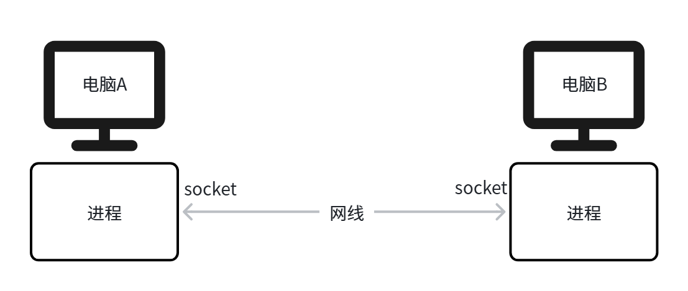
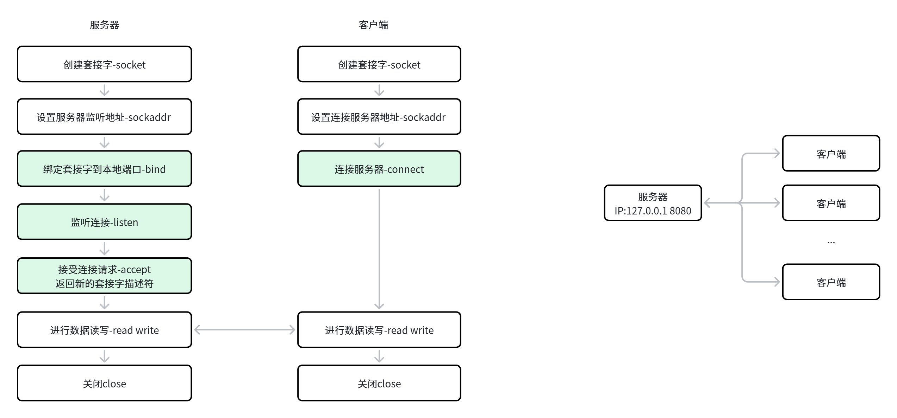
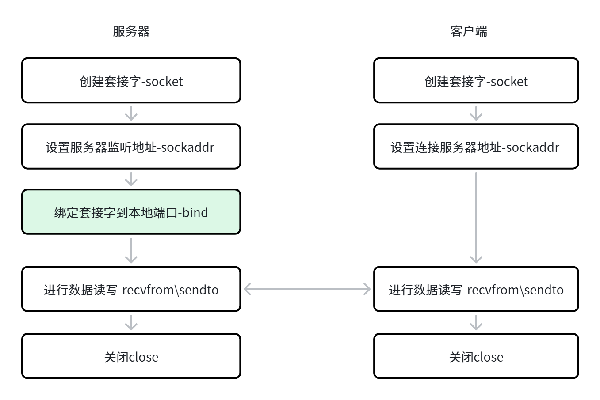

# Linux 基础

Linux API速查手册网站 https://www.bookstack.cn/read/linuxapi/SUMMARY.md
## Linux 基础命令速记

### `mkdir -p ~/catkin_ws/src`

```bash
mkdir -p ~/catkin_ws/src
```

- `mkdir` = make directory，创建文件夹。
- `-p` = parents，表示中间目录不存在时也一起创建。
- 如果不加 `-p`，直接执行 `mkdir catkin_ws/src`，而 `catkin_ws` 又不存在，就会直接报错。
- `~` 表示当前用户的家目录。

等价写法：

```bash
mkdir -p /home/你的用户名/catkin_ws/src
```

### `nano test.cpp`

```bash
nano test.cpp
```

用于打开并编辑文本文件；如果文件不存在，则会新建该文件。

### `ls`
```bash
ls
```
用于列出当前目录中的文件和文件夹。

| 符号 | 含义 |
| ---- | ---- |
| `.`  | 当前目录 |
| `..` | 上一级目录（父目录） |

```text
drwxr-xr-x 29 yun  yun  4096 5月   7 07:29 .
drwxr-xr-x  3 root root 4096 2月   4 00:00 ..
```

## Linux系统IO
//ssize_t是有符号整数类型，表示读写的字节数，返回值为-1表示出错
//off_t是有符号整数类型，表示文件偏移量，单位是字节
//size_t是无符号整数类型，表示写入的字节数
### `open`、`creat`

```c
#include <sys/types.h>
#include <sys/stat.h>
#include <fcntl.h>//fcntl是file control的缩写
#include <unistd.h>
int open(const char* pathname,int flags);
int open(const char* pathname,int flags,mode_t mode);
int creat(const char* pathname,mode_t mode);
int close(int fd);
```

### `read`

```c
#include <unistd.h>
ssize_t read(int fd, void *buf, size_t count);
// fd	文件描述符
// buf	读取的数据存放在buf指针指向的缓冲区
// count	读取的字节数
```

### `write`

```c
#include <unistd.h>
ssize_t write(int fd, const void *buf, size_t count);
// 参数同read函数
```

### `lseek`

```c
#include <sys/types.h>
#include <unistd.h>
off_t lseek(int fd, off_t offset, int whence);
// fd是文件描述符
// offset是偏移量
// whence是偏移量的基准位置。它的取值有三个
// SEEK_SET: 开始位置
// SEEK_CUR: 当前位置
// SEEK_END: 末尾位置
```

## C标准库IO
### `fopen`

```c
#include <stdio.h>
FILE *fopen(const char *pathname, const char *mode);
// pathname是文件路径
// mode是打开文件的模式，常见的有：
// "r"：只读模式，文件必须存在，否则返回NULL
// "w"：写入模式，如果文件存在则清空内容，如果文件不存在则创建新文件
// "a"：追加模式，如果文件存在则在末尾添加内容，如果文件不存在则创建新文件
// "r+"：读写模式，文件必须存在，否则返回NULL
// "w+"：读写模式，如果文件存在则清空内容，如果文件不存在则创建新文件
// "a+"：读写模式，如果文件存在则在末尾添加内容，如果文件不存在则创建新文件
```

### `fclose`

```c
#include <stdio.h>
int fclose(FILE *stream);
// stream是指向FILE对象的指针，表示要关闭的文件流
```

### `fread`

```c
#include <stdio.h>
size_t fread(void *ptr, size_t size, size_t nmemb, FILE *stream);
// ptr是指向一个内存块的指针，读取的数据将存储在此处
// size是每个元素的大小，单位是字节
// nmemb是要读取的元素数量
// stream是指向FILE对象的指针，表示要读取的文件流
```

### `fwrite`

```c
#include <stdio.h>
size_t fwrite(const void *ptr, size_t size, size_t nmemb, FILE *stream);
// 参数同fread函数
```

### `fseek`

```c
#include <stdio.h>
int fseek(FILE *stream, long offset, int whence);
// stream是指向FILE对象的指针，表示要操作的文件流
// offset是偏移量，单位是字节
// whence是偏移量的基准位置。它的取值有三个
// SEEK_SET: 开始位置
// SEEK_CUR: 当前位置
// SEEK_END: 末尾位置
```

### `fclose`

```c
#include <stdio.h>
int fclose(FILE *stream);
// stream是指向FILE对象的指针，表示要关闭的文件流
```

## 进程
Linux 启动后会创建 PID 为 1 的初始进程，后续大多数进程都由它直接或间接创建，整体形成一棵进程树，可用 `pstree` 查看。

- 父进程：创建子进程，可以发送信号、等待子进程结束并获取退出状态。
- 子进程：由父进程创建，初始时相当于父进程的副本，拥有独立地址空间。
- 孤儿进程：父进程先结束，子进程仍在运行，会被 PID 为 1 的进程收养。
- 僵尸进程：子进程已退出，但父进程未调用 `wait` / `waitpid` 回收退出状态。
### `fork`

```c
#include <unistd.h>
pid_t fork(void);
```

`fork` 用于创建子进程。调用后父子进程都会从 `fork` 后继续执行，可通过返回值区分：
- 父进程中返回子进程 PID。
- 子进程中返回 `0`。
- 失败返回 `-1`。

```c
pid_t pid = fork();
if (pid < 0) {
    perror("fork");
} else if (pid == 0) {
    printf("child pid = %d\n", getpid());
} else {
    printf("parent pid = %d, child pid = %d\n", getpid(), pid);
}
```

### 进程终止
进程正常终止：
- `main` 函数中 `return`。
- 调用 `exit(status)`，`status` 是传给父进程的退出状态码。
进程异常终止：收到信号后退出，例如 `SIGKILL`、`SIGSEGV`。
### `wait`、`waitpid`

```c
#include <sys/wait.h>
pid_t wait(int *status);
pid_t waitpid(pid_t pid, int *status, int options);
```

父进程通过 `wait` / `waitpid` 等待子进程结束，并回收子进程资源。
- `pid > 0`：等待指定 PID 的子进程。
- `pid = -1`：等待任意子进程，等同于 `wait`。
- `options = 0`：阻塞等待。
- `options = WNOHANG`：非阻塞检查，子进程未退出时返回 `0`。

```c
int status;
waitpid(pid, &status, 0);
printf("child exit status = %d\n", WEXITSTATUS(status));
```

### `exec`
`fork` 只会复制当前进程。如果希望子进程执行另一个程序，需要在子进程中调用 `exec` 系列函数。

```c
#include <unistd.h>
int execl(const char *path, const char *arg, ...);
```

`exec` 成功后不会返回，当前进程的代码、数据会被新程序替换；失败返回 `-1`。

```c
pid_t pid = fork();
if (pid == 0) {
    execl("/bin/ls", "ls", "-l", "/etc", (char *)NULL);
    perror("execl");
    return 1;
} else {
    int status;
    waitpid(pid, &status, 0);
}
```

常见 `exec` 函数区别：
- `l`：参数用列表传递，如 `execl`、`execlp`。
- `v`：参数用数组传递，如 `execv`、`execvp`。
- `p`：按 `PATH` 搜索程序，如 `execlp`、`execvp`。
- `e`：可额外指定环境变量，如 `execle`、`execve`。
### 保活进程思路
大型项目中可以用一个监控进程启动并管理业务进程：先 `fork`，子进程 `exec` 启动目标程序；父进程循环调用 `waitpid(pid, &status, WNOHANG)` 检查状态，发现子进程退出后重新启动。

```c
#include <stdio.h>
#include <stdlib.h>
#include <unistd.h>
#include <sys/wait.h>
#define PROGRAM "./hello"
pid_t start_program(void) {
    pid_t pid = fork();
    if (pid == 0) {
        execl(PROGRAM, PROGRAM, (char *)NULL);
        perror("execl");
        exit(1);
    }
    if (pid < 0) {
        perror("fork");
        exit(1);
    }
    return pid;
}

int main(void) {
    pid_t pid = start_program();

    while (1) {
        int status;
        pid_t ret = waitpid(pid, &status, WNOHANG);
        if (ret == pid) {
            printf("process exit, restart\n");
            pid = start_program();
        } else if (ret < 0) {
            perror("waitpid");
            exit(1);
        }
        usleep(10 * 1000);
    }
}
```

## 进程间通信
### 匿名管道

```c
#include <unistd.h>
int pipe(int pipefd[2]);
// pipefd是一个长度为2的整数数组，pipefd[0]用于读取数据，pipefd[1]用于写入数据，成功返回0，失败返回-1
```

1、只能用于亲缘关系的进程间通信（父子进程，兄弟进程）
2、管道通信是单工的，一端读，一端写（需要程序实现设计好）。
3、在创建管道后，确保关闭不再需要的文件描述符。例如，如果一个进程只需要读取数据，应该关闭写端；反之亦然。这可以防止文件描述符泄露，并确保管道在不再需要时能够正确关闭。
4、管道有一个固定的缓冲区大小（通常是 64KB），如果写入的数据超过缓冲区大小，写操作会阻塞，直到有足够的空间。因此，确保读取速度跟上写入速度，避免阻塞。
### 命名管道

```c
#include <sys/types.h>
#include <sys/stat.h>
#include <fcntl.h>
int mkfifo(const char *pathname, mode_t mode);
// pathname是命名管道的路径
// mode是命名管道的权限，例如，0666 表示所有用户都有读写权限。成功返回0，失败返回-1
```

注意事项：
1、有名管道可以使非亲缘的两个进程互相通信
2、通过路径名来操作，在文件系统中可见，但内容存放在内存中
### 消息队列

```c
#include <sys/types.h>
#include <sys/ipc.h>
#include <sys/msg.h>
int msgget(key_t key, int msgflg);
// key是消息队列的键值，可以使用ftok函数生成
// msgflg是消息队列的标志，常见的有：
// IPC_CREAT: 如果消息队列不存在则创建
// IPC_EXCL: 与IPC_CREAT一起使用，如果消息队列已存在则返回错误
```

### 共享内存（POSIX）

```c
#include <sys/mman.h>
#include <fcntl.h>
int shm_open(const char *name, int oflag, mode_t mode);
//- 功能：创建或打开一个命名的共享内存对象。
//- 参数：
//  - name：共享内存对象的名字,使用路径字符串（如 ./my_shm）。
//  - oflag：操作标志，如 O_CREAT, O_RDWR, O_RDONLY 等。O_RDONLY（只读）、O_WRONLY（只写）、O_RDWR（读写）O_CREAT（不存在则创建）、O_TRUNC（清空）、O_APPEND（追加）
//  - mode：权限设置，常见的权限设置包括 0666（所有用户都有读写权限）。
//- 返回值：成功返回文件描述符（fd），失败返回 -1。
```

```c
#include <unistd.h>
#include <sys/mman.h>
int ftruncate(int fd, off_t length);//设置共享内存大小
// - 功能：设置由 shm_open 返回的共享内存对象的大小。
// - 参数：
//   - fd：由 shm_open 返回的文件描述符。
//   - length：共享内存大小（字节）。
// - 返回值：成功返回 0，失败返回 -1。
```

```c
#include <sys/mman.h>
void *mmap(void *addr, size_t length, int prot, int flags, int fd, off_t offset);//将共享内存映射到进程地址空间
// - 功能：将共享内存映射到当前进程的虚拟地址空间中。
// - 参数：
//   - addr：建议的映射起始地址（通常为 NULL 让系统自动分配）。
//   - length：要映射的内存长度。
//   - prot：设置内存区域的保护模式（读/写/执行权限），如 PROT_READ可读、PROT_WRITE可写。
//   - flags：映射标志，默认 MAP_SHARED适用于进程间通信，MAP_PRIVATE不会被其他进程看到，适用于只读映射或临时数据处理。
//   - fd：由 shm_open 返回的文件描述符。
//   - offset：偏移量（通常为 0）。
// - 返回值：成功返回映射后的指针，失败返回 MAP_FAILED。
```

```c
#include <sys/mman.h>
int munmap(void *addr, size_t length);//解除映射
// - 功能：解除之前通过 mmap 创建的内存映射关系。
// - 参数：
//   - addr：mmap 返回的映射地址。
//   - length：映射的长度。
// - 返回值：成功返回 0，失败返回 -1。
```

```c
#include <sys/mman.h>
int shm_unlink(const char *name);//删除共享内存对象
// - 功能：删除一个命名的共享内存对象。
// - 参数：
//   - name：共享内存对象的名字（与 shm_open 中使用的名字相同）。
// - 返回值：成功返回 0，失败返回 -1。
```

注意事项：
在 CMakeLists.txt 中，使用 target_link_libraries 显式链接 rt：
target_link_libraries(your_program rt)  # 添加 -lrt
表示链接 librt 库（rt 是 "Real-Time" 的缩写）。librt 提供了 POSIX 实时扩展功能
### 信号量

```c
#include <sys/types.h>
#include <sys/ipc.h>
#include <sys/sem.h>
int semget(key_t key, int nsems, int semflg);
// key是信号量集合的键值，可以使用ftok函数生成
// nsems是信号量集合中的信号量数量
// semflg是信号量集合的标志，常见的有：
// IPC_CREAT: 如果信号量集合不存在则创建
// IPC_EXCL: 与IPC_CREAT一起使用，如果信号量集合已存在则返回错误
```

### 消息队列

```c
#include <mqueue.h>
mqd_t mq_open(const char *name, int oflag, mode_t mode, struct mq_attr *attr);
// - 功能：创建或打开一个命名的消息队列。
// - 参数：
//   - name：消息队列名称（以 / 开头，如 /my_queue）。
//   - oflag：操作标志，如 O_CREAT, O_RDONLY, O_WRONLY, O_RDWR。
//   - mode：权限设置（如 0666），仅在创建时使用。
//   - attr：指向 mq_attr 结构，指定最大消息数、每条消息最大长度等属性，如果 attr 为 NULL，则使用系统默认值（通常 mq_maxmsg=10，mq_msgsize=8192）
// - 返回值：成功返回消息队列描述符（mqd_t），失败返回 (mqd_t) -1。
```

```c
struct mq_attr {
    long mq_flags;       // 队列标志（O_NONBLOCK）
    long mq_maxmsg;      // 最大消息数
    long mq_msgsize;     // 每条消息最大长度
    long mq_curmsgs;     // 当前队列中的消息数
};
//使用参考：
struct mq_attr attr;
attr.mq_flags = 0;
attr.mq_maxmsg = 10;
attr.mq_msgsize = 256;
attr.mq_curmsgs = 0;
```

```c
#include <mqueue.h>
int mq_send(mqd_t mqdes, const char *msg_ptr, size_t msg_len, unsigned int msg_prio);
ssize_t mq_receive(mqd_t mqdes, char *msg_ptr, size_t msg_len, unsigned int *msg_prio);
// - 功能：
//   - mq_send 向队列中发送一条消息。
//   - mq_receive 从队列中接收一条消息。
// - 参数说明：
//   - mqdes：由 mq_open 返回的消息队列描述符。
//   - msg_ptr：消息内容缓冲区。
//   - msg_len：消息长度（必须 ≥ 队列的最大消息长度）。
//   - msg_prio：消息优先级（数值越大优先级越高）。
// - 返回值：成功返回 0（发送）或实际读取字节数（接收），失败返回 -1。
```

```c
#include <mqueue.h>
int mq_close(mqd_t mqdes);//关闭消息队列
```

- 功能：关闭之前打开的消息队列描述符。
- 返回值：成功返回 0，失败返回 -1。

```c
#include <mqueue.h>
int mq_unlink(const char *name);//删除消息队列
```

- 功能：删除指定名称的消息队列（即使仍有进程打开也不会立即删除，直到所有引用关闭）。
- 返回值：成功返回 0，失败返回 -1。

### 信号

```c
#include <signal.h>
```

__sighandler_t signal(int __sig, __sighandler_t __handler) 设置信号处理函数

```c
// 参数：
// __sig：信号编号。
// __handler：信号处理函数。
// 返回值：
// 成功时返回之前的信号处理函数指针。
// 失败时返回 SIG_ERR。
//__sighandler_t 是一个函数指针类型，我们可以基于它来传递函数。
//使用示例：
void signal_handler(int sig) {
    printf("Caught signal %d\n", sig);
}
signal(SIGINT, signal_handler);  // 捕获 Ctrl+C
//发送信号给进程。
#include <signal.h>
#include <sys/types.h>
int kill(pid_t pid, int sig);
// 参数：
// pid：目标进程的 PID。
// sig：要发送的信号编号。
//使进程暂停，直到接收到信号。
#include <unistd.h>
int pause(void);
```

### 信号量

```c
//sem_open - 创建或打开有名信号量
#include <semaphore.h>
#include <fcntl.h>           /* For O_* constants */
sem_t *sem_open(const char *name, int oflag, mode_t mode, unsigned int value);
// - 功能：创建或打开一个命名信号量。
// - 参数：
//   - name：信号量名称（以 / 开头，如 /my_sem）。
//   - oflag：操作标志，如 O_CREAT, O_RDWR。
//   - mode：权限设置（如 0666）。
//   - value：初始值。
// - 返回值：成功返回指向 sem_t 的指针，失败返回 SEM_FAILED。
// 例如
sem_open(SEM_NAME, O_CREAT | O_RDWR, 0666, 0);
// ---
// sem_close - 关闭有名信号量
#include <semaphore.h>
int sem_close(sem_t *sem);
// - 功能：关闭之前由 sem_open 打开的信号量。
// - 返回值：成功返回 0，失败返回 -1。
//---
// sem_unlink - 删除有名信号量
#include <semaphore.h>
int sem_unlink(const char *name);
// - 功能：删除指定名称的有名信号量（即使仍有进程打开也不会立即删除）。
// - 返回值：成功返回 0，失败返回 -1。
//---
// sem_wait / sem_trywait - 等待信号量
// sem_wait
int sem_wait(sem_t *sem);
// - 阻塞直到信号量大于 0，并将其减 1。
//sem_trywait
int sem_trywait(sem_t *sem);
// - 非阻塞，如果信号量为 0，则立即返回 -1，否则减 1。
//---
//sem_post - 增加信号量值
#include <semaphore.h>
int sem_post(sem_t *sem);
// - 功能：将信号量值加 1，唤醒正在等待的线程/进程。
// - 返回值：成功返回 0，失败返回 -1。
```

编译提示错误：undefined reference to symbol 'sem_close@@GLIBC_2.2.5'
添加-lrt -lpthread

## 线程

```c
#include <pthread.h>
pthread_create
int pthread_create(pthread_t *thread, const pthread_attr_t *attr, void *(*start_routine) (void *), void *arg);
```

功能：创建一个新的线程。
参数：
thread：用于存储新创建线程的标识符。
attr：用于指定线程属性（如栈大小、优先级等）。通常设置为 NULL 表示使用默认属性。
start_routine：线程的入口函数，类型为 void *(*start_routine)(void *)。
arg：传递给 start_routine 函数的参数，类型为 void *。
返回值：成功时返回 0，失败时返回错误码。

```c
pthread_join
int pthread_join(pthread_t thread, void **retval);
```

功能：等待指定的线程结束，并获取其返回值。
参数：
thread：要等待的线程的标识符。
retval：指向 void * 类型的指针，用于存储线程的返回值。如果不需要获取返回值，可以设置为 NULL。
返回值：成功时返回 0，失败时返回错误码。

```c
pthread_exit
void pthread_exit(void *retval);
```

功能：使当前线程终止，并返回一个值。
参数：
retval：线程的返回值，类型为 void *。这个值可以通过 pthread_join 函数获取。
返回值：无返回值，因为该函数不会返回。

```c
pthread_cancel
int pthread_cancel(pthread_t thread);
```

功能：请求取消指定的线程。可以用于一个线程取消另一个线程
参数：
thread：要取消的线程的标识符。
返回值：成功时返回 0，失败时返回错误码。

### 互斥锁

初始化互斥锁

```c
int pthread_mutex_init(pthread_mutex_t *mutex, const pthread_mutexattr_t *attr);
```

功能：初始化一个互斥锁。
参数：
mutex：指向 pthread_mutex_t 类型的指针，用于存储互斥锁。
attr：指向 pthread_mutexattr_t 类型的指针，用于指定互斥锁属性。通常设置为 NULL 表示使用默认属性。
返回值：成功时返回 0，失败时返回错误码。

获取互斥锁

```c
int pthread_mutex_lock(pthread_mutex_t *mutex);
```

功能：获取互斥锁。如果锁已被其他线程占用，调用线程会阻塞，直到锁被释放。
参数：
mutex：指向 pthread_mutex_t 类型的指针，用于获取互斥锁。
返回值：成功时返回 0，失败时返回错误码。

尝试获取互斥锁

```c
int pthread_mutex_trylock(pthread_mutex_t *mutex);
```

功能：尝试获取互斥锁，如果锁已被其他线程持有，则立即返回。
参数：
mutex：指向 pthread_mutex_t 类型的指针，用于尝试获取互斥锁。
返回值：
成功时返回 0。
如果锁已被其他线程持有，返回 EBUSY。
其他错误返回相应的错误码。

释放互斥锁

```c
int pthread_mutex_unlock(pthread_mutex_t *mutex);
```

功能：释放互斥锁。
参数：
mutex：指向 pthread_mutex_t 类型的指针，用于释放互斥锁。
返回值：成功时返回 0，失败时返回错误码。

销毁互斥锁

```c
int pthread_mutex_destroy(pthread_mutex_t *mutex);
```

功能：销毁一个互斥锁。
参数：
mutex：指向 pthread_mutex_t 类型的指针，用于销毁互斥锁。
返回值：成功时返回 0，失败时返回错误码。

### 线程同步

初始化条件变量Condition Varialbes

```c
int pthread_cond_init(pthread_cond_t *cond, const pthread_condattr_t *attr);
```

功能：初始化一个条件变量。
参数：
cond：指向 pthread_cond_t 类型的指针，用于存储条件变量。
attr：指向 pthread_condattr_t 类型的指针，用于指定条件变量属性。通常设置为 NULL 表示使用默认属性。
返回值：成功时返回 0，失败时返回错误码。

唤醒一个等待的线程

```c
int pthread_cond_signal(pthread_cond_t *cond);
```

功能：唤醒一个等待该条件变量的线程。
参数：
cond：指向 pthread_cond_t 类型的指针，表示要唤醒的条件变量。
返回值：成功时返回 0，失败时返回错误码。

等待条件变量

```c
int pthread_cond_wait(pthread_cond_t *cond, pthread_mutex_t *mutex);
```

功能：等待条件变量。调用此函数的线程会释放互斥锁并进入等待状态，直到被其他线程唤醒。
参数：
cond：指向 pthread_cond_t 类型的指针，表示要等待的条件变量。
mutex：指向 pthread_mutex_t 类型的指针，表示与条件变量关联的互斥锁。
返回值：成功时返回 0，失败时返回错误码。

销毁条件变量

```c
int pthread_cond_destroy(pthread_cond_t *cond);
```

功能：销毁一个条件变量。
参数：
cond：指向 pthread_cond_t 类型的指针，用于销毁条件变量。
返回值：成功时返回 0，失败时返回错误码。

## Socket通信



什么是Socket通信？
Socket（套接字）是网络通信的编程接口，用于不同设备之间的数据传输。它基于IP地址 + 端口号的组合，允许应用程序通过网络发送和接收数据。
Socket通信的核心是客户端-服务器模型：
1. 服务器：监听某个端口，等待客户端连接。
2. 客户端：主动向服务器的IP和端口发起连接请求。
3. 建立连接后，双方可以互相发送数据。
```sql
+-----------------------+
| HTTP FTP MQTT(应用层)   |  ← 基于文本/二进制的应用协议（如GET /index.html）
+-----------------------+
|    TCP UDP(传输层)      |  ← 可靠连接、流量控制、数据分段（端口号：80/443）
+-----------------------+
|      IP (网络层)        |  ← 寻址和路由（如192.168.1.1 → 公网IP）
+-----------------------+
|    Socket (编程接口)    |  ← 操作系统提供的API（如socket()、bind()、send()）
+-----------------------+
|物理层(有线网络/WiFi模块) |  ← 实际数据传输（如WiFi模组）
+-----------------------+
```
TCP和UDP是两种计算机网络传输协议，用于在网络中传输数据。
TCP（传输控制协议）是一种需要连接的，可靠的协议，它确保数据在发送和接收之间的完整性和顺序。它通过使用序列号、确认和重传机制来实现这一点。TCP在需要可靠传输的应用程序中使用，例如网页浏览器、电子邮件和文件传输。
UDP（用户数据报协议）是一种无连接的，不可靠的协议，它不保证数据的完整性或顺序。UDP更适合需要快速传输数据的应用程序，例如视频和音频流媒体、在线游戏和DNS查询。UDP在传输数据时速度更快，因为它不需要进行确认或重传机制，但是在网络不稳定或拥塞时，会导致数据包丢失或错误。
### TCP通信流程



TCP 通信流程
服务器端
创建套接字：使用 socket 函数创建一个套接字。
绑定地址：使用 bind 函数将套接字绑定到本地地址和端口。
监听连接：使用 listen 函数使套接字进入监听状态。
接受连接：使用 accept 函数接受客户端的连接请求。
读写数据：使用 read 和 write 函数进行数据的读写。
关闭套接字：使用 close 函数关闭套接字。

客户端
创建套接字：使用 socket 函数创建一个套接字。
连接服务器：使用 connect 函数连接到服务器。
读写数据：使用 read 和 write 函数进行数据的读写。
关闭套接字：使用 close 函数关闭套接字。
TCP 通信流程
服务器端
创建套接字：使用 socket 函数创建一个套接字。
绑定地址：使用 bind 函数将套接字绑定到本地地址和端口。
监听连接：使用 listen 函数使套接字进入监听状态。
接受连接：使用 accept 函数接受客户端的连接请求。
读写数据：使用 read 和 write 函数进行数据的读写。
关闭套接字：使用 close 函数关闭套接字。

客户端
创建套接字：使用 socket 函数创建一个套接字。
连接服务器：使用 connect 函数连接到服务器。
读写数据：使用 read 和 write 函数进行数据的读写。
关闭套接字：使用 close 函数关闭套接字。
创建套接字

```c
#include<sys/socket.h>
int socket(int domain, int type, int protocol);
```

socket() 为通讯创建一个端点，为套接字返回一个文件描述符。

参数：
domain 为创建的套接字指定协议集。 例如：
AF_INET 表示IPv4网络协议
AF_INET6 表示IPv6
type 参数指定套接字的类型
常见的类型有 SOCK_STREAM（流套接字/TCP 套接字）和 SOCK_DGRAM（数据报套接字/UDP套接字）等。
protocol 指定实际使用的传输协议。
最常见的就是IPPROTO_TCP、IPPROTO_SCTP、IPPROTO_UDP、IPPROTO_DCCP。
如果该项为0的话，即根据选定的domain和type选择使用缺省协议。
返回值：

socket 函数的返回值为新创建的套接字的文件描述符，如果创建失败则返回 -1。

示例：
创建TCP套接字

```c
int sockfd = socket(AF_INET, SOCK_STREAM, 0);
```

创建UDP套接字

```c
int sockfd = socket(AF_INET, SOCK_DGRAM, 0);
```

设置服务器监听/客户端连接的IP和端口信息

```c
#include<netinet/in.h>
struct sockaddr_in {
    sa_family_t    sin_family; /* 套接字协议族 IPV4  AF_INET */
    in_port_t      sin_port;   /* 端口号 例如 8888*/
    struct in_addr sin_addr;   /* IP 地址 */
};
struct in_addr {
    uint32_t       s_addr;     /* IP地址 */
};
```

示例：

```c
struct sockaddr_in serv_addr;
serv_addr.sin_family = AF_INET; //IPV4
serv_addr.sin_port = htons(8080); //端口设置
```

```c
// 将 IP 地址从字符串转换为二进制形式并存入serv_addr.sin_addr
inet_pton(AF_INET, "127.0.0.1", &serv_addr.sin_addr)
```

htons说明：

```c
#include <arpa/inet.h>
uint16_t htons(uint16_t hostshort);
```

作用：将 16位无符号整数 从 主机字节序 转换为 网络字节序
"htons" 是 "host to network short" 的缩写
字节序背景：
主机字节序：可能是大端序(Big-Endian)或小端序(Little-Endian)，取决于CPU架构
网络字节序：TCP/IP协议规定使用大端序(Big-Endian)

inet_pton说明：

```c
#include <arpa/inet.h>
int inet_pton(int af, const char *src, void *dst);
```

作用：将 IP 地址从字符串转换为二进制形式
参数类型说明
afint地址族 (Address Family)：
• AF_INET - IPv4地址
• AF_INET6 - IPv6地址
srcconst char*源字符串（IP字符串："127.0.0.1"）
dstvoid*目标缓冲区：
• IPv4: 指向struct in_addr
• IPv6: 指向struct in6_addr
返回值：
返回1转换成功，其它值转换失败

connect，用于客户端，连接服务器

```c
#include <sys/socket.h>
int connect(int sockfd, const struct sockaddr *addr, socklen_t addrlen);
```

函数参数说明：
sockfd：通过socket()创建的有效套接字描述符
addr：参数 addr 是指向目标服务器地址的指针，通常是一个 sockaddr_in(IPV4 结构体) 或 sockaddr_in6(IPV6 结构体) 结构体类型的指针。
addrlen：目标服务器地址的长度。
通常使用sizeof(struct sockaddr_in)或sizeof(struct sockaddr_in6)
返回值：
0连接成功建立
-1连接失败，错误码存储在errno中

示例：

```c
connect(sock, (struct sockaddr *)&serv_addr, sizeof(sockaddr_in));
```

bind，用于服务器端，绑定监听地址和端口

```c
#include<sys/socket.h>
int bind(int sockfd, const struct sockaddr *addr, socklen_t addrlen);
```

bind 函数的作用是将一个 socket 绑定到一个具体的地址和端口上。这个地址和端口可以是任意的本地或远程地址和端口，但必须是未被其他 socket 使用的地址和端口。

参数：
sockfd：表示要绑定的 socket 描述符。
addr：表示要绑定的地址信息，是一个指向 struct sockaddr 类型的指针。
addrlen：表示地址信息的长度，通常使用 sizeof 运算符获取。

返回值
成功时返回 0
失败时返回 -1

示例

```c
struct sockaddr_in address;
address.sin_family = AF_INET;
address.sin_addr.s_addr = INADDR_ANY;
address.sin_port = htons(PORT);
bind(server_fd, (struct sockaddr *)&address, sizeof(address));
```

listen，用于服务器端，将套接字设置为监听模式，使其能够接收来自客户端的连接请求。

```c
#include <sys/socket.h>
int listen(int sockfd, int backlog);
```

将套接字设置为监听模式，使其能够接收来自客户端的连接请求。
参数：
sockfd 套接字文件描述符
backlog：决定监听队列大小

函数成功执行时返回 0，失败返回 -1

accept，用于服务器端，接受客户端的连接请求并创建一个新的套接字来处理与该客户端的通信。

```c
#include <sys/types.h>
#include <sys/socket.h>
int accept(int sockfd, struct sockaddr *addr, socklen_t *addrlen);
```

用于接受客户端的连接请求并创建一个新的套接字来处理与该客户端的通信。

sockfd：表示监听套接字的文件描述符。
addr：表示传出参数，指向客户端地址的结构体指针。
addrlen：表示传入传出参数，传入的是指向客户端地址结构体的长度，传出的是客户端地址结构体的实际长度。

如果 accept() 函数调用成功，则返回一个新的套接字描述符，这个套接字描述符用于和客户端进行通信。
如果调用失败，则返回 -1。

当一个客户端发起连接请求时，服务器端的 accept() 函数会从连接请求队列中取出一个连接请求，然后创建一个新的套接字用于和该客户端进行通信
连接成功后，通过write或read函数进行读写，使用完成使用close函数关闭。

### UDP通信流程



服务器端
创建套接字：使用 socket 函数创建一个套接字。
绑定地址：使用 bind 函数将套接字绑定到本地地址和端口。
读写数据：使用 recvfrom 和 sendto 函数进行数据的读写。
关闭套接字：使用 close 函数关闭套接字。

客户端
创建套接字：使用 socket 函数创建一个套接字。
读写数据：使用 sendto 和 recvfrom 函数进行数据的读写。
关闭套接字：使用 close 函数关闭套接字。

recvfrom指定地址接收函数

```c
#include <sys/socket.h>
ssize_t recvfrom(
    int sockfd,                // Socket 文件描述符
    void *buf,                 // 接收数据的缓冲区
    size_t len,                // 缓冲区大小
    int flags,                 // 控制标志（通常填 0-默认阻塞）
    struct sockaddr *src_addr, // 发送方的地址信息（输出参数）
    socklen_t *addrlen         // 地址结构体长度（输入输出参数）
);
```

参数：
sockfd：UDP Socket文件描述符
buf：存放接收数据的缓冲区
len：缓冲区大小
flags：控制选项-0（默认阻塞）-MSG_DONTWAIT（非阻塞）
src_addr：存放发送方的 IP + 端口，如果不需要发送方信息，可以传 NULL
addrlen：src_addr结构体的大小

返回值
成功：返回接收到的字节数（> 0）
失败：返回 -1

使用示例：

```c
int sockfd = socket(AF_INET, SOCK_DGRAM, 0);
struct sockaddr_in sender_addr;
socklen_t sender_len = sizeof(sender_addr);
// 阻塞接收数据
char buffer[1024];
int n = recvfrom(sockfd, buffer, sizeof(buffer), 0,  (struct sockaddr *)&sender_addr, &sender_len);
if (n == -1) {
    printf("recvfrom failed");
} else {
    buffer[n] = '\0';  // 确保字符串终止
    printf("Received %d bytes from %s:%d\n", n,
           inet_ntoa(sender_addr.sin_addr), ntohs(sender_addr.sin_port));
}
```

sendto指定地址发送函数

```c
#include <sys/socket.h>
ssize_t sendto(
    int sockfd,                      // Socket 文件描述符
    const void *buf,                 // 要发送的数据
    size_t len,                      // 数据长度
    int flags,                       // 控制标志（通常填 0）
    const struct sockaddr *dest_addr, // 目标地址（IP + 端口）
    socklen_t addrlen                // 目标地址结构体长度
);
```

参数：
sockfd：UDP Socket文件描述符
buf：要发送的数据
len：数据长度
flags：控制选项，-0（默认阻塞）-MSG_DONTWAIT（非阻塞）
dest_addr：目标地址
addrlen：目标地址结构体长度
返回值
成功：返回实际发送的字节数（通常等于 len）
失败：返回 -1

示例：
初始化服务器信息：

```c
int sockfd = socket(AF_INET, SOCK_DGRAM, 0);
struct sockaddr_in server_addr = {
    .sin_family = AF_INET,
    .sin_port = htons(8080),
    .sin_addr.s_addr = inet_addr("127.0.0.1")
};
// 发送数据到UDP服务器
const char *message = "Hello, UDP Server!";
sendto(sockfd, message, strlen(message), 0,(struct sockaddr *)&server_addr, sizeof(server_addr));
```

UDP服务端

```c
#include <stdio.h>
#include <stdlib.h>
#include <string.h>
#include <unistd.h>
#include <arpa/inet.h>

#define PORT 8080
#define BUFFER_SIZE 1024

int main() {
    int server_fd;
    struct sockaddr_in address;
    int addrlen = sizeof(address);

    // 创建套接字
    if ((server_fd = socket(AF_INET, SOCK_DGRAM, 0)) < 0) {
        printf("socket failed");
        return 1;
    }
    // 绑定地址
    address.sin_family = AF_INET;
    address.sin_addr.s_addr = INADDR_ANY;
    address.sin_port = htons(PORT);
    if (bind(server_fd, (struct sockaddr *)&address, sizeof(address)) < 0) {
        printf("bind failed");
        close(server_fd);
        return 1;
    }
    printf("UDP Server listening on port %d\n", PORT);

    // 读取数据
    char buffer[BUFFER_SIZE] = {0};
    int n = recvfrom(server_fd, buffer, BUFFER_SIZE, 0, (struct sockaddr *)&address, (socklen_t*)&addrlen);
    printf("Received from client: %s\n", buffer);
    // 发送数据
    const char *message = "Hello from server";
    sendto(server_fd, message, strlen(message), 0, (struct sockaddr *)&address, addrlen);

    // 关闭套接字
    close(server_fd);
    return 0;
}
```

UDP客户端

```c
#include <stdio.h>
#include <stdlib.h>
#include <string.h>
#include <unistd.h>
#include <arpa/inet.h>

#define PORT 8080
#define BUFFER_SIZE 1024

int main() {
    int sock = 0;
    struct sockaddr_in serv_addr;

    // 创建套接字
    if ((sock = socket(AF_INET, SOCK_DGRAM, 0)) < 0) {
        printf("socket failed");
        return 1;
    }

    serv_addr.sin_family = AF_INET;
    serv_addr.sin_port = htons(PORT);
    // 将 IP 地址从字符串转换为二进制形式
    if (inet_pton(AF_INET, "127.0.0.1", &serv_addr.sin_addr) <= 0) {
        printf("inet_pton failed");
        close(sock);
        return 1;
    }

    // 发送数据
    const char *message = "Hello from client";
    sendto(sock, message, strlen(message), 0, (struct sockaddr *)&serv_addr, sizeof(serv_addr));

    // 读取数据
    char buffer[BUFFER_SIZE] = {0};
    int n = recvfrom(sock, buffer, BUFFER_SIZE, 0, NULL, NULL);
    printf("Received from server: %s\n", buffer);

    // 关闭套接字
    close(sock);
    return 0;
}
```

## 程序运行

```c
#include <sys/ioctl.h>  // 头文件
int ioctl(int fd, unsigned long request, ... /* arg */);
```

参数说明
fd已打开的设备文件描述符（如 /dev/fb0 的 framebuffer_fd）
request控制命令（由设备驱动定义，如 FBIOGET_VSCREENINFO）
arg可选参数，通常是指向某个数据结构的指针
返回值
成功：返回 0 或设备驱动定义的非负值。
失败：返回 -1，并设置 errno（可通过 perror 查看错误原因）。

ioctl 的用途非常广泛，主要用于：
获取/设置设备信息（如屏幕分辨率、串口波特率）。
控制设备行为（如摄像头调整曝光、调整屏幕亮度）。
特殊硬件操作（如磁盘格式化、网络接口配置）。

例如：读取&设置波特率

```c
#include <termios.h>
#include <sys/ioctl.h>

int main(void)
{
    struct termios tty;
    int fd = open("/dev/ttyS0", O_RDWR);
    ioctl(fd, TCGETS, &tty);  // 获取终端属性
    tty.c_cflag |= B9600;     // 设置波特率 9600
    ioctl(fd, TCSETS, &tty);  // 应用新属性
    close(fd);
    return 0;
}
```
