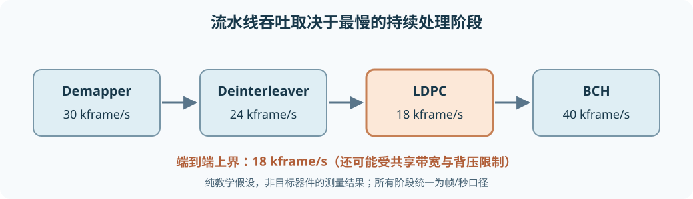

# 从零设计高吞吐架构：从单核到 DVB-S2 端到端链路

目标不是让某个 kernel 跑出漂亮的峰值，而是让输入的 DVB-S2 帧在**可接受误码率、资源、功耗和延迟**下持续流过 Demapper → Deinterleaver → LDPC → BCH。本章先补执行模型与性能单位，再算一条接近 1 Gbit/s 业务吞吐的候选链路需要什么；所有器件级数字示例均标注为**假设**，不是某块 Versal 板卡的实测承诺。

## 1. 为什么专用硬件能加速，却不能无条件加速

CPU 是按指令执行的通用核心，擅长分支、控制、配置和经常变化的任务。FPGA 的可编程逻辑（PL）可配置成许多同时工作的寄存器/运算器与数据通路，适合固定模式的流处理、位操作和专用接口。Versal AI Engine（AIE）是带标量控制、向量运算和本地存储的可编程 tile 阵列，适合重复而密集的数值 kernel。三者是不同的**执行模型**，不是把同一段 C++ 代码复制到不同地方就自然更快。

加速的前提是找到原任务的**限制因素**。如果算术正在等 DDR，增加乘法器不会提高吞吐；如果 PL 与 AIE 边界每帧搬运多次，单 tile 算得再快也可能被接口限制。异构划分应同时看计算、存储、数据移动和控制，而不只看算法名称。

```text
PS：配置、模式切换、异常/调度
 │
 ├─ DDR/NoC ── DMA ── PL：流接口、位重排、专用状态机
 │                            │ PLIO/流
 └────────────────────────── AIE：向量数值 kernel、局部缓冲
                                │
                     共同形成可测量的端到端流水线
```

## 2. 五个容易混淆的性能量

**延迟（latency）**是一份输入从进入到对应输出可用所经历的时间，单位如秒/帧。**吞吐（throughput）**是稳定运行时每秒完成多少份工作，可以是帧/秒、符号/秒、编码位/秒或业务位/秒；写数字必须注明是哪一种。**启动间隔（Initiation Interval，II）**是在流水线稳态下，相邻两份工作进入同一级之间隔多少个时钟周期。若时钟频率为 $f$ 周期/秒、每次启动处理 $W$ 个元素，则理想元素吞吐上界为 $Wf/\mathrm{II}$ 元素/秒；这是“每秒启动次数 × 每次元素数”，尚未计停顿。

**带宽（bandwidth）**是接口单位时间传送的比特或字节数，例如 PLIO 的有效 bit/s；**memory bandwidth** 特指某层存储器可持续提供/接收的字节数/秒，例如 DDR、NoC 或 AIE local bank。接口标称位宽乘时钟只是物理峰值，上层有握手、空泡、路由争用和搬运头开销时有效带宽会更低。$1\ \mathrm{GB/s}=8\ \mathrm{Gbit/s}$，字节与比特不可混写。

一个五级流水线的玩具例子：每级处理一份样本需一个 10 ns 时钟周期，填满后的 II=1；第一份输出要 5 拍即约 50 ns，之后每 10 ns 出一份，稳态约 $100$ M 样本/秒。若不用流水而串行完成五级，则每份约 50 ns，仅 $20$ M 样本/秒。这说明**延迟 50 ns 与吞吐 100 M/s 可同时成立**。若第 3 级需两拍且不能重叠，它会把整个流水线的有效 II 拉到至少 2，除非复制该级或进一步细分；只给前两级加速并不能突破它。

对独立流水级 $i$，每级可持续吞吐 $T_i$ 时，端到端上界为 $T_{\rm chain}\le\min_iT_i$，还要再受共同内存、接口、帧同步与背压约束。单位须统一：不要把“Demapper 每秒符号数”和“LDPC 每秒编码位数”直接取最小，应先按每符号位数和码率换成同一种业务位/秒或帧/秒。



## 3. 四种并行不是同一回事

**pipeline（流水线）**让不同帧/块同时处于不同处理阶段，主要提高稳态吞吐；每帧延迟未必降低。**数据并行**把同一种运算施于多个互不依赖的数据，如一批符号距离。AIE 的 **SIMD** 是数据并行的一种：一条向量指令处理多个 lane。**VLIW/指令级并行**是在同一周期安排不同功能操作，例如一次 load 与一次乘加；它依赖可并行的指令和编译器调度，不等于增加 lane。**任务并行**把不同算法阶段或不同帧放在不同处理单元。**multi-AIE** 可按符号块、帧或图的行组分割，但若多个 AIE 争用同一 LLR 数组、bank、PLIO 或 NoC，扩展效率会下降。

例如 Demapper 的每个接收符号可独立处理，易按符号块分给多个 AIE；Deinterleaver 虽然各输出位置独立，却可能因转置式跨步访存受存储 bank 限制；LDPC CN 可并行处理多个不冲突校验行，但 layered 调度的同一变量更新有依赖；BCH 每帧可并行，但一帧内部的 Berlekamp–Massey 状态递推不如批量距离计算易向量化。判断“可并行”前必须问**结果之间是否有数据依赖**与**数据到达是否足够快**。

## 4. 定点数：省资源之前先弄清误差

浮点数给学习和对照基准带来便利；PL/AIE 高吞吐链常为了带宽、资源和确定性采用**定点（fixed-point）**。定点整数 $q$ 通过固定比例 $2^{-F}$ 表示实数 $x\approx q/2^F$，$F$ 是小数位数。这种记法常称 **Q-format**，但文献对符号位是否计入整数位的命名可能不同，工程接口必须直接写清总位宽、符号、$F$ 与范围。

例如定义**有符号 8 位二补码，7 位小数**：$q\in[-128,127]$，表示范围 $[-1,127/128]$，步长 $1/128$。将 $x=0.3$ 量化为最近整数，$0.3\times128=38.4$，四舍五入得 $q=38$，恢复 $38/128=0.296875$，误差 $-0.003125$。**截断**若仅丢弃小数，通常会产生不同偏差；对负数要区分“向零截断”与“向负无穷取整”。**动态范围**是可表示的最大/最小幅度跨度，**分辨率**是相邻可表示值之间的间隔；多给整数位扩大范围，固定总位宽下会减少小数精度。

若计算得到 $x=1.2$，上述格式无法表示。**饱和（saturation）**把它钳到 $127/128$；**回绕（wrap/overflow）**会丢弃高位，可能出现完全错误的负值。LDPC LLR 的正负号表示比特偏向，溢出回绕可能直接把强烈支持 0 变成强烈支持 1，后果远比普通的小幅量化误差严重。乘法中间结果需要比输入更宽的累加器，最后缩放/舍入/饱和；AMD 的 [2026.1 DSP 库舍入与饱和说明](https://docs.amd.com/r/en-US/Vitis_Libraries/dsp/user_guide/L2/func-fft-ifft-aie-only.html_6_3)也将三者分开配置，具体模式随 AIE 代际而变。

通信链上的量化重点不同：I/Q 采样误差改变距离；Demapper 的 $N_0$ 缩放和 LLR 裁剪改变软信息校准；Deinterleaver 只移动值不应重新量化；LDPC 的边消息反复更新，饱和/归一化会改变收敛；BCH 通常处理硬比特，其域运算本身必须**精确 GF(2) / GF($2^m$)**，不是“可接受近似”的定点概率计算。每次压缩位宽都要与浮点参考比 BER/FER 和帧级误纠，而不只比均方误差。

## 5. 算力与搬运：Roofline 式思维

**算术强度（arithmetic intensity）**是完成一次任务所做的有用运算次数，除以为此从某层存储器传送的字节数，单位 ops/byte。若峰值计算吞吐为 $P_{\rm peak}$ ops/s、该层可持续带宽为 $B$ byte/s，则理想化上界为

$$P\le\min(P_{\rm peak},\ B\times I),$$

其中 $I$ 是算术强度。这不是另一种硬件指令，而是一种“算力屋顶”与“带宽斜坡”的上界模型；对不同层（DDR、NoC、local bank）应分别估算，且实际还会受依赖、路由和控制限制。[Lawrence Berkeley National Laboratory 的 Roofline 资料](https://crd.lbl.gov/assets/Uploads/ixpug16-roofline.pdf)给出这种分析方法的原始研究脉络。

教学数字例子：每元素做 16 次有用运算，从该存储层读 8 byte、写 4 byte，总计 12 byte，则 $I=16/12\approx1.33$ ops/byte。若计算峰值 100 Gops/s、可持续带宽 20 GB/s，带宽屋顶约 $20\times1.33=26.7$ Gops/s，低于计算屋顶，所以**相对于该存储层**是 memory-bound。要改善先考虑减少跨层搬运、提高局部复用、合并访问或使用更快的层，而不是先增加运算单元。若通过本地缓存让同一数据复用 4 次，则对 DDR 计算的算术强度可能显著增加；但若 local bank 变成新瓶颈，仍需看下一级 Roofline。

**连续访问**让 DMA/缓存容易形成长 burst；**随机/跨步访问**可能产生很多小事务、bank 冲突和地址开销。位交织是纯置换，算术强度极低，却可能难做；LDPC 算法每条边的加减/最小值不多，但边消息和变量位置频繁读写，往往同样是数据移动问题。距离计算则可能受算力、星座表访问或输出写带宽中的任何一种限制，不能先验判定。

### 5.1 缓冲与 DMA 也要算时间

单缓冲串行流程若输入 DMA 用 20 µs、计算 25 µs、输出 DMA 用 10 µs，一块共 55 µs。双缓冲允许当前块计算时下一块搬入、上一块搬出；若输入与输出有**独立、互不争用**的搬运资源，稳态间隔至少是 $\max(20,25,10)=25$ µs。若它们共享一条不能同时读写的 DMA，总搬运每块至少 $20+10=30$ µs，于是稳态下界变为 30 µs，不能宣称双缓冲必达 25 µs。还要检查缓冲容量、锁、同步与首尾填充开销。DMA 只负责搬运，不能修复算术阶段的 II 或不合理的访问模式。

## 6. 一次完整的 1 Gbit/s 帧级预算

选择 **DVB-S2 正常帧、8PSK 3/5、导频开启**，仅作为统一量纲的算例。[ETSI EN 302 307-1 第 5.3–5.5 节](https://www.etsi.org/deliver/etsi_en/302300_302399/30230701/01.04.01_60/en_30230701v010401p.pdf#page=22)给出：BBFRAME $38688$ 位，其中 80 位 BBHEADER；若数据字段填满，最多 $38608$ 位。BCH 后 $38880$ 位，LDPC 后 FECFRAME $64800$ 位；8PSK 每数据符号 3 编码位，故 $21600$ 数据符号。物理层另有 90 符号头，启用导频时此模式有 $14\times36=504$ 个导频符号，因此每 PLFRAME 共 $22194$ 符号。更上层封装和填充会使实际净业务位数低于这里的“填满数据字段”口径。

若想让**这一数据字段口径**达到 $1.0\times10^9$ bit/s，至少需要帧率

$$F=\frac{10^9\ \mathrm{bit/s}}{38608\ \mathrm{bit/frame}}\approx25902\ \mathrm{frame/s},$$

即每帧时间预算约 $1/F=38.608$ µs。由此换算各级**必须持续处理的数量级**：

| 工作 | 每帧 | 约每秒要求 |
| --- | ---: | ---: |
| 填满的数据字段输出 | 38608 bit | 1.000 Gbit/s |
| LDPC 输入 / BCH 输出 | 38880 bit | 1.007 Gbit/s |
| LDPC 输出 / FECFRAME 软值 | 64800 bit | 1.678 Gbit/s |
| 8PSK 数据符号 | 21600 symbol | 559.5 Msymbol/s |
| 含 PL 头与导频的物理符号 | 22194 symbol | 574.9 Msymbol/s |

这些不是单个 tile 的目标：它们是**整条系统**在该模式下的最低持续处理/发射量级。如果可用射频符号率远低于约 575 Msymbol/s，任何 PL+AIE 架构都不可能在这个单载波/该模式上交付上述业务口径；需换 MODCOD、提高可用符号率、并行多个载波或重新定义目标。不能把“1 Gbit/s FECFRAME 编码位吞吐”误当“1 Gbit/s 信息吞吐”，因为前者在此仅对应约 $38608/64800\approx0.596$ Gbit/s 的数据字段口径。

若一份软 LLR 存 8 bit，一帧 FECFRAME 的**单份数组**是 64800 byte。每秒单向读写一次约 $64800\times25902\approx1.68$ GB/s；一次读加一次写至少约 3.36 GB/s，尚未计边消息、重复迭代、元数据及其他级。为给 LDPC 搬运做初筛，**假设**某个具体 $H$ 有 $E=200000$ 条边、迭代 8 轮，每轮每边至少读一次、写一次 1-byte 消息，则最低边消息流量约

$$200000\times8\times2\ \mathrm{byte/frame}\times25902\ \mathrm{frame/s}
\approx82.9\ \mathrm{GB/s}.$$

这里的 $E$ 和 8 轮仅是示意，不是 ETSI 对该模式的实际边数或固定迭代预算；它说明**重复搬运**为何很容易超过一次帧输入的带宽需求。真实实现可以把边消息保留在片上、压缩、重排或在 PL/AIE 之间分工，但必须测量新的局部 bank、NoC 与接口带宽。

假设项目简述中的单 AIE LDPC 吞吐 30 Mbit/s 确实是在**相同信息位口径、模式、迭代和精度**下测得，则仅算力理想分割也需要约 $1000/30\approx34$ 个这样的等效处理单元；若并行效率只有 50%，需约 67 个。这个算术只是**条件性下界/粗估**，不包括边消息共享、DDR、AIE 数量、路由及算法变化；实际项目应先统一测量口径，再谈复制多少 tile。

## 7. 如何用测量而非猜测做 partitioning

先建立逐帧账本：每级输入/输出单位、每帧元素数、每元素运算量、读写字节数、实际设备吞吐、延迟、资源与误码率。再按同一帧率目标比较：

| 模块 | 可能的第一候选 | 应实测的决定性因素 |
| --- | --- | --- |
| Demapper | AIE 向量或 PL 查表/流水线 | 距离/指数近似、星座表、LLR 写出与接口带宽 |
| Deinterleaver | PL 帧缓冲转置或 AIE 分块转置 | 跨步访问、bank 冲突、完整帧缓冲和时延 |
| LDPC | PL、multi-AIE 或混合 | 边消息字节/轮、层依赖、平均/尾部迭代、量化损失 |
| BCH | PL 专用小核心或 PS/AIE | 实际帧率、GF 运算量、纠错失败路径与后级交接 |

**single-AIE** 适合先确立数值正确性和每 tile 的周期/块基准；**multi-AIE** 只有在帧/块可独立分配且接口能供数时才扩展。**PL** 擅长固定数据重排、bit/XOR 逻辑和深流水；**AIE** 擅长向量化数值核；**PL+AIE** 可让 PL 整理/分流、AIE 批量运算，但跨边界传输本身必须入账。选择规则不是静态的：若 PL 帧缓冲资源不足或 AIE 本地转置 bank 冲突严重，就要重新划分。

测量步骤可按“基准正确 → 单级周期 → 接口吞吐 → 两级联接 → 全链压力测试”推进。对每一级分别统计**活跃周期、等待输入、输出背压、DMA 等待、memory bank 冲突、每帧实际迭代次数**；[AMD UG1076 2026.1 的硬件 profiling/event trace](https://docs.amd.com/r/en-US/ug1076-ai-engine-environment/Profiling-the-AI-Engine-in-Hardware)提供观测 AIE、DMA、lock、memory 和 I/O 事件的工具。模拟器数据有助于排除算法问题，但最终系统吞吐应以目标硬件、真实帧序列和热态稳态测量。特别要看尾延迟：某些 LDPC 难帧需要更多迭代，平均吞吐达标也可能造成 FIFO 堵塞或丢帧。

### 7.1 Pipeline balancing 的具体做法

假定统一目标是 25902 帧/秒，先把每级的**实测帧/秒**列出来；例如某级只能 18000 帧/秒，它就是直接瓶颈。优化时先判是算术、访存还是输入阻塞；若是算术，考虑 SIMD、流水分级、复制 tile；若是访存，考虑分块、局部复用、压缩或更合适的 PL/AIE 划分；若是输入阻塞，先查上游。一个阶段升到 30000 帧/秒后，重新测整链，下一阶段才可能成为瓶颈。不要把每个模块单独在不同数据、不同精度、不同迭代预算下测得的“峰值”直接相加或取最小。

## 8. 常见误区与最终检查表

| 常见说法 | 更可靠的判断 |
| --- | --- |
| “Latency 降低就意味着吞吐提高。” | 流水深度、II 和稳态重叠程度不同，两者可独立变化。 |
| “位宽乘时钟就是实际带宽。” | 还要计背压、burst、协议、bank 争用与有效载荷比例。 |
| “SIMD、VLIW、多 AIE 都是同一种并行。” | 分别是 lane、指令组合和多处理单元层面的并行。 |
| “定点位宽越少越好。” | LLR 动态范围、饱和和 BER/FER 可能先失效。 |
| “计算受限时增加 DDR 带宽就能加速。” | 先用算术强度与实测 stall 判断是哪一层限制。 |
| “双缓冲能把输入、计算、输出时间完全重叠。” | 资源共享和同步可能阻止完美重叠。 |
| “单核 30 Mbit/s，复制 34 个核必达 1 Gbit/s。” | 还需要相同吞吐口径、并行效率、足够接口与存储能力。 |
| “LDPC syndrome 为零就可不管系统 FER。” | 错误码字也可能合法，还须端到端比较业务位与误帧。 |

在设计评审中持续问四件事：**每帧真正输出多少业务位？每级每帧要移动多少字节、计算多少次？哪些数据依赖或共享资源阻止并行？目标板卡上哪个计数器证明当前瓶颈？** 能用同一口径回答这些问题，才谈得上可信的 1 Gbit/s 端到端架构。

## 权威原始资料

- [ETSI EN 302 307-1 V1.4.1，第 5.3–5.5 节](https://www.etsi.org/deliver/etsi_en/302300_302399/30230701/01.04.01_60/en_30230701v010401p.pdf#page=22)：DVB-S2 帧、调制、交织与 PL 开销。
- [AMD UG1076 2026.1：Profiling the AI Engine in Hardware](https://docs.amd.com/r/en-US/ug1076-ai-engine-environment/Profiling-the-AI-Engine-in-Hardware)：在真实硬件上观察处理器、DMA、存储与 I/O 事件。
- [AMD Vitis DSP Library 2026.1：Rounding and Saturation](https://docs.amd.com/r/en-US/Vitis_Libraries/dsp/user_guide/L2/func-fft-ifft-aie-only.html_6_3)：量化后缩放、舍入与饱和的实现选项。
- [Lawrence Berkeley National Laboratory：Roofline Model 资料](https://crd.lbl.gov/assets/Uploads/ixpug16-roofline.pdf)：算术强度与带宽/算力双上界的分析方法。
