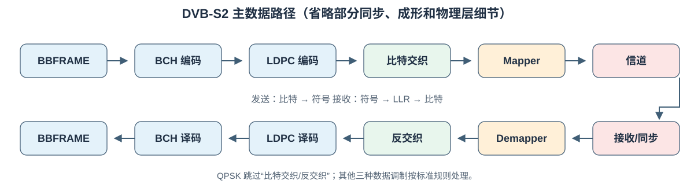
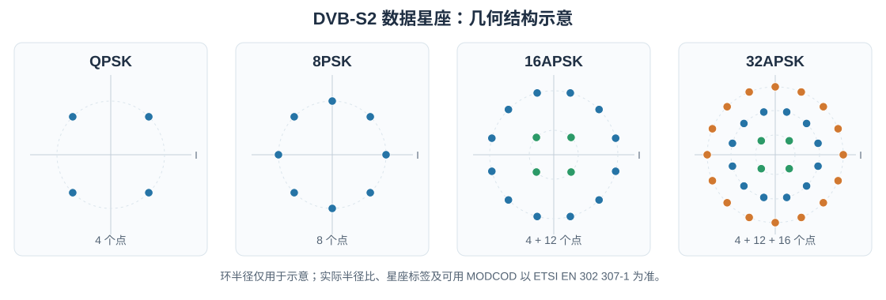
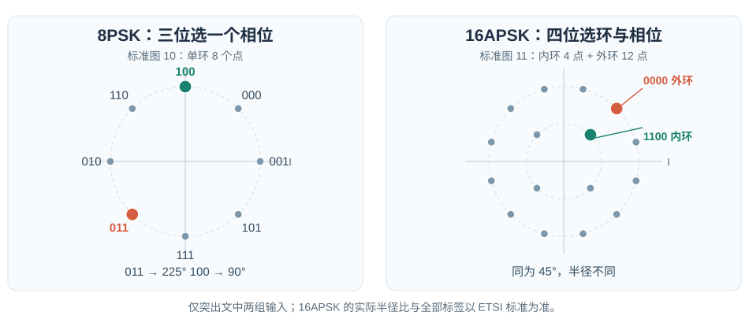

# 从零理解 DVB-S2 数字通信系统

本文从比特、概率和复数表示讲起，逐步走到星座映射、AWGN 信道、软解映射以及 DVB-S2 帧。读完后，应能沿着一帧数据回答三个问题：**它在发送端变成了什么？接收端实际观测到了什么？接收端凭什么恢复原始比特？**

本文以 [ETSI EN 302 307-1 V1.4.1（DVB-S2）](https://www.etsi.org/deliver/etsi_en/302300_302399/30230701/01.04.01_60/en_30230701v010401p.pdf) 为规范依据。为讲清原理而使用的简化数值模型会明确标注；这些模型不等于完整标准实现。

## 1. 先看全链路：比特怎样穿过卫星信道

```text
业务数据（例如 MPEG-TS 包或通用数据流）
  → 模式适配/流适配 → BBFRAME（基带帧，含 BBHEADER）
  → BCH 外码 → LDPC 内码 → FECFRAME（纠错码字）
  → 位交织（部分调制方式）→ 星座 Mapper → XFECFRAME（复数数据符号）
  → PL 成帧（PLHEADER、可选导频）→ 脉冲成形 → 上变频/卫星信道
  → 下变频/同步/均衡 → 符号采样 → Demapper（硬判决或软 LLR）
  → 解交织 → LDPC 解码 → BCH 解码 → 去除基带帧包装 → 业务数据
```



这不是一条“发送端直接把 0/1 变成无线电波，接收端再读回 0/1”的管道。纠错编码会添加冗余；Mapper 把若干编码比特变为一个复数符号；信道使符号偏移；Demapper 必须把一个有噪声的坐标转换成对各个比特的判断及其可信程度。[标准第 4.2 节的系统框图](https://www.etsi.org/deliver/etsi_en/302300_302399/30230701/01.04.01_60/en_30230701v010401p.pdf#page=14)可与上图对照。

先固定术语：**调制**决定一个符号可取的理想坐标；**编码**添加用于纠错的结构；**成帧**规定边界、信令和导频；**脉冲成形**决定符号序列如何成为连续时间波形。它们解决不同问题，不要混为一谈。

## 2. 从比特到符号

一个**比特**只有 `0` 或 `1`。一个**符号**是在一个符号时刻发送的某种可区分状态。假设有 $M$ 个状态，而且每个状态对应一个长度相同的二进制标签，那么需要 $m$ 个比特选出一个状态。因为一个比特有 2 种取值，$m$ 个比特有 $2^m$ 种组合，所以

$$M=2^m,\qquad m=\log_2 M.$$

这里 $\log_2 M$ 是“2 的几次方等于 $M$”。例如 QPSK 有 4 个状态，每个符号标 2 比特；8PSK 有 8 个状态，标 3 比特；16APSK、32APSK 分别标 4、5 比特。这里的“每符号比特数”是**映射器输入端的编码比特数**，不等于用户业务的净比特数。若发送符号率为 $R_s$ 符号/秒，未考虑纠错和帧开销时，Mapper 消耗编码比特的速率是 $mR_s$ 比特/秒。真实业务速率还要扣除纠错冗余、帧头、导频和适配开销。

一个最小例子：QPSK 的两个输入比特为 `10`，Mapper 查表输出一个复数点；下一组 `01` 再输出另一个点。接收机观测的并不是干净的 `10` 或 `01`，而是被信道扰动的点坐标。

## 3. 为什么用复数表示无线电信号

### 3.1 I、Q 是平面坐标，不是两根天线

在纸上画横轴 $I$（同相）、纵轴 $Q$（正交），一个点可写作 $(I,Q)$。复数只是把这对实数紧凑地记为

$$s=I+jQ,\qquad j^2=-1.$$

这里 $j$ 是工程中常用的虚数单位，$I$ 和 $Q$ 仍是可测的实数。点到原点的距离（幅度）为 $|s|=\sqrt{I^2+Q^2}$；点相对于横轴的角度是相位。`I=0.8, Q=0.2` 表示“向右 0.8、向上 0.2”，不要求真实电压含有一个神秘的“虚数部分”。

为什么能用两个坐标？固定载波频率 $f_c$ 时，余弦和相差四分之一周期的正弦可作为两种彼此独立的波形基底。一个简化的实射频信号是

$$x(t)=I(t)\cos(2\pi f_ct)-Q(t)\sin(2\pi f_ct).$$

$t$ 是时间，$f_c$ 单位为 Hz；$\cos$、$\sin$ 的自变量是角度（弧度），$2\pi f_ct$ 是载波相位。接收端用相应的载波参考做下变频，才重新得到 I/Q。上式的负号是常见约定；实现中若整体约定一致，也会看到其他符号习惯。

**复基带**指只保留缓慢变化的 $I(t)+jQ(t)$，暂不写高速载波。星座图画的是符号采样时刻的复基带值，而非空中电磁波的形状。实践中符号还会经过脉冲成形，故连续时间的 $I(t),Q(t)$ 不会简单地在符号边界突变。

### 3.2 星座图与距离

**星座**是允许发送的理想复数点集合。接收点 $y$ 与候选点 $s$ 的欧几里得距离为

$$|y-s|=\sqrt{(I_y-I_s)^2+(Q_y-Q_s)^2}.$$

这就是平面勾股定理。距离平方 $|y-s|^2$ 不开根号，比较大小时结果相同，后面的高斯似然也恰好使用它。



图用于理解几何位置，并非完整的标准比特标签表。BPSK 的教学模型可设 `0 → +1`、`1 → -1`。BPSK 只换左右相位。PSK 的点围绕同一圆，主要靠相位区分；APSK 的点还分布在不同半径的环上，同时利用幅度与相位。DVB-S2 的 16APSK 有内环 4 点和外环 12 点，32APSK 有三环 4、12、16 点；环半径比依 MODCOD 而变，不能把一张示意图当作所有模式的坐标表。[标准第 5.4 节的映射图](https://www.etsi.org/deliver/etsi_en/302300_302399/30230701/01.04.01_60/en_30230701v010401p.pdf#page=28)给出实际约定。

下面这张图进一步标出 8PSK 和 16APSK 的比特标签；读标签时要同时看点的位置，而不只是看环的形状。



### 3.3 QPSK 的完整小表与 Gray 相邻关系

令 $a=1/\sqrt{2}\approx0.7071$。如此每个 QPSK 点的能量 $|s|^2=a^2+a^2=1$，便于不同方案比较。按 DVB-S2 的 QPSK 图，坐标与标签可写为：

| 标签 $b_Ib_Q$ | 理想点 $s$ | 象限 |
| --- | --- | --- |
| `00` | $+a+ja$ | 右上 |
| `01` | $+a-ja$ | 右下 |
| `10` | $-a+ja$ | 左上 |
| `11` | $-a-ja$ | 左下 |

因此第一个比特由 I 的正负区分，第二个比特由 Q 的正负区分。沿圆周走向相邻点，只翻转一个比特，这就是 **Gray 标记** 的核心作用：噪声让点越过最近的边界时，通常只错一位，而不是两位。Gray 标记不能消灭误码，也不表示所有 PSK/APSK 模式都能按同一套简单的笛卡尔规则标号。8PSK 的具体标签及 16/32APSK 的具体映射须遵循标准相应图表。

## 4. 接收判决前，先补概率论

### 4.1 事件、条件概率和随机变量

事件的概率 $P(A)$ 是它发生的可能性，介于 0 和 1。若已知道事件 $B$ 发生，则

$$P(A\mid B)=\frac{P(A\cap B)}{P(B)},\qquad P(B)>0.$$

$A\cap B$ 表示二者同时发生。若投一颗公平骰子，$A$ 是“点数为偶数”，$B$ 是“点数大于 3”，则 $P(B)=3/6$，$P(A\cap B)=2/6$，所以 $P(A\mid B)=2/3$。条件信息会改变概率。

**随机变量**是实验结果对应的数值。例如发送的是哪个离散星座点 $S$，或噪声的某个实数坐标 $N_I$。离散 $S$ 可给每个值分配概率 $P(S=s)$；连续 $N_I$ 则通常使用**概率密度** $f_{N_I}(u)$。密度值本身不是“恰好等于 $u$”的概率；区间概率是密度曲线下面积：

$$P(a\le N_I\le b)=\int_a^b f_{N_I}(u)\,du.$$

$\int$ 可理解为把非常窄的小区间的“宽度 × 高度”加起来。连续变量恰好落在单个无限精确数上的概率通常为 0，但其密度可以大于 0，甚至大于 1。

**独立**意味着知道一个变量的结果不改变另一个变量的分布。若 I、Q 噪声独立，联合密度就是两项密度的乘积。此假设很重要，并非所有实际射频失真都满足它。

### 4.2 高斯噪声、均值、方差

均值（期望）是长期平均值，记 $E[N_I]$；方差 $E[(N_I-E[N_I])^2]$ 衡量围绕均值的平方偏离。零均值、方差 $\sigma^2$ 的高斯实变量，其密度为

$$f_N(n)=\frac{1}{\sqrt{2\pi\sigma^2}}\exp\!\left(-\frac{n^2}{2\sigma^2}\right).$$

$\sigma$ 是标准差，$\exp(z)=e^z$，$e\approx2.71828$。距离零越远，负指数越小，因此大噪声较少见。分母使整条曲线下的面积等于 1。$\pi$ 是圆周率。方差越大，曲线越宽，接收点通常散得越远。

这里的 **AWGN** 意为加性白高斯噪声：加性指噪声加到信号上；高斯指其统计分布；白指在所考虑频带内噪声谱近似平坦。我们先在接收机完成匹配滤波和定时采样后的**离散复数符号模型**讨论它；这不等于说实际卫星链路只有 AWGN，放大器非线性、相位噪声、衰落和同步误差另需处理。

### 4.3 似然、后验与对数

接收后看到 $y$，想反推发送点 $s$。$p(y\mid s)$ 是**假设发送了 $s$ 时，观测 $y$ 的密度**，称似然；$P(s\mid y)$ 是**已经观测到 $y$ 后，发送 $s$ 的概率**，称后验。二者的条件方向不同。贝叶斯公式把它们联系起来：

$$P(S=s\mid Y=y)=\frac{p(y\mid s)P(S=s)}{\sum_{u\in\mathcal S}p(y\mid u)P(S=u)}.$$

$\mathcal S$ 是所有可能星座点；分母是在所有候选发送点上求和，保证后验和为 1。若各点先验概率相等，比较后验大小等价于比较似然大小。**对数** $\ln$ 是自然指数 $\exp$ 的反运算；因其单调递增，比较正数 $A$ 与 $B$ 的大小，也可比较 $\ln A$ 与 $\ln B$。概率连乘变对数相加，数值计算更稳定，这正是 LLR 使用对数的原因。

## 5. AWGN 下，接收机为什么看距离

### 5.1 从两个实高斯噪声到复数似然

令发送符号 $s=s_I+js_Q$，接收采样 $y=s+n$，其中 $n=n_I+jn_Q$。假定 $n_I,n_Q$ **独立**、各为零均值高斯且方差均为 $\sigma^2$。于是 $y_I-s_I=n_I$、$y_Q-s_Q=n_Q$。由独立性，两维条件密度是两项一维密度之积：

$$
\begin{aligned}
p(y\mid s)
&=\frac{1}{2\pi\sigma^2}
  \exp\!\left(-\frac{(y_I-s_I)^2+(y_Q-s_Q)^2}{2\sigma^2}\right)\\
&=\frac{1}{\pi N_0}\exp\!\left(-\frac{|y-s|^2}{N_0}\right),
\end{aligned}
$$

其中在本文的**符号采样归一化约定**下，$N_0=2\sigma^2=E[|n|^2]$。有些资料用连续时间的单边/双边功率谱密度解释 $N_0$，其因子约定会不同；套公式前必须先对齐定义。

负指数只取决于距离平方：$y$ 离某理想点越近，在该点被发送的假设下越“常见”。若各星座点等先验，则**最大似然判决**

$$\hat s_{\rm ML}=\arg\max_{s\in\mathcal S}p(y\mid s)
=\arg\min_{s\in\mathcal S}|y-s|^2.$$

$\arg\max$ 表示“找出让表达式最大的那个候选值”；$\arg\min$ 类似。若各点先验不相等，最大后验判决应最大化 $p(y\mid s)P(S=s)$，未必就是最近点。若实际噪声非独立、非圆对称高斯，简单欧几里得最近点规则也可能不是最优。

### 5.2 一个 BPSK 概率小例子

仍采用**教学**映射 `0 → +1, 1 → -1`，实噪声标准差 $\sigma=0.5$，观测 $y=0.2$。到 `+1` 与 `-1` 的平方距离分别为 $0.64$、$1.44$。高斯指数分别为 $-0.64/(2\cdot0.25)=-1.28$ 和 $-1.44/(2\cdot0.25)=-2.88$；两个密度的共同前因子可约掉。因此似然比为 $e^{-1.28}/e^{-2.88}=e^{1.60}\approx4.95$。等先验时，`0` 的后验概率是 $4.95/(1+4.95)\approx0.832$，`1` 约 $0.168$。硬判决只给 `0`；软信息还保留“约 83% 对 17%”的区别。

## 6. Mapper 的逆向工作：Demapper 与 LLR

### 6.1 硬判决不是软判决

Mapper 输入 $m$ 位、输出一个理想点。Demapper 输入有噪声的 $y$，可以输出：

- **硬判决**：选最近的一个理想点，再取其 $m$ 位标签。例如 `00`，但不说明点离判决边界有多近。
- **软判决**：对每一位给一个实数，描述该位更像 `0` 还是 `1`，以及可信程度。LDPC 解码特别依赖这种软信息。

对位 $b_k$，本文采用“正数支持 0”的 LLR 约定：

$$L_k(y)=\ln\frac{P(b_k=0\mid y)}{P(b_k=1\mid y)}.$$

$L_k=0$ 表示两者同样可能；$L_k>0$ 偏向 0，$L_k<0$ 偏向 1；$|L_k|$ 越大越有把握。例如 $L=\ln 9\approx2.197$ 意味着 0 对 1 的后验赔率为 9:1，即 $P(0\mid y)=0.9$。有的实现定义相反的 LLR，符号也就反转；对接解码器时必须统一。

设 $\mathcal S_{k,0}$ 为第 $k$ 位标签为 0 的星座点集合，$\mathcal S_{k,1}$ 类似。若各点等先验，代入贝叶斯公式并约去公共分母，就得到精确 AWGN 位 LLR：

$$L_k(y)=\ln\frac{\displaystyle\sum_{s\in\mathcal S_{k,0}}
 \exp(-|y-s|^2/N_0)}{\displaystyle\sum_{s\in\mathcal S_{k,1}}
 \exp(-|y-s|^2/N_0)}.$$

此式并非“先选最近点再给它的每位编一个置信度”，而是在两组候选点的似然之间比较。若点先验不均匀，求和项应分别乘 $P(S=s)$，不能直接使用上面的等先验简式。

当噪声较小、每组主要由最近的点贡献时，可用 **max-log** 近似：

$$L_k(y)\approx\frac{\min_{s\in\mathcal S_{k,1}}|y-s|^2
-\min_{s\in\mathcal S_{k,0}}|y-s|^2}{N_0}.$$

其来源是 $\ln\sum_i e^{a_i}\approx\max_i a_i$；这一步丢掉了其他候选点的贡献，因此是近似，而非恒等式。工程实现常结合数值稳定的 log-sum-exp、查表、裁剪和量化。

### 6.2 完整 QPSK 数值例子

使用上面的 DVB-S2 QPSK 标签，$a\approx0.7071$。令接收点 $y=0.8+j0.2$，每个实维噪声方差 $\sigma^2=0.25$，故 $N_0=0.5$。逐点计算平方距离：

| 候选标签 | 候选点 | $|y-s|^2$（约） |
| --- | --- | ---: |
| `00` | $+a+ja$ | $0.266$ |
| `01` | $+a-ja$ | $0.831$ |
| `10` | $-a+ja$ | $2.529$ |
| `11` | $-a-ja$ | $3.094$ |

例如 `00` 的计算是 $(0.8-0.7071)^2+(0.2-0.7071)^2\approx0.266$。最近点是 `00`，所以硬判决为 `00`。但是两位的把握程度不同：I 方向离分界线 $I=0$ 更远，第一位更可靠。

由于 QPSK 这张表的第一位只由 I 的符号决定、第二位只由 Q 的符号决定，各 LLR 的求和可消去另一维共同因子。直接展开两个高斯指数之比可得

$$L_I=\frac{(0.8+a)^2-(0.8-a)^2}{N_0}=\frac{4a(0.8)}{0.5}\approx4.53,$$

$$L_Q=\frac{(0.2+a)^2-(0.2-a)^2}{N_0}=\frac{4a(0.2)}{0.5}\approx1.13.$$

所以第一位为 0 的后验概率为 $e^{4.53}/(1+e^{4.53})\approx0.989$，第二位为 0 的后验概率为 $e^{1.13}/(1+e^{1.13})\approx0.756$。两位硬判决都是 0，但可信度明显不同。一般 8PSK/APSK 几何与标签并不这样按 I/Q 分离，应使用对候选点集合求和的通式。

## 7. 为什么纠错编码需要位交织和软信息

### 7.1 冗余的直觉

若将一位重复三次，例如 `1 → 111`，接收 `101` 时可以多数投票猜回 `1`；代价是传 3 位才携带 1 位信息。真正的 FEC 不只是重复，而是根据多位之间的约束引入有结构的冗余。例如简单偶校验位 $p=b_1\oplus b_2$，其中 $\oplus$ 表示异或（相同为 0，不同为 1）；收到三个数后可以检查约束是否满足，但单个校验通常还不足以定位并修复所有错误。

**码率** $R=K/N$：$K$ 个输入位编码为 $N$ 个输出位，$N-K$ 是冗余位。码率越低，冗余通常越多，但并非仅凭码率就能判断纠错性能。DVB-S2 先用 BCH 外码，再用 LDPC 内码；接收侧顺序相反。LDPC 利用大量稀疏校验约束和软 LLR 迭代推断比特，BCH 外码帮助清除剩余错误。[标准第 5.3 节的 FECFRAME 定义与参数表](https://www.etsi.org/deliver/etsi_en/302300_302399/30230701/01.04.01_60/en_30230701v010401p.pdf#page=22)给出具体长度。

这里要分清两个数字：`3/5` 是某种 **LDPC 内码率**，不是业务有效载荷占整条卫星帧的精确比例；BBHEADER、BCH 校验、PLHEADER、导频等还会消耗位置。

### 7.2 位交织改变顺序，不增加信息

交织是一种可逆置换。演示用 12 位按行写入 3 行 4 列：

```text
原始序列： 0 1 2 3 4 5 6 7 8 9 A B
写成矩阵： 0 1 2 3
           4 5 6 7
           8 9 A B
按列读出： 0 4 8 1 5 9 2 6 A 3 7 B
```

数字/字母是位置标签，不是实际比特值。接收端用逆置换把每个软值放回原编码位位置。交织的目的不是凭空增加冗余，而是调整编码位在调制标签上的位置，改善不同比特位可靠性与纠错码之间的配合。**DVB-S2 的位交织不是所有调制方式都有**：标准第 5.3.3 节规定了 8PSK、16APSK、32APSK 的交织，QPSK 不走这套位交织；8PSK 的 3/5 模式还有特殊的列读取顺序。真实矩阵尺寸、读写方向应按 [标准第 5.3.3 节及表 8](https://www.etsi.org/deliver/etsi_en/302300_302399/30230701/01.04.01_60/en_30230701v010401p.pdf#page=26)实现，不能照抄上面的玩具矩阵。

从解码器视角，Demapper 输出的是按**调制标签顺序**排列的 LLR；解交织恢复**LDPC 编码位顺序**，否则即使每个 LLR 的正负号都正确，校验约束仍会接错位置。

## 8. DVB-S2 的帧、MODCOD 与实际传输

### 8.1 四个容易混淆的名字

| 名称 | 在链路上的位置 | 包含什么、用什么单位 |
| --- | --- | --- |
| BBFRAME | 适配后、BCH 前 | BBHEADER（80 位）和数据字段组成的 $K_{\rm bch}$ 位基带帧 |
| FECFRAME | BCH、LDPC 后 | 长帧 $N_{\rm ldpc}=64800$ 位或短帧 $16200$ 位的纠错码字 |
| XFECFRAME | 交织、Mapper 后 | $N_{\rm ldpc}/m$ 个复数**数据符号** |
| PLFRAME | 物理层成帧后 | PLHEADER、数据符号和可选导频组成的传输帧 |

业务流可以是连续流，不意味着“一个业务包 = 一个 BBFRAME”。模式适配负责流标识、同步/包装等；80 位 BBHEADER 告诉接收机如何解释后续数据字段。BBFRAME 进入外码 BCH、内码 LDPC。Mapper 的数据输出称 XFECFRAME，再由 PL 成帧器加物理层头和导频。PLHEADER 不要和 BBHEADER 混淆：前者服务于物理层识别帧和模式，后者描述基带数据。[标准第 5.1–5.2 节](https://www.etsi.org/deliver/etsi_en/302300_302399/30230701/01.04.01_60/en_30230701v010401p.pdf#page=18)与[第 5.5 节](https://www.etsi.org/deliver/etsi_en/302300_302399/30230701/01.04.01_60/en_30230701v010401p.pdf#page=30)分别定义这些部分。

### 8.2 MODCOD 决定什么

**MODCOD** 是调制方式与纠错码率的组合，例如 `8PSK 3/5`。接收机必须知道当前帧应按哪个星座和 FEC 参数来解码。DVB-S2 的 90 符号 PLHEADER 由 26 符号的 SOF（帧起始标识）及 64 符号的 PLS（物理层信令）构成；其调制使用 $\pi/2$-BPSK，与后续数据区选用的 QPSK/8PSK/APSK **不是同一回事**。PLS 表示 MODCOD 与 TYPE；TYPE 指示长/短 FECFRAME 及导频使用情况。标准表 12 给出 MODCOD 编码，例如 `8PSK 3/5` 对应 MODCOD 值 12。[参见 PLHEADER 与 MODCOD 表](https://www.etsi.org/deliver/etsi_en/302300_302399/30230701/01.04.01_60/en_30230701v010401p.pdf#page=32)。

CCM（固定编码调制）长期使用同一模式；VCM/ACM 可按帧改变模式，以适应业务或链路条件。“自适应”不表示同一帧内每个符号随意换星座：接收端要先读取该帧的 PL 信令，再按帧模式处理数据。

### 8.3 导频、脉冲成形与真实接收机

数据区按 90 个数据符号为一个 slot 分组。启用导频时，按标准规定的间隔插入每组 36 个导频符号，用于载波同步等；导频本身不携带用户数据。发端后续的平方根升余弦（SRRC）脉冲成形限制带宽并控制符号间干扰；DVB-S2 规定滚降系数 $\alpha=0.35,0.25,0.20$。直观地说，$\alpha$ 越小，在同一符号率下理论占用频带越窄，但实际系统对滤波器、同步和链路非理想因素仍有要求。[标准第 5.5–5.6 节](https://www.etsi.org/deliver/etsi_en/302300_302399/30230701/01.04.01_60/en_30230701v010401p.pdf#page=30)定义 PL 成帧和基带成形。

实际接收机不能直接把 ADC 样本送进上面的 $y=s+n$ 公式。它先要做频率/相位恢复、定时同步、匹配滤波、帧同步，并根据需要补偿信道与射频失真。**只有在正确的采样时刻、正确的幅度和相位参考下**，星座上的点才有可比较的距离。导频和 PLHEADER 也是让这一过程可行的关键结构。

## 9. 把数字算到底：正常帧 8PSK 3/5

选 DVB-S2 **正常 FECFRAME、8PSK 3/5、启用导频**。由标准正常帧参数表，该模式 $K_{\rm bch}=38688$ 位，BCH 输出 $N_{\rm bch}=K_{\rm ldpc}=38880$ 位，LDPC 输出 $N_{\rm ldpc}=64800$ 位。于是：

1. BBFRAME 为 38688 位，其中 BBHEADER 80 位，因此在**数据字段填满且不计更上层开销**时最多承载 $38688-80=38608$ 数据字段位。
2. BCH 增加 $38880-38688=192$ 校验位；LDPC 再增加 $64800-38880=25920$ 校验位。LDPC 内码率确为 $38880/64800=3/5$。
3. 位交织只重排 64800 位；8PSK 每符号放 3 位，因此 XFECFRAME 有 $64800/3=21600$ 个数据符号。
4. 每 slot 90 个数据符号，数据区有 $21600/90=240$ 个 slot。PLHEADER 另占 90 个符号。
5. 按标准“每 16 个 slot 后插入，且最后一个数据 slot 后不插入”规则，导频块数为 $\lfloor(240-1)/16\rfloor=14$，每块 36 个符号，共 $14\times36=504$ 个导频符号。$\lfloor x\rfloor$ 表示不大于 $x$ 的最大整数。
6. PLFRAME 总计 $90+21600+504=22194$ 个符号。不启用导频则为 $21690$ 个符号。

按“每个 PLFRAME 的数据字段位 / PLFRAME 符号数”这个**理想化口径**，启用导频时为 $38608/22194\approx1.740$ 位/PL 符号；不能把它直接叫做用户净吞吐率。实际业务吞吐还受基带填充、上层封装、帧间处理、物理层传输与符号率等影响。若仅为了量级感取 $R_s=10$ Msymbol/s，上述口径约为 17.40 Mbit/s；它仍不是对任何具体业务链路的保证值。相关帧长、MODCOD、slot、导频规则见 [ETSI 第 5.3–5.5 节](https://www.etsi.org/deliver/etsi_en/302300_302399/30230701/01.04.01_60/en_30230701v010401p.pdf#page=22)。

这个例子串起了整条链：38608 个填满的数据字段位并非直接按 3 位一组发送；它们先和 80 位基带头一起经过 BCH/LDPC 变成 64800 个编码位，重排后映射为 21600 个 8PSK 数据点，再加 PLHEADER 和导频，最后才经脉冲成形发射。

## 10. 常见误区与回看路线

| 容易产生的想法 | 更准确的说法 |
| --- | --- |
| “一个符号就是一个比特” | QPSK/8PSK/16APSK/32APSK 分别每数据符号承载 2/3/4/5 个**编码**比特。 |
| “I、Q 是两个不同的无线信道” | 它们是同一复基带信号的两个正交实坐标。 |
| “星座点最接近哪个就能得到可靠的比特” | 最近点给硬判决；点到决策边界的距离及噪声方差还决定软置信度。 |
| “概率密度 $p(y\mid s)$ 就是发了 $s$ 的概率” | 前者是观测似然密度；后者需要结合先验，求后验 $P(s\mid y)$。 |
| “LLR 正数一定代表 1” | 符号由定义决定；本文规定正数支持 0。 |
| “8PSK 3/5 每符号都有 $3\times3/5$ 个业务位” | 这仅近似考虑 LDPC 码率，漏掉 BCH、BB/PL 头、导频及填充等。 |
| “交织会增加纠错冗余” | 交织只重排位置；冗余由编码产生。QPSK 在 DVB-S2 中不使用该位交织。 |
| “PLHEADER 与 BBHEADER 是同一个头” | 一个是物理层帧同步/模式信令，一个描述基带帧数据。 |
| “信道只有 AWGN，解调只要算距离” | AWGN 是理解与设计的重要基线模型；实际还需同步、滤波和处理非线性等。 |

再读整条链时，可以只问三个连续问题：**当前对象的单位是位、复符号，还是连续波形？当前步骤在增加冗余、重排、映射、包装，还是估计概率？接收侧靠哪一项信息做逆操作？** 分清单位、概率条件方向与帧层次之后，Mapper、Demapper、LLR、FECFRAME、MODCOD 就不再是互不相干的术语。

## 规范入口

- [ETSI EN 302 307-1 V1.4.1：DVB-S2 总规范](https://www.etsi.org/deliver/etsi_en/302300_302399/30230701/01.04.01_60/en_30230701v010401p.pdf)。优先核对第 4.2 节系统框图、第 5.3 节 FEC/交织、第 5.4 节星座映射、第 5.5 节 PL 成帧以及第 5.6 节脉冲成形。
