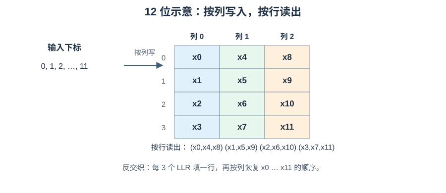

# 从零到实现：DVB-S2 Demapper 与位交织

发送端先把纠错码字位重排，再按星座标签将每组比特映射到一个复数点；接收端看到有噪声的点，须估计**每个编码位**更可能为 0 还是 1，并把软值放回 LDPC 期望的原始列顺序。两个动作分别叫**解映射（Demapper）**和**解交织（Deinterleaver）**。它们常连续出现，但一个处理概率证据，一个处理位置，不可互换。

```text
发送：FECFRAME 编码位 → 位交织 → 每 m 位组成标签 → 星座 Mapper → 信道
接收：复数采样 y → Demapper：按标签位置给 m 个 LLR → 解交织
                                            → 原 FECFRAME 位顺序的 LLR → LDPC
```

本文先构造接收概率模型，再推 Demapper 公式；最后从一般置换推到 [ETSI EN 302 307-1 第 5.3.3 节](https://www.etsi.org/deliver/etsi_en/302300_302399/30230701/01.04.01_60/en_30230701v010401p.pdf#page=26) 的块交织。数值例子会明确哪些是教学模型，哪些是标准规定。

## 1. 从 $y=s+n$ 看“接收的是什么”

一个数字调制**符号**可取若干理想状态。接收机在正确的采样时刻，把其同相和正交分量记为两个实数 $(I,Q)$，合写成复数 $s=I+jQ$；$j^2=-1$，只是二维坐标的记号。星座图的横轴是 I、纵轴是 Q；**星座**是所有允许发送的理想点的集合 $\mathcal S$。例如 QPSK 有 4 个点、每数据符号标 2 个编码位；8PSK、16APSK、32APSK 分别有 8、16、32 点，每符号标 3、4、5 位。PSK 点主要按相位分开，APSK 还分不同半径的环，具体标签与环半径必须按对应 MODCOD 的标准图表，不可把通用示意图当数值规范。

令 $s$ 为实际发送的理想点，$n$ 为信道与接收处理后落在这一采样上的扰动，$y$ 为接收样本。最基本模型是

$$y=s+n.$$

这只是采样点处的**加性噪声模型**。真实接收机在此之前还须载波/定时同步、匹配滤波、幅度和相位校正；若存在相位噪声、非线性或残余频偏，简单的 $y=s+n$ 未必充分。接收端不知道 $s$，只知道 $y$ 和候选星座点；Demapper 必须根据候选与观测之间的关系产生证据。

## 2. 在似然之前：随机变量、密度和高斯

### 2.1 概率与概率密度不是一个数

掷骰子的结果只有离散的六个值，可直接给“恰好出现 3”赋概率。噪声电压却可在连续范围取值，不能给每个无限精确的实数分配普通的点概率；在连续模型下，恰好取单点的概率为 0。对连续随机变量 $N$，使用**概率密度** $f_N(u)$ 描述各处“概率的浓淡”。区间 $[a,b]$ 的概率是密度曲线在区间下方的面积，数学上写作 $P(a\le N\le b)=\int_a^b f_N(u)\,du$。$\int$ 是把无数个很窄区间的“密度 × 宽度”累加；密度值本身不是概率，甚至可以大于 1，只要整体面积为 1。

**随机变量**是实验结果所对应的数，例如 I 轴噪声 $N_I$。**均值**是长期平均值；**方差**是与均值的偏差平方的长期平均，标准差 $\sigma$ 是方差的平方根。本节用均值 0、方差 $\sigma^2$ 的**高斯（正态）**噪声：

$$f_N(u)=\frac{1}{\sqrt{2\pi\sigma^2}}\exp\!\left(-\frac{u^2}{2\sigma^2}\right).$$

$\pi$ 是圆周率，$\exp(z)=e^z$ 且 $e\approx2.718$；负指数让远离 0 的大噪声较罕见。分母保证整条曲线面积为 1。方差越大，曲线越宽。**AWGN** 指加性白高斯噪声；“白”描述所考虑带宽内的谱近似平坦，不等于每个实际接收误差都严格独立高斯。

### 2.2 从一维高斯推到 I/Q 条件密度

假设 $n=n_I+jn_Q$，两个实坐标**独立**，各服从均值 0、方差 $\sigma^2$ 的高斯。独立意味着知道 $n_I$ 不改变 $n_Q$ 的分布，二维联合密度可把两项一维密度相乘。若已假定发出候选点 $s=s_I+js_Q$，则观测 $y=y_I+jy_Q$ 对应噪声 $n_I=y_I-s_I$、$n_Q=y_Q-s_Q$。相乘得到

$$p(y\mid s)=\frac{1}{2\pi\sigma^2}
\exp\!\left(-\frac{(y_I-s_I)^2+(y_Q-s_Q)^2}{2\sigma^2}\right).$$

左边是“**给定发送点 $s$ 时，连续观测 $y$ 的条件概率密度**”，不是“收到精确值 $y$ 的概率”，更不是“发了 $s$ 的后验概率”。把 $y$ 固定、比较不同 $s$ 时，同一个表达式称为候选 $s$ 的**似然（likelihood）**；这是使用密度给候选打分的视角。区间/区域概率仍需积分。

复平面的勾股距离满足 $|y-s|^2=(y_I-s_I)^2+(y_Q-s_Q)^2$；这个值是两个坐标误差的平方和，单位是符号幅度单位的平方。定义本文**离散符号采样归一化下**的 $N_0=E[|n|^2]=2\sigma^2$，其中 $E$ 表示平均值；于是同一密度可写成

$$p(y\mid s)=\frac{1}{\pi N_0}\exp\!\left(-\frac{|y-s|^2}{N_0}\right).$$

若其他文献用连续时间单/双边噪声谱密度、不同匹配滤波器增益或不同星座归一化，$N_0$ 与每轴方差的关系要重新核对，不能把本式的数值因子不加说明地搬过去。固定 $N_0$ 时，公共前因子对所有候选相同，比较似然只需比较距离平方：越近越合理。但若候选先验不同，**最可能发送**的点还需结合先验；“最近点”只在等先验、该 AWGN 模型等条件下等价于最大后验判决。

## 3. 从符号似然走到每个比特的 LLR

### 3.1 把一个比特的候选点分成两组

Mapper 将每个 $m$ 位标签映射到一个点。对标签中的第 $k$ 位，设 $\mathcal S_{k,0}$ 为该位等于 0 的全部星座点，$\mathcal S_{k,1}$ 为该位等于 1 的点。收到 $y$ 后，**符号似然** $p(y\mid s)$ 是每个候选点的条件密度。**比特条件似然密度** $p(y\mid b_k=0)$ 则要对“所有该位为 0 的候选点”求平均或按条件先验加权：

$$p(y\mid b_k=0)=\sum_{s\in\mathcal S_{k,0}}p(y\mid s)P(s\mid b_k=0).$$

$\sum$ 表示逐项相加；$P(s\mid b_k=0)$ 是已知该位为 0 时该候选点的概率。等概星座且标签均匀时，每组有 $2^{m-1}$ 点，权重均为 $1/2^{m-1}$。这是**多个互斥发送候选的混合密度**，不是单个点的密度，也不是比特后验概率。

现在用**条件概率**反推发送位。设 $P(b_k=0\mid y)$ 为观测后该位为 0 的后验概率，$P(b_k=1\mid y)$ 同理；它们的比值叫后验赔率。贝叶斯关系说明“后验赔率 = 条件似然密度比 × 先验赔率”：

$$\frac{P(b_k=0\mid y)}{P(b_k=1\mid y)}
=\frac{p(y\mid b_k=0)}{p(y\mid b_k=1)}
\frac{P(b_k=0)}{P(b_k=1)}.$$

自然对数 $\ln$ 是指数函数 $\exp$ 的反函数，把乘法变加法；定义“**正数支持 0**”的对数似然比（Log-Likelihood Ratio，LLR）为

$$L_k(y)=\ln\frac{P(b_k=0\mid y)}{P(b_k=1\mid y)}.$$

这是一种**无量纲的对数赔率**，不是概率密度或概率。$L>0$ 偏向 0，$L<0$ 偏向 1，$|L|$ 越大两种候选越不均衡。若先验比特等概率、星座点也等概率，先验赔率和组内相同权重约掉，代入二维高斯密度后得到精确软解映射式：

$$L_k(y)=\ln\frac{\displaystyle\sum_{s\in\mathcal S_{k,0}}
\exp(-|y-s|^2/N_0)}{\displaystyle\sum_{s\in\mathcal S_{k,1}}
\exp(-|y-s|^2/N_0)}.$$

若码字位的先验不等概率，或迭代 Demapper 收到译码器反馈，须在每项中加入对应先验权重并避免重复计算；不能依然直接用这个等先验简式。实现常以 log-sum-exp 计算：先减去该组最大指数，避免小概率指数下溢，再把偏移加回。这不会改变数学结果。

### 3.2 Max-Log 从何而来，代价是什么

若某组里一个候选点比其余点更近，指数和可近似由这一项主导。因为 $\ln\sum_i e^{a_i}\approx\max_i a_i$，上式可化为

$$L_k^{\rm maxlog}(y)\approx
\frac{\min_{s\in\mathcal S_{k,1}}|y-s|^2-
\min_{s\in\mathcal S_{k,0}}|y-s|^2}{N_0}.$$

它比较两组各自的最近点，免去指数与对数，但**不是**“先找全星座唯一最近点，再给所有比特相同的置信度”。若一个组里有多个贡献相近的点，Max-Log 忽略了它们的总权重，LLR 幅值会偏离精确值。例如仅用于展示近似误差的四个候选平方距离：0 组为 $0.1,0.3$，1 组为 $0.2,2.0$，$N_0=0.5$。精确值为 $\ln[(e^{-0.2}+e^{-0.6})/(e^{-0.4}+e^{-4})]\approx0.686$；Max-Log 只取两组最小值，得到 $(0.2-0.1)/0.5=0.2$。这些距离不是某个标准星座的坐标表，只说明忽略第二近点可能明显改变软值。

### 3.3 完整 QPSK 数值轨迹

取等能量 QPSK 点 $s=(\pm a)\pm j a$，$a=1/\sqrt2\approx0.7071$。用第一个标签位表示 I 的正负、第二位表示 Q 的正负：`00` 是右上、`01` 右下、`10` 左上、`11` 左下；这与 [DVB-S2 QPSK 标记图](https://www.etsi.org/deliver/etsi_en/302300_302399/30230701/01.04.01_60/en_30230701v010401p.pdf#page=28)一致。若 $y=0.8+j0.2$、$N_0=0.5$（每实维方差 $0.25$），逐点平方距离为：

| 标签 | $s$ | $|y-s|^2$（约） |
| --- | --- | ---: |
| `00` | $+a+ja$ | $0.266$ |
| `01` | $+a-ja$ | $0.831$ |
| `10` | $-a+ja$ | $2.529$ |
| `11` | $-a-ja$ | $3.094$ |

最近点硬判决为 `00`。但两个比特的可靠程度不同；这张 QPSK 表可让另一轴的共同因子在分子/分母中约掉，得到精确 LLR：

$$L_I=\frac{4a(0.8)}{N_0}\approx4.53,\qquad
L_Q=\frac{4a(0.2)}{N_0}\approx1.13.$$

来源是比较正负 I 点的高斯指数差：$[(I+a)^2-(I-a)^2]/N_0=4aI/N_0$，Q 轴同理。两个值都支持 0，但第二位明显不那么可靠；由赔率还可算出 $P(b_I=0\mid y)\approx0.989$、$P(b_Q=0\mid y)\approx0.756$。此特殊 QPSK 情况下 Max-Log 与精确式相同；高阶 8PSK/APSK 一般没有这样的 I/Q 分离，须按实际标签枚举候选集。APSK 的内外环距离与映射会随模式变化，不能用“一张圈图＋统一公式系数”代替标准星座表。

## 4. 为什么还要交织：顺序影响每位的可靠性

同一个高阶调制符号的不同标签位，可能有不同的几何决策边界和可靠程度。位交织（bit interleaving）不是改变比特值，而是把 LDPC 码字位重新分配到这些标签位置，使码的结构与调制位通道更合适；LDPC 译码器仍要求按**原码字列顺序**收到 LLR，所以接收侧必须应用逆置换。它不会添加纠错冗余，也不会让噪声凭空消失。

一个**置换（permutation）**是把 $N$ 个位置一一重新排列，每个原位置恰好出现一次。若输出位置 $j$ 取原位置 $\pi(j)$，写作 $z[j]=b[\pi(j)]$；**逆置换**要把值放回原位，即 $b[\pi(j)]=z[j]$。因此同一个地址关系在发送端是 gather（按原地址取），在接收端可写成 scatter（向原地址放）；把两边都写成 $b[j]=z[\pi(j)]$ 通常会错，除非该置换恰好自身为逆。

### 4.1 12 个位置完整手算

这里只用数字做**位置标签**，不是实际比特值。原顺序 `0 1 2 3 4 5 6 7 8 9 10 11`，按列写入一个 4 行、3 列矩阵：

```text
             列 0   列 1   列 2
行 0           0      4      8
行 1           1      5      9
行 2           2      6     10
行 3           3      7     11
```

按行、从左到右读出：`0 4 8  1 5 9  2 6 10  3 7 11`。逆向时把这串每连续 3 个值填回一行，再按列读出，就回到 `0 1 2 3 4 5 6 7 8 9 10 11`。若这些值是 LLR 而非比特，逆向同样只**移动数值的位置**，不改变符号、幅度或量化格式。



### 4.2 从矩阵读写推导索引

令 $N=RC$，$R$ 为行数、$C$ 为列数。原输入 $b[k]$，按列写入时 $k=cR+r$，其中 $0\le r<R,0\le c<C$。若按正常列顺序读一行，输出索引 $j=rC+c$，所以

$$z[rC+c]=b[cR+r].$$

逆向直接把右端原地址当目标即可：$b[cR+r]=z[rC+c]$。从任意原索引 $k$ 求其行列：$c=\lfloor k/R\rfloor$，$r=k\bmod R$，故它在输出的位置为 $j=(k\bmod R)C+\lfloor k/R\rfloor$。$\lfloor\ \rfloor$ 是向下取整，$\bmod$ 是整数除法余数；可代入 12 位例子的 $k=6$：$c=1,r=2$，输出位置 $j=2\cdot3+1=7$，确实是读出序列中的第 7 个零基位置。

为兼容**改变读取列次序**的模式，令 `order[q]` 表示输出行中第 $q$ 个标签位来自原矩阵哪一列。则统一公式是

$$z[rC+q]=b[\mathrm{order}[q]R+r],\qquad
b[\mathrm{order}[q]R+r]=z[rC+q].$$

`order` 必须本身是 $0,\ldots,C-1$ 的置换。普通情况为 `[0,1,...,C-1]`。DVB-S2 的 8PSK **码率 3/5** 是特殊读序：首个 BBHEADER 比特在一行三个输出位置中排**第三**，不能走默认读序；按 [标准图 8](https://www.etsi.org/deliver/etsi_en/302300_302399/30230701/01.04.01_60/en_30230701v010401p.pdf#page=27)的三列反向读序可写作零基 `[2,1,0]`。把这一顺序作为模式表配置，不要在解交织后再临时“交换一个 bit”来补丁式修复。

### 4.3 DVB-S2 的真实矩阵尺寸

[ETSI 第 5.3.3 节表 8](https://www.etsi.org/deliver/etsi_en/302300_302399/30230701/01.04.01_60/en_30230701v010401p.pdf#page=26)规定：

| 调制 | 每数据符号编码位数 $C$ | 正常帧 $N=64800$ 的行数 $R$ | 短帧 $N=16200$ 的行数 $R$ |
| --- | ---: | ---: | ---: |
| 8PSK | 3 | 21600 | 5400 |
| 16APSK | 4 | 16200 | 4050 |
| 32APSK | 5 | 12960 | 3240 |

例如正常 8PSK：按列写 64800 位到 $21600\times3$ 矩阵，再按行读，每 3 个输出位就是一个数据符号的标签。短帧同理，但行数换成 5400。**QPSK 不使用本条 DVB-S2 位交织规则**，应按 FECFRAME 的既定顺序将两位组成符号；接收端也不要凭“任何调制都应解交织”的通用印象额外重排。8PSK 3/5 的特殊 `order` 是码率与调制的联合选择，不能只检查调制名。

## 5. 可实现的 C++ 与缓冲区组织

以下 C++20 `std::span` 示例只实现**已给定行数和列次序的置换内核**；调用端仍需从 MODCOD/帧型选择标准参数、准备足够长的缓冲区。`T` 可为 bit、float LLR 或定点 LLR；不要让输入输出 span 指向重叠区域。

```cpp
#include <cstddef>
#include <span>
#include <stdexcept>

template <class T>
void interleave(std::span<const T> input, std::span<T> output,
                std::size_t rows, std::span<const unsigned> order) {
    const std::size_t cols = order.size();
    if (cols == 0 || input.size() != rows * cols || output.size() != input.size())
        throw std::invalid_argument("interleaver dimensions");
    for (std::size_t r = 0; r < rows; ++r)
        for (std::size_t q = 0; q < cols; ++q)
            output[r * cols + q] = input[order[q] * rows + r];
}

template <class T>
void deinterleave(std::span<const T> input, std::span<T> output,
                  std::size_t rows, std::span<const unsigned> order) {
    const std::size_t cols = order.size();
    if (cols == 0 || input.size() != rows * cols || output.size() != input.size())
        throw std::invalid_argument("deinterleaver dimensions");
    for (std::size_t r = 0; r < rows; ++r)
        for (std::size_t q = 0; q < cols; ++q)
            output[order[q] * rows + r] = input[r * cols + q];
}
```

调用端还须验证 `order` 长度是 $C$、每个值都在 `[0,C)` 且互不重复，否则可能越界或覆盖输出。这里按行遍历让输入 `input[r*C+q]`（Demapper 自然输出的每符号 LLR）连续读取，而解交织目标地址 `order[q]*R+r` 跨列远距写入；反向的发送交织则以跨列 gather 读取、连续输出。若 LDPC 需要连续的原位顺序，解交织可采用**分块转置**、缓存每列连续片段或多 bank 缓冲，减少随机写冲突；分块大小须以实际 cache/bank/向量宽度测量，不能只看算法公式。

Demapper 的输出常自然排为 AoS（每个符号的 $C$ 个 LLR 紧邻），LDPC 更常需要 SoA/码字原位序。至少准备一帧输入与一帧输出，若上下游同时工作，可使用双缓冲；缓冲所有权、帧号与 MODCOD 元数据要随数据一起流动，避免把上一帧的 `order` 用到下一帧。LLR 的正负号、缩放和噪声方差估计需与 LDPC 约定一致，解交织**不负责**修正这些数值。

## 6. 验证方法、瓶颈与常见误区

先用位置标签 `0..N-1` 做往返测试：`deinterleave(interleave(input)) == input`；再用唯一标记检验每个输出位置出现一次，用单个脉冲（仅某个位置非零）核对索引公式。对 $R=4,C=3$ 的例子，期望序列必须与上面的 12 位手算一致。真实 $64800/16200$ 情况至少覆盖每种帧型与调制、首尾索引、8PSK 3/5 特例以及 QPSK 旁路。置换往返**不能单独证明两端都符合标准**：若发送与接收都用了同一个错误 `order`，仍会往返成功；应另用 ETSI 图表或已知测试向量核对。

对 Demapper，用无噪声星座点、靠近决策边界的点、很大的 $N_0$、很小的 $N_0$、APSK 内外环附近的点测试。比较精确 LLR 与 Max-Log 的符号及幅值；精确式宜在对数域计算，输入量化后还要检查饱和、NaN/无穷值和标签 bit index。整链验证不能只看“LDPC 最后 syndrome 为零”，还需比较原信息位，并分别统计 BER/FER。

| 常见误解 | 正确模型 |
| --- | --- |
| “$p(y\mid s)$ 是发送了 $s$ 的概率。” | 它是给定 $s$ 时连续观测 $y$ 的条件**密度**；后验还要结合先验。 |
| “最近星座点足以给所有位一样的软值。” | 每位应比较不同标签组，幅值反映其自身可靠性。 |
| “Max-Log 是精确恒等式。” | 它忽略组内非最近点；只有特殊几何或极限条件下才可能重合。 |
| “交织器会增强码字冗余。” | 它只改位置，必须逆置换回 LDPC 列顺序。 |
| “所有 DVB-S2 模式都用同一个交织矩阵。” | QPSK 旁路；8PSK/APSK 列数、帧型行数不同，8PSK 3/5 还改读序。 |
| “把 LLR 取反就是解交织。” | 取反改变比特偏向；解交织仅移动存储地址。 |
| “往返置换测试通过就完全符合标准。” | 两个同样错误的置换仍可互逆；需标准向量或独立索引检查。 |

## 规范入口

- [ETSI EN 302 307-1 V1.4.1，第 5.3.3 节：Bit Interleaver](https://www.etsi.org/deliver/etsi_en/302300_302399/30230701/01.04.01_60/en_30230701v010401p.pdf#page=26)：读写方向、矩阵尺寸、8PSK 3/5 特例。
- [ETSI EN 302 307-1 V1.4.1，第 5.4 节：Constellation Mapping](https://www.etsi.org/deliver/etsi_en/302300_302399/30230701/01.04.01_60/en_30230701v010401p.pdf#page=28)：QPSK、8PSK、16APSK、32APSK 的标准标签与几何。
