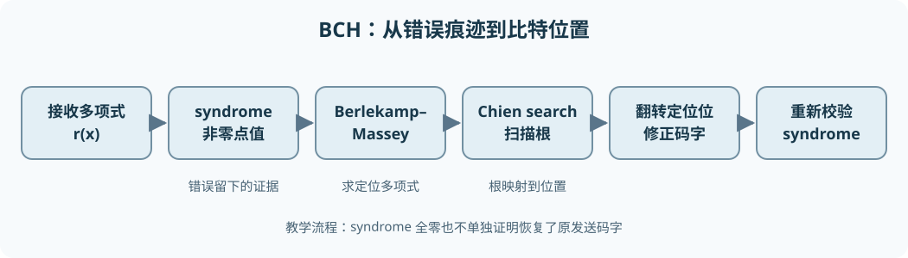

# 从零理解 BCH 码：有限域、编码与完整译码

BCH（Bose–Chaudhuri–Hocquenghem）码回答的问题是：发送端能否按**可计算的代数规则**加入冗余，让接收端即使不知道原信息，也能定位并纠正一定数量的比特翻转？答案是可以。它的基本路线是让每个合法码字对应的多项式在一组指定的有限域元素处等于零；错误会破坏这些零值，破坏的结果（syndrome）又包含错误位置的信息。

本章不要求预先掌握有限域、多项式或循环码。我们先把每一步真正需要的运算建起来，再用一个**非 DVB-S2 的教学码**完成从编码到两位纠错的全部手算。最后把相同思想对应到 DVB-S2 的 BCH 外码，并说明阅读 C/C++ 编码器、解码器时应核对什么。

```text
信息比特 → 二进制多项式 u(x) → 乘 x^校验位数并求余 → BCH 码字 c(x)
             ↓ 通过可能翻转比特的信道
接收多项式 r(x) → 求 syndrome → Berlekamp–Massey 求错误定位多项式
             → Chien search 扫描错误位置 → 翻转这些位 → 验证 → 信息比特
```



## 1. 先从一个比特翻转与 XOR 开始

信息位是想传送的 `0/1`；校验位是发送端根据规则添加的冗余；完整输出叫码字。若接收端某一位读错，就称该位发生**比特翻转**。同样的翻转做两次会回到原值：`0 → 1 → 0`。所以编码理论常用异或（XOR，记 $\oplus$）表示“加法”：$0\oplus0=0$、$0\oplus1=1$、$1\oplus0=1$、$1\oplus1=0$。它也等于普通整数相加后只保留除以 2 的余数，即**模 2 加法**。二进制乘法则只有 $1\cdot1=1$，其余都为 0。

这两个运算构成 **GF(2)**，即只有 `0`、`1` 两个元素的有限域。此处“域”的关键意义是：可以一致地进行加、减、乘，以及除以非零元素；在 GF(2) 中唯一非零元素是 `1`，故除法很简单。由于 $a\oplus a=0$，加法和减法相同。普通十进制的 `1+1=2` **不能**直接搬进后面的多项式或有限域计算。

在一组合法码字中，任意两个不同码字逐位比较，不同位置的个数叫**汉明距离** $d_H$。最小的码字间距离叫 $d_{\min}$。若 $d_{\min}\ge 2t+1$，最近码字原则可保证纠正至多 $t$ 位翻转：两个码字各自“半径 $t$”的接收区域不会重叠。BCH 的构造会保证一个**设计距离**下界；实际最小距离有时更大，但不能只看冗余位数就断定能纠几位。

## 2. 比特串为什么能写成多项式

把第 $i$ 位记为系数 $a_i\in\{0,1\}$，对应 $a_ix^i$；符号 $x$ 此时只是一个**形式变量**，不是一个具体数字。比如按“低次项对应低索引位”的约定，位序列 $a_0,a_1,a_2,a_3=(1,1,0,1)$ 可写为

$$a(x)=1+x+x^3.$$

$x^i$ 的意思是 $i$ 个 $x$ 相乘；$x^0=1$。省略的 $x^2$ 项系数是 0。**多项式的次数**是最高非零项的指数，此例为 3；全零多项式没有通常意义下的有限次数。源码可能把 `a0` 放最低位，也可能反向存储；两者并不矛盾，但编码器与解码器必须采用同一约定。

在 GF(2) 上，系数逐位 XOR。例如

$$ (1+x+x^3)+(1+x^2)=x+x^2+x^3,$$

因为两个常数项 $1\oplus1=0$。多项式乘法先按普通代数展开，再把同次项的系数 XOR：

$$ (x+1)(x^2+1)=x^3+x^2+x+1.$$

**多项式长除法**与整数长除法相似：用被除式当前最高项除以除式最高项，得到商的一项，再用 XOR 消去最高项，重复直到余式次数小于除式次数。例：

```text
             x
x² + x + 1 ) x³ + x² + 0x + 1
             x³ + x² + x       （先乘 x，再 XOR）
             ----------------
                       x + 1   （余式，次数 1 < 2）
```

商为 $x$，余式为 $x+1$，即 $(x^3+x^2+1)=x(x^2+x+1)+(x+1)$。**求余**记为 $A(x)\bmod B(x)$，结果是这一长除法的余式。后续系统编码就是“移位后求余”，不是神秘的专用操作。

> 术语提醒：这里的多项式余式仍是一个 GF(2) 多项式；把它当作普通整数余数，会把 XOR 误写成带进位加减。

## 3. 循环码：把移位变成代数操作

长度为 $n$ 的码字用次数小于 $n$ 的多项式表示。**循环移位**把末端的一位绕回开头；在多项式表示中，它等于先乘 $x$，再按 $x^n-1$ 求余。因为 $x^n$ 回绕成 $1$。在 GF(2) 中减与加相同，所以这里 $x^n-1=x^n+1$。

例如长度 4 的 `1001` 若写为 $1+x^3$，乘 $x$ 得 $x+x^4$；按 $x^4-1$ 求余后 $x^4$ 等同于 1，于是变成 $1+x$。位索引方向决定你把这叫左移还是右移，因此源码审查应以**指数与实际传输顺序**为准，而不是只看“左移”这个词。

若一个码在循环移位后仍是同一个码中的合法码字，就叫**循环码（cyclic code）**。一个常见构造是选定多项式 $g(x)$，把它的所有适当长度的倍数作为合法码字；$g(x)$ 称为**生成多项式（generator polynomial）**。若 $g(x)$ 能整除 $x^n-1$，则合法码字的循环移位仍是 $g(x)$ 的倍数：乘 $x$ 后除掉的若干个 $x^n-1$ 也都是 $g$ 的倍数。这里“整除”表示求余为零。这正是循环性与多项式结构的连接。

但怎样挑 $g$，才能保证码字相隔足够远？BCH 的办法是规定若干“必须为零的取值点”。这些点不够放在只有 `0/1` 的 GF(2) 中，所以先要建立更大的有限域。

## 4. 从 GF(2) 建造 GF($2^m$)

### 4.1 为什么需要新的元素

假设希望长度 $n=15$，并在某个元素 $\alpha$ 的多个不同幂次处检查码字。GF(2) 只有 `0`、`1`；非零元素只剩 1，重复取幂永远得到 1，无法区分 15 个位置。我们需要有 16 个元素的 **GF($2^4$)**，其中 15 个非零元素可以排成一个循环。

先把元素表示为次数低于 4 的二进制多项式：

$$a_0+a_1\alpha+a_2\alpha^2+a_3\alpha^3,\qquad a_i\in\{0,1\}.$$

四个系数各有两种取值，所以恰好有 $2^4=16$ 个表达式。$\alpha$ 是我们即将按规则构造的特殊元素，不是实数；“$\alpha^i$”表示在这套运算中的连乘。加法按各系数 XOR，例如 $(\alpha+1)+(\alpha^2+1)=\alpha^2+\alpha$。

乘法会产生 $\alpha^4$ 等高次项，必须规定一种一致的“折回”规则。选择四次多项式

$$p(z)=z^4+z+1$$

作为**域的模多项式**，规定 $p(\alpha)=0$。由于减法等于加法，这给出

$$\alpha^4=\alpha+1.$$

以后每遇到 $\alpha^4$ 就用 $\alpha+1$ 代换，再按 XOR 合并。例如 $\alpha^5=\alpha(\alpha+1)=\alpha^2+\alpha$，以及

$$(\alpha^3+1)\alpha=\alpha^4+\alpha=(\alpha+1)+\alpha=1.$$

上例说明 $\alpha^3+1$ 是 $\alpha$ 的乘法逆元。能对每个非零元素做这种除法，需要 $p$ **不可约**：它不能在 GF(2) 上分解成两个次数更低的非平凡多项式。仅说“用任意四次多项式取余”并不能保证得到域；若模多项式可约，某些非零元素乘起来可能为零，除法会失效。本例 $z^4+z+1$ 是不可约且**本原（primitive）**的；“本原”比不可约更强，表示 $\alpha$ 的连续幂能遍历所有 15 个非零元素。

### 4.2 一张够用的 GF(16) 幂表

反复用 $\alpha^4=\alpha+1$，可得到下表。右列也可写成四位二进制，依次代表 $\alpha^3,\alpha^2,\alpha,1$ 的系数；例如 $\alpha^4=\alpha+1$ 对应 `0011`。

| 幂 | 多项式形式 | 四位表示 | 幂 | 多项式形式 | 四位表示 |
| ---: | --- | :---: | ---: | --- | :---: |
| $\alpha^0$ | $1$ | `0001` | $\alpha^8$ | $\alpha^2+1$ | `0101` |
| $\alpha^1$ | $\alpha$ | `0010` | $\alpha^9$ | $\alpha^3+\alpha$ | `1010` |
| $\alpha^2$ | $\alpha^2$ | `0100` | $\alpha^{10}$ | $\alpha^2+\alpha+1$ | `0111` |
| $\alpha^3$ | $\alpha^3$ | `1000` | $\alpha^{11}$ | $\alpha^3+\alpha^2+\alpha$ | `1110` |
| $\alpha^4$ | $\alpha+1$ | `0011` | $\alpha^{12}$ | $\alpha^3+\alpha^2+\alpha+1$ | `1111` |
| $\alpha^5$ | $\alpha^2+\alpha$ | `0110` | $\alpha^{13}$ | $\alpha^3+\alpha^2+1$ | `1101` |
| $\alpha^6$ | $\alpha^3+\alpha^2$ | `1100` | $\alpha^{14}$ | $\alpha^3+1$ | `1001` |
| $\alpha^7$ | $\alpha^3+\alpha+1$ | `1011` | $\alpha^{15}$ | $1$ | `0001` |

注意 0 也是域元素，但没有写成 $\alpha$ 的某个幂。表显示前 15 个幂互不相同，$\alpha^{15}=1$，所以 $\alpha$ 的**乘法阶**为 15；“乘法阶”就是从 1 起连乘多少次才第一次回到 1。非零元素相乘可把幂指数相加并对 15 取余，例如 $\alpha^4\alpha^8=\alpha^{12}$；除法是指数相减再对 15 取余，例如 $\alpha^5/\alpha^4=\alpha$。**加法绝不能把指数直接相加**：$\alpha^4+\alpha^8=(\alpha+1)+(\alpha^2+1)=\alpha^2+\alpha=\alpha^5$，须使用多项式形式或四位 XOR。

写 C/C++ 时常用两个表：`exp[i]` 存 $\alpha^i$ 的四位表示；`log[value]` 对非零元素反查指数。这样非零乘除可转成指数加减。零没有对数，必须单独分支；把 `log[0]` 当作有效指数是常见严重错误。

不使用表也能直接乘。把四位值当成系数位图，先“移位并在乘数当前最低位为 1 时 XOR 到结果”，每次左移后的第五位表示出现了 $\alpha^4$，要按 $\alpha^4=\alpha+1$ 约减。`0b10011` 正是 $z^4+z+1$ 的系数位图，`0b10000` 用来检查第五位：

```text
gf16_mul(a, b):                  # a、b 为 0..15 的四位域元素
    result = 0
    while b != 0:
        if (b & 1) != 0:
            result = result XOR a
        b = b >> 1
        a = a << 1
        if (a & 0b10000) != 0:  # 出现 alpha^4
            a = a XOR 0b10011  # 用 alpha^4 = alpha + 1 约减
    return result & 0b1111
```

例如 `0b1000` 表示 $\alpha^3$，`0b0010` 表示 $\alpha$；乘法中前者左移出现第五位，约减后为 `0b0011`，即 $\alpha^4=\alpha+1$。这里的 `XOR` 是按位异或；`>>`、`<<` 分别右移、左移。源码若用整数表、SIMD 或硬件加速，结果仍必须与这套域运算一致。

## 5. 最小多项式：从有限域的根回到二进制系数

刚才的 $p(z)$ 是**构造 GF(16) 的模多项式**。现在我们还需要一种不同但有关的概念：给定某个域元素 $\beta$，在所有**系数只取 0/1**且以 $\beta$ 为根的非零多项式中，取次数最低、最高项系数为 1 的那个，称为 $\beta$ 在 GF(2) 上的**最小多项式** $M_\beta(x)$。这里 $x$ 又是码字/生成多项式的形式变量；计算 $M_\beta(\beta)$ 时才把 $x$ 代入 $\beta$。同一个字符 `x` 在不同多项式里是占位符，不代表它已经等于 $\alpha$。

为什么不能直接把 $(x+\alpha)$ 当生成因子？它的系数 $\alpha$ 一般不是比特 `0/1`，而最终要编码**二元**比特串。最小多项式把扩域中的根及其相关根一起“打包”为 GF(2) 系数的因子。

在特征为 2 的域中，平方会使交叉项抵消：$(a+b)^2=a^2+b^2$。如果一个二元系数多项式 $f(x)$ 满足 $f(\beta)=0$，两边平方后也有 $f(\beta^2)=0$；继续平方，$\beta^4,\beta^8,\ldots$ 也是根。这些叫**共轭根**，其指数不断乘 2、对 15 取余形成一个循环陪集：

```text
从 1 出发：1 → 2 → 4 → 8 → 1
从 3 出发：3 → 6 → 12 → 9 → 3
```

因此 $\alpha,\alpha^2,\alpha^4,\alpha^8$ 共用一个最小多项式；$\alpha^3,\alpha^6,\alpha^{12},\alpha^9$ 共用另一个。前者就是域的模多项式（把 $z$ 改名为 $x$）：

$$M_1(x)=x^4+x+1.$$

后者可以把四个一次因子在 GF(16) 中相乘，再把系数化简，得到**二元**多项式

$$M_3(x)=\prod_{j\in\{3,6,12,9\}}(x+\alpha^j)=x^4+x^3+x^2+x+1.$$

$\prod$ 表示把括号逐个相乘。这里加号也是减号；下标 `1`、`3` 指“以 $\alpha^1$、$\alpha^3$ 为代表的陪集”，不是多项式次数。例如把 $x=\alpha^3$ 代入 $M_3$，得到 $\alpha^{12}+\alpha^9+\alpha^6+\alpha^3+1$；从幂表换成四位值是 `1111 XOR 1010 XOR 1100 XOR 1000 XOR 0001 = 0000`，确为根。相应的其他三根由平方性质得到。

**本节要点：**域的模多项式规定“怎样算”；最小多项式规定“怎样用二元系数同时包含一组扩域根”。两者可能碰巧相同（本例 $M_1$），但角色不同。

## 6. BCH 生成多项式为什么能保证纠错

### 6.1 在连续幂处制造零值

现在固定域 GF(16)、本原元 $\alpha$、码长 $n=15$。我们希望每个合法码字多项式 $c(x)$ 在 $\alpha^1,\alpha^2,\alpha^3,\alpha^4$ 处都取值为 0，即

$$c(\alpha)=c(\alpha^2)=c(\alpha^3)=c(\alpha^4)=0.$$

这种从 $\alpha^1$ 开始连续取根的构造叫**本原窄义二元 BCH 码**的一个实例。“窄义”指从 $\alpha^1$ 开始；“本原”指长度采用 $2^4-1=15$。不同 BCH 码可以使用其他起点、其他长度或缩短版本，不能把本例参数当成通用定义。

连续 4 个根对应**设计距离** $\delta=5$，预计保证纠正 $t=2$ 位，因为 $2t+1=5$。但 $c(x)$ 系数必须仍是二进制，因此要把这些根所属的 GF(2) 最小多项式都纳入生成多项式。$\alpha,\alpha^2,\alpha^4$ 已在 $M_1$ 的同一组共轭根里，$\alpha^3$ 在 $M_3$ 里；不需要把 $M_1$ 重复乘三遍。两个因子没有共同根，其**最小公倍式**就是它们的乘积：

$$
\begin{aligned}
g(x)&=\operatorname{lcm}(M_1(x),M_3(x))\\
&=(x^4+x+1)(x^4+x^3+x^2+x+1)\\
&=x^8+x^7+x^6+x^4+1.
\end{aligned}
$$

$\operatorname{lcm}$ 表示同时包含两个多项式因子的最低次数首一多项式；**首一**意为最高次项系数为 1。乘积展开时同次项按 XOR 抵消，例如两个 $x^5$ 项相消。这个 $g$ 的次数为 8，所以每 15 位码字可以有 $k=15-8=7$ 个独立信息位，另 8 位体现为校验冗余，码率为 $7/15$。更准确地说，允许的码字是次数小于 15 的 $g(x)$ 倍数；选次数低于 7 的乘子，刚好有 $2^7$ 个不同码字。

为什么这是循环码？上述根都是 15 次单位根，因为 $\alpha^{15}=1$。二元多项式 $x^{15}-1$ 在这些根处为 0，而 $g$ 包含其相应不可约因子，故 $g$ 整除 $x^{15}-1$；于是上一节的循环移位论证适用。**生成多项式**不是“只含校验位的多项式”，而是整个合法码字集合的共同因子。

### 6.2 从连续根到最小距离：不只凭直觉

这里给出 BCH 距离界限的关键理由。若某个非零码字只有 $w\le4$ 个 `1`，它可写为 $c(x)=x^{i_1}+\cdots+x^{i_w}$，其中 $i_j$ 是不同的位置。令 $X_j=\alpha^{i_j}$；由于 $0\le i_j<15$ 且 $\alpha$ 的阶为 15，各 $X_j$ 非零且互不相同。把 $x=\alpha,\alpha^2,\ldots,\alpha^w$ 逐一代入“必须为零”的条件，得到

$$X_1^\ell+X_2^\ell+\cdots+X_w^\ell=0,\qquad \ell=1,2,\ldots,w.$$

这是一组 $w$ 个线性方程：每个假定存在的 `1` 的系数都为 1。其系数表由 $X_j^\ell$ 组成，称为 Vandermonde 型矩阵。对互不相同且非零的 $X_j$，它是**可逆**的，意思是方程右端全为零时，唯一解是“所有系数均为零”；可逆性的代数证据是行列式等于非零因子的乘积 $\left(\prod_jX_j\right)\left(\prod_{j<k}(X_k-X_j)\right)$。**行列式**在这里只需作为方阵能否唯一求解的检验量：非零便可逆；每个因子非零，因为 $X_j\ne0$ 且彼此不同。这样就与“存在 $w$ 个系数为 1”的假设矛盾。

所以任何非零码字至少有 5 个 `1`，即 $d_{\min}\ge5$。本例的 $g(x)$ 自身是合法码字，恰有 5 个非零项，故实际上 $d_{\min}=5$。它保证纠正不超过 2 位翻转；“设计距离 5”在别的 BCH 实例里可能只是下界，不总等于实际最小距离。这也回答了**BCH 为什么能纠错**：不是因为多项式名字特殊，而是连续根约束排除了彼此太近的合法码字。

## 7. 系统编码：用求余制造 8 个校验位

现在给 7 位信息选择一个能看清全过程的例子。沿用“$x^i$ 对应索引 $i$”的约定，取信息多项式 $u(x)=x+1$，即 $u_0=u_1=1$，其余五位为 0。所谓**系统编码**，是要让原信息直接留在码字的高 7 个系数位置，低 8 个系数用于校验。

先把信息整体乘 $x^8$，相当于给低位空出 8 个位置：

$$x^8u(x)=x^9+x^8.$$

这个移位结果一般还不是 $g$ 的倍数。对它除以 $g$，商为 $x$，余式为 $q(x)=x^7+x^5+x$，因为

$$x^9+x^8=x\,g(x)+\underbrace{(x^7+x^5+x)}_{q(x)}.$$

可以手查：$xg=x^9+x^8+x^7+x^5+x$；把后面三个低次项 XOR 回去，只剩 $x^9+x^8$。现在把**余式**加到空出的低 8 位上：

$$
\begin{aligned}
c(x)&=x^8u(x)+q(x)\\
&=x^9+x^8+x^7+x^5+x\\
&=xg(x).
\end{aligned}
$$

因此 $c$ 可被 $g$ 整除，确实是合法 BCH 码字；高 7 位仍是原信息。这里的 `+` 与减相同，所以“加余式”正好抵消原除法式中的余式。按**从 $x^{14}$ 到 $x^0$ 的显示顺序**，15 位码字是 `000001110100010`；按**低位先行的系数顺序**，非零位置为 $1,5,7,8,9$。两个显示方向不能混着用。

一般的系统编码伪代码如下。`xor_polynomial` 是按系数 XOR；`mod_polynomial` 是前面讲过的 GF(2) 长除法余式：

```text
encode(u, g, parity_count):
    shifted = u(x) * x^parity_count
    parity  = shifted mod g(x)
    c       = shifted XOR parity
    return c
```

若 $\deg g=n-k$，则余式次数小于 $n-k$，不会覆盖信息所在的高位。实际编码器可用移位寄存器与 XOR 反馈流式求余，而不必真的分配大多项式；寄存器反馈抽头由 $g$ 的非零系数决定。无论采用位数组、整数掩码还是 LFSR，最终都必须满足 **`c mod g == 0`、信息位置不变** 这两项基本检查。ETSI 的 DVB-S2 编码步骤也是“移位、除以生成多项式、把余式放回码字”这一结构。[标准第 5.3.1 节](https://www.etsi.org/deliver/etsi_en/302300_302399/30230701/01.04.01_60/en_30230701v010401p.pdf#page=23)给出规范次序。

## 8. 接收端第一步：syndrome 怎样反映错误

### 8.1 定义、单位与性质

设接收的 15 位二进制序列对应多项式 $r(x)$，真实码字为 $c(x)$，错误模式为 $e(x)$：出错的位位置系数为 1，未出错为 0。逐位翻转由 XOR 表示，所以 $r(x)=c(x)+e(x)$。**syndrome（综合、伴随式）**在本例是一组 GF(16) 元素，而不只是单个 `0/1`。取指定的四个根处的接收值：

$$S_\ell=r(\alpha^\ell),\qquad \ell=1,2,3,4.$$

$S_\ell$ 是一个 4 位表示的域元素。因为合法码字在这些点上为零，

$$S_\ell=c(\alpha^\ell)+e(\alpha^\ell)=e(\alpha^\ell).$$

这一步极重要：**syndrome 只携带错误模式的信息，码字内容已消去**。若全部为零，可能确实无错，也可能超过纠错能力的错误恰好伪装成另一个码字；若非零，就知道接收序列违反了 BCH 的根约束。

本例发出 $c=x^9+x^8+x^7+x^5+x$，假设**索引 0 和 1** 两位翻转，则 $e(x)=1+x$，收到

$$r(x)=c(x)+e(x)=x^9+x^8+x^7+x^5+1.$$

高次到低次显示为 `000001110100001`。直接代入错误多项式比代入整个接收多项式更省手算，因 $c$ 在指定根处本来就是零：

| 序号 | $S_\ell=1+\alpha^\ell$ | 用幂表化简 | 四位表示 |
| ---: | --- | --- | :---: |
| 1 | $1+\alpha$ | $\alpha^4$ | `0011` |
| 2 | $1+\alpha^2$ | $\alpha^8$ | `0101` |
| 3 | $1+\alpha^3$ | $\alpha^{14}$ | `1001` |
| 4 | $1+\alpha^4$ | $\alpha$ | `0010` |

例如第四行用 $\alpha^4=\alpha+1$，所以 $1+\alpha^4=\alpha$。这四个 syndrome 为后面的 BM 算法提供输入，不是四个错误位置，也不是四个校验位。由于二进制系数平方仍是自己，可额外验证 $S_2=S_1^2$、$S_4=S_2^2$；这个关系有助于实现时减少部分计算，但不能把需要的 syndrome 索引顺序打乱。

### 8.2 syndrome 如何编码位置

若错误在位置 $j_1,\ldots,j_v$，错误多项式为 $e(x)=x^{j_1}+\cdots+x^{j_v}$。记 $X_h=\alpha^{j_h}$ 为每个错误位置对应的**位置值**，则代入得到

$$S_\ell=X_1^\ell+\cdots+X_v^\ell.$$

这就是 syndrome 与错误位置的数学桥梁：接收端知道左侧的数，想反求右侧未知的 $X_h$。若只有一个错误，$S_1=\alpha^j$，查幂表即可得 $j$。两个错误时，$S_1=X_1+X_2$，一个和还不足以唯一指出两个未知数；需利用更多连续 syndrome，并把未知位置浓缩成一个多项式。下一节完成这一转换。

## 9. 错误定位多项式：把未知位置变成根

设实际错误数为 $v\le t$，位置值仍为 $X_h=\alpha^{j_h}$。定义**错误定位多项式（error locator polynomial）**：

$$\Lambda(z)=\prod_{h=1}^{v}(1+X_hz)=1+\lambda_1z+\cdots+\lambda_vz^v.$$

这里 $z$ 是新引入的形式变量；$\lambda_i$ 是 GF(16) 中的系数，$\Lambda$ 的次数是错误数 $v$（位置值非零时）。若把 $z=X_h^{-1}$ 代入，括号 $1+X_hX_h^{-1}=1+1=0$，所以它的**根是错误位置值的倒数**。$X_h^{-1}$ 指乘上 $X_h$ 后等于 1 的域元素，不是普通实数倒数。这一“倒数”是 Chien 搜索采用 $\alpha^{-j}$ 而非 $\alpha^j$ 的根源。

对本例的索引 0、1，有 $X_1=\alpha^0=1$、$X_2=\alpha$，因此真实定位多项式应是

$$\Lambda(z)=(1+z)(1+\alpha z)=1+(1+\alpha)z+\alpha z^2
=1+\alpha^4z+\alpha z^2.$$

但接收机事先**不知道** $X_1,X_2$；上式只是我们用已知的教学答案检验后续算法。接收机必须从 syndrome 中求出系数 $\lambda_i$。

### 9.1 syndrome 递推从哪里来

两错误时，$\lambda_1=X_1+X_2$、$\lambda_2=X_1X_2$。因 $X_1,X_2$ 是 $T^2+\lambda_1T+\lambda_2$ 的两个根，每个 $X_h$ 都满足 $X_h^2+\lambda_1X_h+\lambda_2=0$。把等式乘 $X_h^{\ell-2}$，再对所有错误位置 $h$ 相加，就有

$$S_\ell+\lambda_1S_{\ell-1}+\lambda_2S_{\ell-2}=0,\qquad \ell\ge3.$$

这是一条**递推约束**：一个正确的 $\Lambda$ 必须使后续 syndrome 的某些组合为零。一般 $v$ 错误时，同理得到 $S_\ell+\lambda_1S_{\ell-1}+\cdots+\lambda_vS_{\ell-v}=0$（索引需在已有 syndrome 范围内）。Berlekamp–Massey（BM）算法的任务，就是从已知的 syndrome 序列中找到**次数尽可能低**、能解释它的递推关系的多项式；在不超过 $t$ 个错误的条件下，这个多项式就是错误定位多项式。

“尽可能低”重要：若明明只有一个错误，却硬塞一个高次数多项式，根可能引入假位置。$2t$ 个连续 syndrome 足以支持最多 $t$ 个错误的定位；超过设计能力时，算法仍会输出某个形式上的多项式，但不能保证它对应真实错误。

## 10. Berlekamp–Massey 逐轮手算

### 10.1 先解释算法中的状态

采用与本例相配的**从 $S_1$ 开始的索引约定**，处理第 $n$ 轮时使用 $S_{n+1}$，$n=0,1,2,3$。`C(z)` 是当前候选定位多项式，`L` 是当前估计的最小阶数；`B(z)` 保存一次关键旧版本；`b` 保存那次的非零偏差；`shift` 记录旧版本需要平移几个次数。

每轮先问：“当前的 $C$ 是否已经能预测这个新 syndrome？”计算**偏差（discrepancy）**：

$$d=S_{n+1}+\sum_{i=1}^{L}C_iS_{n+1-i},$$

其中 $C_i$ 是 $C(z)$ 中 $z^i$ 的系数，$\sum$ 表示把各项用 GF(16) 加法逐项 XOR。如果 $d=0$，当前递推通过本轮；若 $d\ne0$，就把一份合适倍数、合适次数平移的旧多项式加回 $C$，使这一轮的偏差抵消。平移 $z^{\text{shift}}$ 的效果是把旧系数向高次移动。

修正形式为 $C\leftarrow C+(d/b)z^{\text{shift}}B$。这里 $b\ne0$，因此可以做 GF(16) 除法；选择系数 $d/b$ 正是为了在相应位置产生与当前偏差相同的量，由于加法是 XOR，它与原偏差相加为 0。若新信息显示现有阶数还不够（条件 $2L\le n$），才把 $L$ 提高并保存旧状态。具体更新如下，`oldC` 必须在覆盖 `C` 前保存：

```text
C(z) = 1; B(z) = 1; L = 0; b = 1; shift = 1
for n = 0 .. 2*t-1:
    d = S[n+1]
    for i = 1 .. L:
        d = d + C[i] * S[n+1-i]        # GF(2^m) 加法/乘法

    if d == 0:
        shift = shift + 1
        continue

    oldC = C
    C = C + (d / b) * z^shift * B
    if 2*L <= n:
        L = n + 1 - L
        B = oldC
        b = d
        shift = 1
    else:
        shift = shift + 1
return C, L
```

这个伪代码说明**状态如何更新**，不是对所有 BCH 变体、syndrome 起点、擦除信息和加速实现都可直接粘贴的生产代码。另一些资料把 `S[0]` 作为第一项；若索引整体改了，偏差公式也必须同步改。

### 10.2 把四个 syndrome 真正代进去

已知 $S_1=\alpha^4$、$S_2=\alpha^8$、$S_3=\alpha^{14}$、$S_4=\alpha$。每轮的中间量如下：

| 轮次 $n$ | 新读入 | 偏差 $d$ | 轮后 $C(z)$ | 轮后 $L$ | 关键动作 |
| ---: | --- | --- | --- | ---: | --- |
| 0 | $S_1$ | $\alpha^4$ | $1+\alpha^4z$ | 1 | 保存旧 $B=1,b=\alpha^4$ |
| 1 | $S_2$ | $\alpha^8+\alpha^4\alpha^4=0$ | 不变 | 1 | `shift` 从 1 变 2 |
| 2 | $S_3$ | $\alpha^{14}+\alpha^4\alpha^8=\alpha^5$ | $1+\alpha^4z+\alpha z^2$ | 2 | 加 $(\alpha^5/\alpha^4)z^2B=\alpha z^2$ |
| 3 | $S_4$ | $\alpha+\alpha^4\alpha^{14}+\alpha\alpha^8=0$ | 不变 | 2 | 递推已通过 |

详细核对几个容易算错的位置：第 1 轮 $\alpha^4\alpha^4=\alpha^8$，与 $S_2$ XOR 为 0。第 2 轮 $\alpha^4\alpha^8=\alpha^{12}$；用幂表，$\alpha^{14}+\alpha^{12}=(\alpha^3+1)+(\alpha^3+\alpha^2+\alpha+1)=\alpha^2+\alpha=\alpha^5$。所以修正系数 $d/b=\alpha^5/\alpha^4=\alpha$。第 3 轮，$\alpha^4\alpha^{14}=\alpha^{18}=\alpha^3$，$\alpha\alpha^8=\alpha^9=\alpha^3+\alpha$，三项 XOR 得 $\alpha+\alpha^3+(\alpha^3+\alpha)=0$。

最终 $C(z)=1+\alpha^4z+\alpha z^2$，恰与上一节用真实位置写出的 $\Lambda(z)$ 一致。注意 BM 输出的是**域元素系数**，不是“第 0、1 位错误”的直接列表；还差找根与位置映射。

## 11. Chien 搜索与最终纠错

**Chien search** 是用固定顺序枚举可能的错误位置。对位置 $j=0,1,\ldots,14$，计算 $\Lambda(\alpha^{-j})$；若结果为 0，就判定第 $j$ 位有错误。指数 $-j$ 在 15 个非零元素的循环中理解，例如 $\alpha^{-1}=\alpha^{14}$。对本例：

$$\Lambda(\alpha^0)=1+\alpha^4+\alpha=1+(1+\alpha)+\alpha=0,$$

$$\Lambda(\alpha^{-1})=1+\alpha^4\alpha^{-1}+\alpha(\alpha^{-1})^2
=1+(1+\alpha^{-1})+\alpha^{-1}=0.$$

所以找到位置 0 和 1。二次多项式在域中最多只有两个不同根，因而不会再有第三个根；实际程序仍应按约定扫描允许的位置并计数。把接收的 `000001110100001` 的**低索引第 0、1 位**翻转，恢复 `000001110100010`，对应 $c(x)=x^9+x^8+x^7+x^5+x$。重新计算四个 syndrome 都为零，且 $c(x)\bmod g(x)=0$；读取高 7 位，恢复 $u(x)=x+1$。

为什么 Chien 搜索要一个位置一个位置试，却不先求一条通用方程的闭式解？因为每个候选值都是已知的 $\alpha^{-j}$，域有限；按幂顺序迭代求值可重复利用上一步的乘积，适合软件查表或硬件流水。若 $\Lambda(z)=\sum_i\lambda_iz^i$，从位置 $j$ 移到 $j+1$ 时，每项 $\lambda_i\alpha^{-ij}$ 只需再乘固定因子 $\alpha^{-i}$，无需从头做指数运算。

搜索若找到的根数不等于 BM 给出的次数 $L$，应报告解码失败，而不是猜一个错误位置。修正后重新计算 syndrome，也应作为一致性检查。但要牢记：**超过 $t$ 个错误时，即使这些检查碰巧通过，也不保证恢复了原始码字**；代数解码的纠错保证只覆盖指定错误范围。

```text
decode(r, t, alpha, allowed_positions):
    for ell = 1 .. 2*t:
        S[ell] = evaluate_in_field(r, alpha^ell)
    if all S[ell] == 0:
        return r, "checks passed; not proof of no channel error"

    Lambda, L = berlekamp_massey(S)
    if L > t:
        return failure

    error_positions = []
    for j in allowed_positions:
        if evaluate_in_field(Lambda, alpha^(-j)) == 0:
            error_positions.push(j)
    if len(error_positions) != L:
        return failure

    corrected = r
    for j in error_positions:
        corrected[j] = corrected[j] XOR 1
    if any evaluate_in_field(corrected, alpha^ell) != 0 for ell=1..2*t:
        return failure
    return corrected, "valid BCH word under decoder's checks"
```

这个流程针对**二元错误**：找到位置后翻转即可，因为非零错误幅度只能是 1。Reed–Solomon 等非二元码还需计算错误的数值大小，不能只翻转一个比特。

## 12. 对照 C/C++ 源码：逐层检查什么

源码往往优化得比上述伪代码复杂，但可以沿同一数据流逐层核对：

1. **位与多项式的对应**：确认 `bit[0]` 是 $x^0$ 还是最高次项；输入字节内部是高位先传还是低位先传。画出一个只有两个 `1` 的短输入，核对移位、余式和输出排列。
2. **域表示**：确认本原多项式、元素位宽与 `exp/log` 表。GF(16) 示例使用 $x^4+x+1$；真实 DVB-S2 不是这个表。`log[0]` 必须被保护，指数需要按非零乘法群的周期取模。
3. **GF 运算**：域加法是 XOR；非零乘法可用 `exp[(log[a]+log[b]) % period]`；除法可用指数相减并处理负数取模。也可不用查表，采用移位/XOR 约减；结果必须一致。
4. **生成多项式与系统编码**：检查生成因子、实际校验位数、反馈抽头、余式放置方向，以及 `encoded % g == 0`。若采用缩短码，别误以为名义母码长度就是每帧实际输出长度。
5. **syndrome**：确认用的是 $S_1$ 到 $S_{2t}$ 还是其他起点；Horner 求值（从高次到低次依次“当前值乘代入点，再 XOR 新系数”）与直接求值应一致。
6. **BM 状态**：检查偏差 `d`、旧候选 `B`、旧偏差 `b`、阶数 `L`、平移量的更新时机。将 `oldC` 保存得太晚会破坏后续轮次；零偏差轮次仍要增加平移量。
7. **Chien 位置映射**：确认试根是 $\alpha^{-j}$ 还是因不同定义而改成 $\alpha^j$，以及扫描位置是否包含只在未缩短母码中存在的位。根数与阶数不匹配必须处理。
8. **失败状态与边界**：零 syndrome、单错、恰好 $t$ 错、超过 $t$ 错、两根重合/无效、缓冲区长度和最后一个字节不足 8 位，都需要明确行为。不要仅以“输出可被 $g$ 整除”宣告发送信息一定正确。

更有效的测试方式是为一个小码枚举所有码字，并对每个码字注入 0、1、2 位错误：在本例这些错误都必须还原；再注入 3 位错误，记录可能检出、失败或误纠，但不要把“全都还原”当作设计要求。大码无法穷举，仍可使用编码不变量、指定错误位置注入、与独立参考实现对拍、随机测试及边界测试。

## 13. 与 DVB-S2 BCH 外码的关系

DVB-S2 不是使用本章的 $(15,7)$ 玩具码。[ETSI EN 302 307-1 第 5.3 节](https://www.etsi.org/deliver/etsi_en/302300_302399/30230701/01.04.01_60/en_30230701v010401p.pdf#page=22)规定：每个 BBFRAME 先进入**系统 BCH 外码**，输出再作为**LDPC 内码**的输入；LDPC 输出才是 FECFRAME。接收端逆序，通常先做 LDPC 解码，再处理剩余错误的 BCH 译码。BCH 的作用不是替代 LDPC，而是给串联纠错链增加另一层约束。

标准表 5a/5b 为每个模式列出 $K_{\rm bch},N_{\rm bch},t$ 等参数，表 6a/6b 列出生成多项式所用因子。例如**正常 FECFRAME 的 3/5 模式**：$K_{\rm bch}=38688$、$N_{\rm bch}=38880$、BCH 标称 $t=12$，故校验位数是 $38880-38688=192$。该模式按标准将表 6a 的前 12 个规定多项式相乘构造 BCH 生成多项式；它们在该表中各为 16 次，故总次数为 192。这与“移位 192 位、对 $g$ 求余，再追加余式”的系统编码机制一致。[标准第 5.3.1 节和表 6a](https://www.etsi.org/deliver/etsi_en/302300_302399/30230701/01.04.01_60/en_30230701v010401p.pdf#page=23)才是实现该模式时的准绳，不能把本章的 $x^8+x^7+x^6+x^4+1$ 用进真实 DVB-S2。

在较短的实际帧中采用**缩短（shortening）**的思想：从更长的母码固定某些信息位并不传送它们，从而保留相关纠错结构，同时改变实际码长。因而源码里可能同时出现“有限域非零元素周期”“母码位置”和“本帧真正传送的位置”三个范围；这三个数字不应简单互换。短 FECFRAME 的表 6b 采用不同的生成因子和参数，不能沿用正常帧的表。

上例 LDPC 内码接收 $38880$ 位，输出 $64800$ 位；`3/5` 是 $38880/64800$ 的 LDPC 内码率，不是 BCH 的码率。BCH 自己的码率是 $38688/38880$。回到最初的数据流：

```text
发送：BBFRAME 38688 位 → BCH +192 位 → 38880 位 → LDPC → FECFRAME 64800 位
接收：FECFRAME 软解码 → 38880 位 → BCH 纠正残余位错 → BBFRAME 38688 位
```

标准定义了发送端编码、帧结构和参数；具体接收机可选不同实现方式。这里讲的 BM+Chien 是理解**代数 BCH 译码**的一条典型路径，不应误说成标准强制接收机只能用这一种 C/C++ 算法。

## 14. 常见误区与知识地图

| 容易误解的说法 | 更准确的理解 |
| --- | --- |
| “GF($2^4$) 就是 0 到 15 的普通整数运算。” | 可用四位数存储元素，但加法是 XOR，乘法须按不可约多项式约减。 |
| “不可约多项式一定是本原多项式。” | 不可约保证能构造域；本原还要求选出的元素遍历所有非零元素。 |
| “域的模多项式就是 BCH 生成多项式。” | 前者定义 GF($2^m$) 运算；后者规定哪些二元码字合法，角色不同。 |
| “$\alpha^i+\alpha^j=\alpha^{i+j}$。” | 指数相加用于**乘法**；加法应把多项式系数 XOR。 |
| “生成多项式就是校验位本身。” | 它是所有合法码字的共同因子；余式才构成具体输入的系统校验位。 |
| “syndrome 的每个元素对应一个错误位。” | syndrome 是多个根处的域取值；BM 根据整个序列求定位多项式。 |
| “Chien 搜索应检查 $\Lambda(\alpha^j)$。” | 在本章定位多项式定义下，错误位置 $j$ 对应根 $\alpha^{-j}$；其他文献定义不同须连公式一起改。 |
| “syndrome 全零必定无错。” | 超过纠错范围的错误可能把一个合法码字变成另一个，检验仍通过。 |
| “标准规定 BCH，就规定必须用 BM。” | 标准规定外码和参数；BM+Chien 是典型的接收端实现思路。 |

把概念关系压缩成一条链：**GF(2) 让比特可代数运算 → GF($2^m$) 提供足够多的非零取值点 → 最小多项式把这些扩域根变成二元因子 → 生成多项式规定合法码字 → 连续根保证最小距离 → syndrome 提取错误位置的幂和 → BM 求定位多项式 → Chien 找根并翻转错误位**。读代码时只要不断核对“当前变量处于链上的哪一步、使用什么域、位位置按什么顺序解释”，大多数看似神秘的表驱动和移位/XOR 实现就能还原为这条清晰的逻辑。

## 权威原始资料

- [MIT OpenCourseWare，Principles of Digital Communication II，Chapter 8](https://ocw.mit.edu/courses/6-451-principles-of-digital-communication-ii-spring-2005/01060b08ba74792ee8d85eb82b9efdb4_chap8.pdf)：有限域上的线性码与二元 BCH 码的进一步理论。
- [ETSI EN 302 307-1 V1.4.1，第 5.3 节](https://www.etsi.org/deliver/etsi_en/302300_302399/30230701/01.04.01_60/en_30230701v010401p.pdf#page=22)：DVB-S2 BCH/LDPC 级联、帧长、纠错参数与生成多项式因子。
