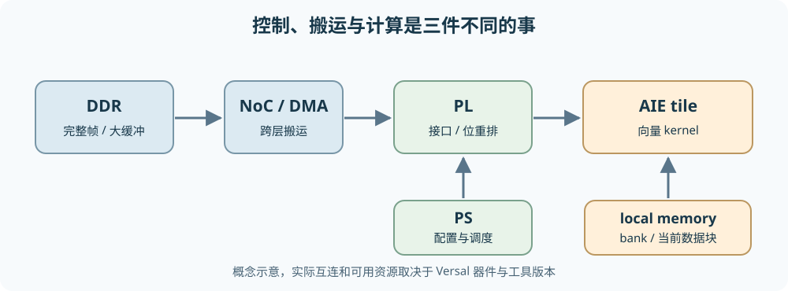

# 从零理解 Versal AI Engine：计算、存储与数据流

本章讨论 AMD Versal 中与 DVB-S2 接收链加速直接相关的 **PS、PL、AI Engine（AIE）与数据搬运**。仓库没有记录具体 Versal 器件型号或已安装 Vitis 版本；因此架构概念按器件家族解释，示例接口以 [AMD UG1079 2026.1](https://docs.amd.com/r/en-US/ug1079-ai-engine-kernel-coding/Kernel-Inputs-and-Outputs) 为参考。不同 Versal 系列、AIE/AIE-ML 代际和工具版本会改变资源数量、向量宽度、接口及可用功能，不能将本章示例的数字当作目标板卡保证值。

## 1. 为什么不是让一个 CPU 做完所有事

**CPU**（中央处理器）是通用的指令执行器：按程序取指、判断分支、读写内存；它擅长复杂控制和经常改变的任务，但若同一种简单运算要对海量样本反复做，指令、缓存与数据搬运成本可能占据很多周期。**FPGA 可编程逻辑（Programmable Logic，PL）**把逻辑门、寄存器和连接线配置成并行电路：每拍可以同时推进不同流水级，擅长确定时序的位处理、协议接口、重排和专用数据通路；代价是设计/时序收敛与资源管理更复杂。PL 不是“把 C++ 在许多 CPU 上同时运行”。

传统 **Zynq** 已把处理系统（Processing System，PS）和 PL 放在同一器件：PS 跑控制软件、配置和调度，PL 实现定制并行数据通路。**Versal** 在这类异构思路上加入由多个可编程计算单元组成的 **AI Engine 阵列**，并用片上网络（Network on Chip，NoC）连接主要端点。AIE 位于“通用 CPU”与“逐门构造的 PL”之间：它仍执行编译后的 kernel 指令，但每个 tile 有适合密集数值计算的向量单元和靠近计算的数据存储。目的不是淘汰 PS/PL，而是在算法中把控制、规则算术与高度定制的流式逻辑放到适合的位置。[AMD Versal 系统架构](https://docs.amd.com/r/2025.1-English/ug1273-versal-acap-design/System-Architecture)列出这些主要资源；实际可用组合依器件系列而异。

```text
外部输入/DDR ── NoC ──┬── PS：帧控制、模式配置、异常处理、软件协调
                      ├── PL：AXI 接口、位重排、专用流水线、DMA/流桥接
                      └── AIE 阵列：多个 tile 执行数值 kernel
                                      ├─ tile：scalar + vector + 本地存储/流接口
                                      └─ tile：scalar + vector + 本地存储/流接口
```



**异构计算**就是不同执行模型协作；划分依据不是“某模块名字听起来像 AI”，而是运算形态、状态大小、数据访问、实时性及接口成本。DVB-S2 中星座距离/LLR 很适合批量数值计算；位交织以置换和访存为主；LDPC 同时含大量并行 CN/VN 运算与困难的边消息搬运；BCH 外码可能更适合较小的专用 PL 或 PS 处理，最终需测量。

## 2. AIE tile 内究竟有什么

**tile** 是阵列中的一个可放置计算与存储资源的单元。一个典型 AIE 计算 tile 包含指令控制/标量处理能力、向量运算能力、寄存器、数据存储访问与流接口；相邻 tile 可以通过本地存储、流互连等路径通信。具体每 tile 的本地存储容量、bank 数、向量 lane 数和时钟随代际变化，不应假定所有 Versal 器件都相同。[AMD AI Engine 编程指南](https://docs.amd.com/r/en-US/ug1079-ai-engine-kernel-coding/Kernel-Inputs-and-Outputs)区分了流与块缓冲接口。

**标量（scalar）**操作一次处理一个数据元素或控制值，例如更新循环索引、检查边界、管理地址。**向量（vector）**操作让一条运算指令同时作用于多个数据 lane。若 8 个 LLR 排成一组，同时计算 8 个加法，就是单指令多数据（SIMD）的直觉；可一次处理多少元素取决于数据类型、AIE 代际与具体指令，不可把“8”当硬件规格。**VLIW**（Very Long Instruction Word，超长指令字）则关心**同一周期能否安排不同类别的操作**，例如一边做向量算术、一边发起数据读写；SIMD 是“一条运算指令作用于多个元素”，VLIW 是“并列发出多种操作”，两者不是同义词。编译器能否安排重叠，还受指令依赖、寄存器和端口限制。

```text
              一个 AIE 计算 tile 的教学示意
输入流/本地缓冲 → 标量控制 ─┬→ 向量运算/累加寄存器 → 输出流
                            └→ load/store → 本地 memory banks
                                ↑ DMA/缓冲同步由图连接与接口协作
```

**local memory（本地存储）**离计算核心近，适合反复读写小块数据。它常被拆成若干 **bank（存储体）**，以便不同访问并行；但一个 bank 在同一时刻能服务的读写数有限。两路 SIMD 算术即使理论吞吐充足，若每拍都争用同一个 bank，也会被存储冲突阻塞。**寄存器**更近、更快但容量更小；外部 DDR 更大却搬运延迟和可用带宽有限。不要把“tile 本地存储”理解成 CPU 的透明 cache：数据放置、缓冲和连接常需要设计者明确规划。

## 3. Stream、buffer/window 与 DMA 分别解决什么

**stream（流）**是一系列按顺序到达的元素；消费者通常按顺序读取，可边到边算，适合生产者与消费者速率相近的流水线。例如 PL 每拍送 I/Q 样本给 AIE，AIE 连续输出 LLR。流路径常带背压：下游停顿会阻止上游继续推进。stream 不自带“随机访问整帧第 17342 项”的语义。

**buffer（块缓冲）**一次容纳一段数据，kernel 可反复访问或按索引读写；早期资料常用 **window** 描述此类定长块，现行 ADF 接口常写 `input_buffer<T>`/`output_buffer<T>`。例如一个 16 样本块的 FFT 或矩阵片段需要多次访问，块接口通常比纯流更合适。块传输可能采用 **ping-pong（双缓冲）**：计算核心读 A 块时 DMA 填 B 块，下一次交换；这让搬运与计算重叠，但需要同步，不能在 DMA 写未完成时读，也不能在消费者读未完成时覆盖。AMD 文档说明相邻 tile 的共享存储缓冲与 lock 协同方式：[本地存储通信](https://docs.amd.com/r/en-US/ug1079-ai-engine-kernel-coding/Data-Communication-via-AI-Engine-Data-Memory)。

**DMA（Direct Memory Access，直接存储器访问）**是按描述符自动搬运数据的机制，避免 PS CPU 逐元素复制。DMA 本身不是计算 kernel，也不让有限带宽变无限；它会受源/目的地址、突发长度、路由、bank、锁和并发传输影响。AIE 附近的 DMA 可以在存储与 stream 间移动数据，PL 侧也可有自己的 DMA。若 DMA 等待缓冲锁、stream FIFO 已满或源端尚未准备好，计算核心会因缺数停顿；AMD 的 [DMA Stall Analysis](https://docs.amd.com/r/2025.2-English/ug1076-ai-engine-environment/DMA-Stall-Analysis)给出这类诊断视角。

### 3.1 AIE-to-AIE、PL-to-AIE、DDR-to-AIE 三条路

| 路径 | 常用机制 | 何时有用 | 要防的瓶颈 |
| --- | --- | --- | --- |
| 相邻 AIE kernel 之间 | stream 或共享/相邻本地 buffer | 流水级、局部复用、低开销交接 | FIFO 背压、bank 冲突、同步锁 |
| PL 与 AIE 之间 | 流互连、ADF 的 PLIO 边界 | PL 做前端/重排，AIE 做批量算术 | 接口宽度、频率、打包格式不匹配 |
| 外部 DDR/HBM 与 AIE 之间 | NoC 与 GMIO / 支持器件上的 external buffer | 大块帧数据输入输出 | NoC/DDR 带宽、DMA 启停、地址访问模式 |

**PLIO**（PL input/output）是 ADF 图和 PL 侧流接口的逻辑边界；它并不自动表示数据来自 DDR。**GMIO**（global memory input/output）面向全局存储的内存映射搬运，通常经 NoC 到 DDR/HBM；它也不是 kernel 内一个可随意解引用的普通 C 指针。AMD [UG1076 2026.1](https://docs.amd.com/r/en-US/ug1076-ai-engine-environment/Controlling-Data-Transfers-between-AI-Engine-and-Global-Memory)明确区分 GMIO 的线性全局存储路径与部分 AIE-ML 器件支持的 external buffer。**NoC** 是片上路由/连接网络，使 PS、PL、AIE 与内存控制器交换数据；它承担搬运，不代替缓存、DMA 或运算核心。

**cascade（级联）**是相邻 AIE 计算单元之间用于传递专门累加器数据的路径，常见于分段 FIR 或乘加链。它不是可承载任意帧格式的通用 stream；是否适用 LDPC 要看具体数值内核和数据依赖，不能仅因“tile 之间要通信”就选 cascade。[AMD 的 cascade FIR 示例](https://docs.amd.com/r/en-US/ug1079-ai-engine-kernel-coding/Coding-with-Intrinsics)展示其典型用途。

## 4. 从 DDR 到 kernel 的存储层级

```text
外部 DDR/HBM：容量大；帧缓冲、批量数据；受共享带宽/延迟限制
       │  经内存控制器 + NoC，常由 DMA/GMIO 发起传输
       ▼
PL 片上缓冲 / AIE interface tile：分流、打包、节流、块边界
       │  stream 或 buffer DMA / 本地连接
       ▼
AIE tile local memory banks：当前处理块、查表、局部中间值
       │  load/store
       ▼
AIE 寄存器/向量寄存器：当前运算元素与累加结果
```

“离核心越近就越快”只是趋势，不能脱离 bank 冲突和具体访问模式。若每个 LDPC 迭代都把全部边消息搬回 DDR，再搬进 AIE，重复流量可能比计算本身更贵。若把所有消息塞进单 tile local memory，又可能根本装不下。需要决定哪些数组常驻 AIE 本地、哪些放 PL BRAM/URAM、哪些留 DDR，并核对目标器件资源。PS 的缓存/片上存储也是整体层级的一部分，但不等于 AIE 核心可直接以普通指针访问 PS cache。

## 5. Kernel、graph 与 ADF：一个最小例子

**kernel** 是在某个 AIE 计算核心上执行的函数；**graph** 是描述 kernel、输入输出端口和连接关系的图；**ADF（Adaptive Data Flow）**是 AMD 用于表达该图、端口和运行约束的编程模型。graph 让编译器为 kernel 分配 tile、配置流或缓冲连接，kernel 函数则定义每次被调用时对数据做什么。它不是 CPU 上普通函数链式调用，也不保证每条 graph 边零成本。

下面的示意以 `int32` 定长 16 元素块将每个数乘 2；目的是看清 kernel 与 graph 的边界，**不是**高效 SIMD 版，也不是实际 DVB-S2 算法。算术溢出检查在真实固定点设计中不可省略。接口形式参照 [AMD UG1079 2026.1 的 graph 教学例子](https://docs.amd.com/r/en-US/ug1079-ai-engine-kernel-coding/Creating-a-Data-Flow-Graph-Including-Kernels)；编译前仍需按目标平台准备工程、仿真输入文件与链接配置。

```cpp
// gain2.cc：一次处理 16 个 int32 元素的教学 kernel
#include <adf.h>

void gain2(adf::input_buffer<int32>& in, adf::output_buffer<int32>& out) {
    const int32* src = in.data();
    int32* dst = out.data();
    for (int i = 0; i < 16; ++i)
        dst[i] = src[i] * 2;
}
```

```cpp
// graph.h：只示意接口、kernel 与块大小
#include <adf.h>
void gain2(adf::input_buffer<int32>&, adf::output_buffer<int32>&);

class GainGraph : public adf::graph {
    adf::kernel k;
public:
    adf::input_plio in;
    adf::output_plio out;

    GainGraph() {
        k = adf::kernel::create(gain2);
        adf::source(k) = "gain2.cc";
        in = adf::input_plio::create("in", adf::plio_32_bits, "data/in.txt");
        out = adf::output_plio::create("out", adf::plio_32_bits, "data/out.txt");
        adf::connect(in.out[0], k.in[0]);
        adf::connect(k.out[0], out.in[0]);
        adf::dimensions(k.in[0]) = {16};
        adf::dimensions(k.out[0]) = {16};
    }
};
```

一次数据流是：PLIO 的仿真/硬件源提供一块 16 个整数 → graph 连接将块放进 kernel 的输入 buffer → kernel 读本地缓冲、写输出 buffer → graph 把输出送到 PLIO 边界。`adf::dimensions` 规定块元素数，`source` 告诉编译器函数实现在哪个源文件；外层程序还要初始化/运行 graph。若把 PLIO 换成 GMIO，数据源会变为全局存储路径，host 还需发起与同步传输；不是只改一个名字就完成硬件连接。实际工程的头文件、目录和接口语法须以已安装 Vitis 版本为准，本仓库未提供可编译的 AIE 平台工程，因此本段是**官方 API 风格的教学片段，未在目标板卡验证**。

### 5.1 为什么这个 kernel 还不快

上面的 `for` 循环是标量写法，是否自动向量化由编译器、类型、依赖及目标 AIE 决定。真正做 DVB-S2 Demapper 时，要将多组 I/Q 输入按向量 lane 打包，批量计算平方距离/最小值或近似 LLR；还要保证星座表、临时结果与输出 LLR 的本地存储布局让向量 load/store 连续。对 LDPC，CN 可做符号、最小/次小值的并行归约，但边消息散乱访问与同一变量的写冲突可能决定实际速度。单个 kernel 的算术吞吐高，并不代表整条 graph 端到端吞吐高。

## 6. 把 DVB-S2 接收链放在图上

先看一个**候选划分**，不是最终硬件方案：

```text
卫星前端 / PL 输入 → 同步与帧切分（PL）→ I/Q 块
       → Demapper 候选：AIE 向量 kernel → 每符号 2/3/4/5 个 LLR
       → Deinterleaver 候选：PL 存储重排或 AIE+本地块转置
       → LDPC 候选：多个 AIE/PL 分层处理 + 边消息缓冲
       → BCH 候选：PL 小型代数核心或 PS 软件 → BBFRAME
                    ↑ PS 配置 MODCOD、帧型、迭代预算和失败处理
```

若一帧为 64800 编码位、每个软 LLR 存 8 位，仅**一份** LLR 数组约 64800 字节；LDPC 还需要边消息、图地址与双缓冲，不能只以这份数组估计容量。假设每帧在 AIE/PL 之间往返搬运一次，可算字节/帧，再乘帧/秒与迭代次数做带宽预算；若同一帧多次在 DDR 往返，带宽需求会被迭代放大。具体吞吐率要靠目标器件上的 Vitis Analyzer、event trace、DMA stall 和接口计数器核实，而不是凭 AIE 理论每周期运算数推断。

## 7. 常见误区与下一步阅读路线

| 误区 | 更准确的理解 |
| --- | --- |
| “AIE 就是小 FPGA。” | AIE tile 是有指令执行、向量单元与本地存储的可编程处理单元；PL 是配置成电路的数据通路。 |
| “SIMD 等于多核，VLIW 也等于 SIMD。” | SIMD 是一条运算处理多个元素；多核是多个计算单元；VLIW 是一周期安排多类指令。 |
| “local memory 和 DDR 都能用同一个 C 指针直接访问。” | AIE 本地与全局存储有不同接口和搬运路径，GMIO/NoC/DMA 需明确配置。 |
| “stream 一定比 buffer 快。” | 连续流适合顺序处理；需要随机访问或多次复用的块可能更适合 buffer。 |
| “PLIO 会自动把 DDR 帧送进 AIE。” | PLIO 是与 PL 流的边界；DDR 数据还要有 DMA/GMIO 等实际路径。 |
| “更多 tile 就一定线性加速。” | 数据划分、共享存储、NoC、接口和调度可能先饱和。 |
| “cascade 是通用 tile 间网络。” | 它偏向特定累加数据路径，普通数据还需 stream/共享 buffer 等。 |

继续读 AMD 文档时，先确认目标**器件系列和 AIE 代际**，再看 [UG1079 2026.1 的 Kernel/Graph Programming Guide](https://docs.amd.com/r/en-US/ug1079-ai-engine-kernel-coding/Graph-Programming-Model)、[UG1076 2026.1 的工具与性能分析](https://docs.amd.com/r/en-US/ug1076-ai-engine-environment/Controlling-Data-Transfers-between-AI-Engine-and-Global-Memory)；本仓库未指定 Vitis 版本，若实际安装并非 2026.1，应以所装版本的对应章节和编译器诊断优先。对后续架构设计，始终分别记录 **算术周期、local memory bank 冲突、PLIO/GMIO 吞吐、DMA 等待、每帧搬运字节**，避免把一种瓶颈误判成另一种。
